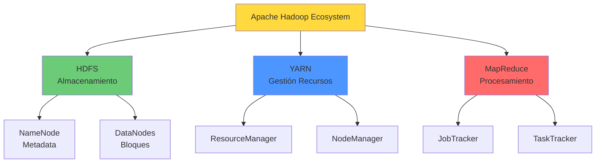
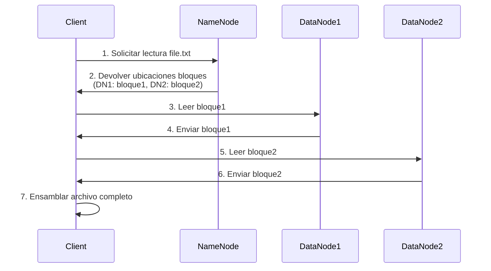
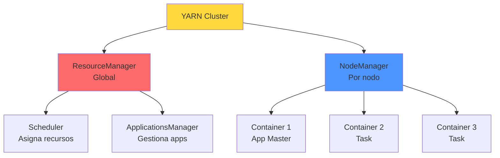
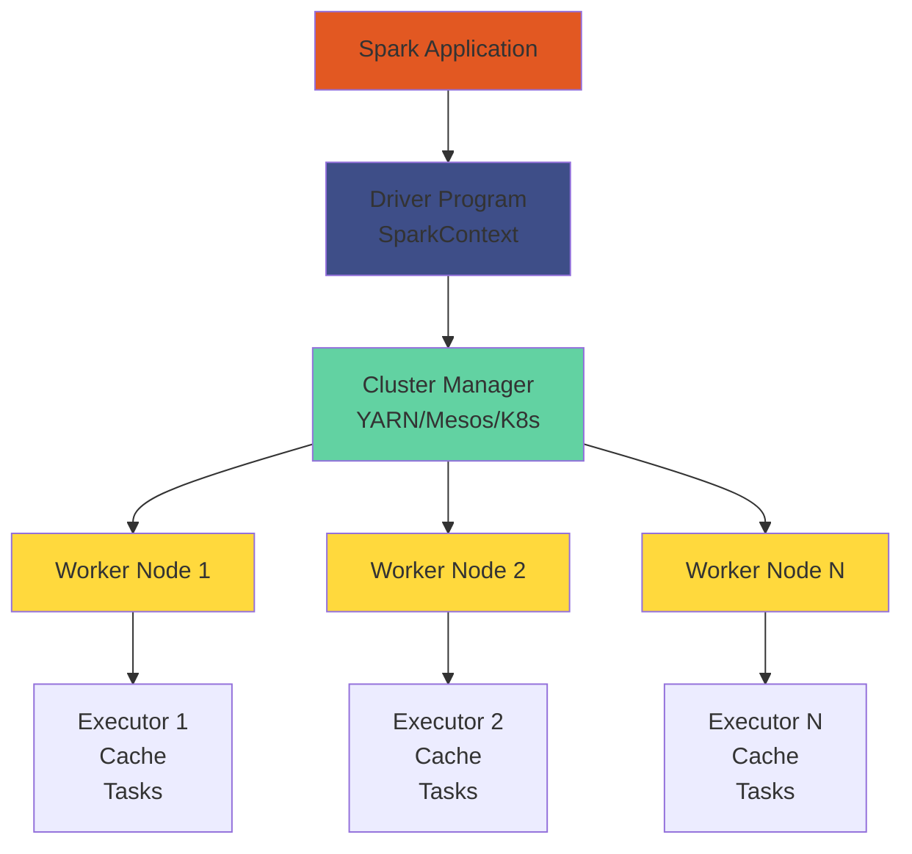
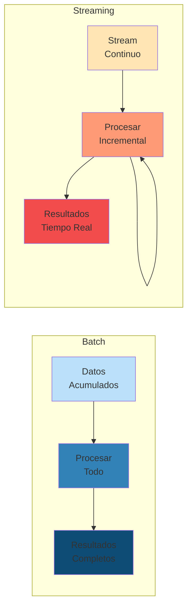
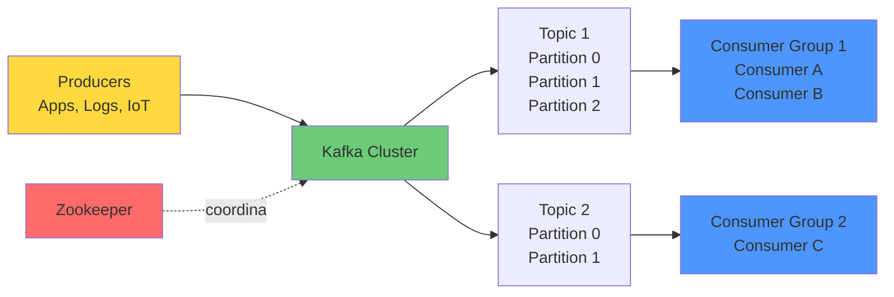
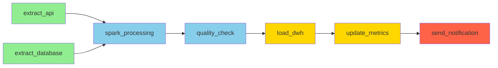

# CAPÍTULO 9: Infraestructura Big Data

!!! abstract "Ecosistema Completo"
    La infraestructura Big Data comprende un conjunto de tecnologías distribuidas diseñadas para almacenar, procesar y analizar volúmenes masivos de datos de manera eficiente, escalable y tolerante a fallos.

---

## 9.1. Ecosistema Hadoop

!!! info "Apache Hadoop"
    **Hadoop** es el framework de código abierto más establecido para procesamiento distribuido de grandes conjuntos de datos usando el modelo **MapReduce** y almacenamiento HDFS.

### Componentes Core de Hadoop



---

### HDFS (Hadoop Distributed File System)

**Arquitectura Master-Slave:**

| Componente | Rol | Responsabilidades |
|------------|-----|-------------------|
| **NameNode** | Master | Gestiona metadata, namespace, bloques |
| **DataNode** | Slave | Almacena bloques de datos reales |
| **Secondary NameNode** | Checkpoint | Backups periódicos del NameNode |

**Características clave:**

- ✅ **Replicación:** Cada bloque se replica 3 veces (configurable)
- ✅ **Bloques grandes:** 128 MB por defecto (vs 4 KB en FS tradicionales)
- ✅ **Write-once, read-many:** Optimizado para lecturas masivas
- ✅ **Tolerancia a fallos:** Detección automática y re-replicación
- ✅ **Localidad de datos:** Procesamiento cerca de donde están los datos

**Ejemplo: Operaciones HDFS básicas**

```bash
# === COMANDOS HDFS ===

# 1. Listar archivos en HDFS
hdfs dfs -ls /user/hadoop/

# 2. Crear directorio
hdfs dfs -mkdir -p /data/raw/2024

# 3. Subir archivo local a HDFS
hdfs dfs -put local_file.csv /data/raw/2024/

# 4. Descargar archivo de HDFS
hdfs dfs -get /data/raw/2024/file.csv ./local_file.csv

# 5. Ver contenido de archivo
hdfs dfs -cat /data/raw/2024/file.csv | head -10

# 6. Ver información de replicación
hdfs fsck /data/raw/2024/file.csv -files -blocks -locations

# 7. Cambiar factor de replicación
hdfs dfs -setrep -w 5 /data/important/critical.csv

# 8. Ver espacio usado
hdfs dfs -du -h /data/

# 9. Eliminar archivo (ir a trash)
hdfs dfs -rm /data/temp/old_file.csv

# 10. Eliminar permanentemente (skip trash)
hdfs dfs -rm -r -skipTrash /data/temp/
```

**Ejemplo Python: Interactuar con HDFS**

```python
# === PYTHON + HDFS ===

from hdfs import InsecureClient
import pandas as pd
from io import StringIO

# 1. Conectar a HDFS (WebHDFS)
client = InsecureClient('http://namenode:50070', user='hadoop')

# 2. Listar archivos
files = client.list('/data/raw/')
print(f"Archivos en /data/raw/: {files}")

# 3. Subir archivo
with open('local_data.csv', 'r') as f:
    client.write('/data/raw/local_data.csv', f)

# 4. Leer archivo como DataFrame
with client.read('/data/raw/data.csv', encoding='utf-8') as reader:
    content = reader.read()
    df = pd.read_csv(StringIO(content))

print(f"DataFrame loaded: {df.shape}")
print(df.head())

# 5. Subir DataFrame directamente
df_output = pd.DataFrame({
    'id': range(1000),
    'value': range(1000, 2000)
})

csv_string = df_output.to_csv(index=False)
client.write('/data/processed/output.csv', csv_string, encoding='utf-8')

# 6. Verificar si archivo existe
if client.status('/data/raw/data.csv', strict=False):
    print("✅ Archivo existe")
    
    # Obtener metadata
    status = client.status('/data/raw/data.csv')
    print(f"   Tamaño: {status['length'] / 1024 / 1024:.2f} MB")
    print(f"   Replicación: {status['replication']}")
    print(f"   Modificado: {status['modificationTime']}")

# 7. Eliminar archivo
client.delete('/data/temp/old_file.csv')

# Output ejemplo:
# Archivos en /data/raw/: ['data.csv', 'local_data.csv', 'transactions.parquet']
# DataFrame loaded: (50000, 10)
# ✅ Archivo existe
#    Tamaño: 125.34 MB
#    Replicación: 3
#    Modificado: 1708435200000
```

**Arquitectura HDFS: Lectura de Archivos**



---

### MapReduce: Modelo de Programación

**Concepto:**
MapReduce es un modelo de programación para procesamiento distribuido de grandes datasets en clusters.

**Fases:**

1. **Map:** Procesa entrada y emite pares clave-valor
2. **Shuffle & Sort:** Agrupa valores por clave
3. **Reduce:** Agrega valores para cada clave


**Ejemplo Clásico: WordCount**

```python
# === MapReduce en Python (mrjob) ===

from mrjob.job import MRJob
import re

WORD_RE = re.compile(r"[\w']+")

class MRWordCount(MRJob):
    """
    MapReduce para contar palabras en documentos
    """
    
    def mapper(self, _, line):
        """
        FASE MAP: Emitir (palabra, 1) por cada palabra
        
        Input: línea de texto
        Output: (palabra, 1)
        """
        for word in WORD_RE.findall(line):
            yield (word.lower(), 1)
    
    def reducer(self, word, counts):
        """
        FASE REDUCE: Sumar todos los counts por palabra
        
        Input: (palabra, [1, 1, 1, ...])
        Output: (palabra, total)
        """
        yield (word, sum(counts))

if __name__ == '__main__':
    MRWordCount.run()

# Ejecutar:
# python wordcount.py input.txt -o output/
# python wordcount.py hdfs:///data/books/*.txt -r hadoop -o hdfs:///results/wordcount/

# Output ejemplo:
# "hadoop"    1523
# "data"      2891
# "processing" 876
```

**Ejemplo Avanzado: Join de Datasets**

```python
# === MapReduce: Join de Clientes y Pedidos ===

from mrjob.job import MRJob
from mrjob.step import MRStep

class MRJoinCustomersOrders(MRJob):
    """
    Join entre customers.csv y orders.csv usando MapReduce
    """
    
    def steps(self):
        return [
            MRStep(mapper=self.mapper_join,
                   reducer=self.reducer_join)
        ]
    
    def mapper_join(self, _, line):
        """
        MAP: Emitir (customer_id, (tipo, data))
        
        customers.csv: C|123|John Doe|john@email.com
        orders.csv: O|123|456.78|2024-01-15
        """
        parts = line.strip().split('|')
        
        if parts[0] == 'C':  # Customer
            customer_id = parts[1]
            customer_data = {
                'name': parts[2],
                'email': parts[3]
            }
            yield (customer_id, ('customer', customer_data))
        
        elif parts[0] == 'O':  # Order
            customer_id = parts[1]
            order_data = {
                'amount': float(parts[2]),
                'date': parts[3]
            }
            yield (customer_id, ('order', order_data))
    
    def reducer_join(self, customer_id, values):
        """
        REDUCE: Combinar customer con sus orders
        """
        customer = None
        orders = []
        
        for value_type, data in values:
            if value_type == 'customer':
                customer = data
            elif value_type == 'order':
                orders.append(data)
        
        if customer and orders:
            total_spent = sum(o['amount'] for o in orders)
            
            yield (customer_id, {
                'customer': customer,
                'num_orders': len(orders),
                'total_spent': total_spent,
                'orders': orders
            })

# Output ejemplo por customer_id:
# "123" -> {
#     "customer": {"name": "John Doe", "email": "john@email.com"},
#     "num_orders": 5,
#     "total_spent": 2894.50,
#     "orders": [...]
# }
```

---

### YARN (Yet Another Resource Negotiator)

**Arquitectura:**



**Componentes:**

| Componente | Función |
|------------|---------|
| **ResourceManager** | Gestiona recursos del cluster completo |
| **NodeManager** | Gestiona recursos en cada nodo |
| **ApplicationMaster** | Coordina ejecución de una aplicación específica |
| **Container** | Unidad de recursos (CPU, RAM) asignada a una tarea |

---

### Hadoop Ecosystem: Herramientas Adicionales

| Herramienta | Propósito | Descripción |
|-------------|-----------|-------------|
| **Hive** | SQL sobre Hadoop | Motor SQL que traduce queries a MapReduce/Tez/Spark |
| **Pig** | Scripting | Lenguaje de alto nivel (Pig Latin) para ETL |
| **HBase** | NoSQL DB | Base de datos columnar distribuida sobre HDFS |
| **Sqoop** | Ingesta | Importar/exportar datos entre RDBMS y Hadoop |
| **Flume** | Streaming | Recolección y agregación de logs en tiempo real |
| **Oozie** | Workflow | Orquestación de jobs MapReduce/Pig/Hive |
| **Zookeeper** | Coordinación | Servicio de coordinación distribuida |

**Ejemplo: Hive Query**

```sql
-- === APACHE HIVE: SQL sobre Hadoop ===

-- 1. Crear tabla externa sobre datos HDFS
CREATE EXTERNAL TABLE IF NOT EXISTS sales (
    transaction_id BIGINT,
    customer_id INT,
    product_id INT,
    quantity INT,
    amount DECIMAL(10,2),
    transaction_date DATE
)
ROW FORMAT DELIMITED
FIELDS TERMINATED BY ','
STORED AS TEXTFILE
LOCATION '/data/raw/sales/';

-- 2. Crear tabla particionada (mejor performance)
CREATE TABLE sales_partitioned (
    transaction_id BIGINT,
    customer_id INT,
    product_id INT,
    quantity INT,
    amount DECIMAL(10,2)
)
PARTITIONED BY (year INT, month INT)
STORED AS ORC  -- Formato columnar optimizado
TBLPROPERTIES ("orc.compress"="SNAPPY");

-- 3. Insertar datos con particiones
INSERT INTO sales_partitioned PARTITION(year=2024, month=1)
SELECT transaction_id, customer_id, product_id, quantity, amount
FROM sales
WHERE YEAR(transaction_date) = 2024 AND MONTH(transaction_date) = 1;

-- 4. Query analítico sobre datos particionados
SELECT 
    year,
    month,
    COUNT(*) as num_transactions,
    SUM(amount) as total_revenue,
    AVG(amount) as avg_transaction,
    COUNT(DISTINCT customer_id) as unique_customers
FROM sales_partitioned
WHERE year = 2024
GROUP BY year, month
ORDER BY month;

-- 5. Join con dimensión de productos
SELECT 
    p.category,
    p.product_name,
    SUM(s.quantity) as units_sold,
    SUM(s.amount) as revenue
FROM sales_partitioned s
JOIN products p ON s.product_id = p.id
WHERE s.year = 2024 AND s.month = 1
GROUP BY p.category, p.product_name
ORDER BY revenue DESC
LIMIT 10;
```

---

## 9.2. Apache Spark

!!! success "Spark: Procesamiento In-Memory"
    **Apache Spark** es el framework de procesamiento distribuido de nueva generación, hasta **100x más rápido** que MapReduce gracias al procesamiento en memoria (RAM).

### Arquitectura de Spark



**Componentes:**

- **Driver:** Ejecuta función `main()`, crea SparkContext, convierte código a DAG
- **Cluster Manager:** Asigna recursos (YARN, Mesos, Kubernetes, Standalone)
- **Executors:** Procesos JVM en workers que ejecutan tareas y cachean datos
- **Tasks:** Unidades de trabajo enviadas a executors

---

### RDD vs DataFrame vs Dataset

| Característica | RDD | DataFrame | Dataset |
|----------------|-----|-----------|---------|
| **Abstracción** | Colección distribuida inmutable | Datos estructurados en columnas | Tipo tipado + DataFrame |
| **Optimización** | Manual | Catalyst optimizer | Catalyst optimizer |
| **Type-safety** | ❌ Runtime | ❌ Runtime | ✅ Compile-time |
| **Performance** | Más lento | Rápido | Rápido |
| **API** | Transformaciones funcionales | SQL-like | Ambos |
| **Cuándo usar** | Transformaciones complejas | Análisis estructurado estándar | ML pipelines, tipo tipado |

---

### Spark: Ejemplo Completo de Análisis

```python
# === APACHE SPARK: Análisis Completo ===

from pyspark.sql import SparkSession
from pyspark.sql import functions as F
from pyspark.sql.types import *
from pyspark.sql.window import Window

# 1. Crear SparkSession
spark = SparkSession.builder \
    .appName("E-commerce Analysis") \
    .config("spark.sql.shuffle.partitions", "200") \
    .config("spark.default.parallelism", "200") \
    .config("spark.sql.adaptive.enabled", "true") \
    .getOrCreate()

print(f"✅ Spark {spark.version} iniciado")
print(f"   Master: {spark.sparkContext.master}")
print(f"   Executors: {spark.sparkContext.defaultParallelism}")

# 2. Leer datos desde HDFS (varios formatos)
df_sales = spark.read \
    .option("header", "true") \
    .option("inferSchema", "true") \
    .csv("hdfs:///data/raw/sales/*.csv")

df_customers = spark.read \
    .parquet("hdfs:///data/processed/customers")

df_products = spark.read \
    .format("jdbc") \
    .option("url", "jdbc:postgresql://db:5432/products") \
    .option("dbtable", "products") \
    .option("user", "admin") \
    .option("password", "pass") \
    .load()

print(f"\n📊 Datos cargados:")
print(f"   Sales: {df_sales.count():,} registros")
print(f"   Customers: {df_customers.count():,} registros")
print(f"   Products: {df_products.count():,} registros")

# 3. Data Quality: Verificar calidad
print("\n🔍 Verificación de Calidad:")
print("   Sales - Valores nulos por columna:")
df_sales.select([
    F.sum(F.col(c).isNull().cast("int")).alias(c)
    for c in df_sales.columns
]).show()

# 4. Transformaciones: Limpieza y Enriquecimiento
df_sales_clean = df_sales \
    .filter(F.col("amount") > 0) \
    .filter(F.col("quantity") > 0) \
    .filter(F.col("transaction_date").isNotNull()) \
    .withColumn("transaction_date", F.to_date("transaction_date")) \
    .withColumn("year", F.year("transaction_date")) \
    .withColumn("month", F.month("transaction_date")) \
    .withColumn("day_of_week", F.dayofweek("transaction_date"))

# 5. Joins: Enriquecer con dimensiones
df_enriched = df_sales_clean \
    .join(df_customers, "customer_id", "left") \
    .join(df_products, "product_id", "left")

# 6. Agregaciones: Métricas de negocio
df_monthly_metrics = df_enriched \
    .groupBy("year", "month") \
    .agg(
        F.count("transaction_id").alias("num_transactions"),
        F.sum("amount").alias("total_revenue"),
        F.avg("amount").alias("avg_transaction_value"),
        F.countDistinct("customer_id").alias("unique_customers"),
        F.countDistinct("product_id").alias("unique_products")
    ) \
    .orderBy("year", "month")

print("\n📈 Métricas Mensuales:")
df_monthly_metrics.show(12, truncate=False)

# 7. Window Functions: Análisis avanzado
window_spec = Window.partitionBy("customer_id").orderBy("transaction_date")

df_customer_analysis = df_enriched \
    .withColumn("transaction_number", F.row_number().over(window_spec)) \
    .withColumn("cumulative_spent", F.sum("amount").over(
        window_spec.rowsBetween(Window.unboundedPreceding, Window.currentRow)
    )) \
    .withColumn("days_since_last_purchase", 
                F.datediff(F.col("transaction_date"),
                          F.lag("transaction_date", 1).over(window_spec)))

# 8. Detección de Churn: Clientes inactivos
from pyspark.sql import functions as F
from datetime import datetime, timedelta

max_date = df_enriched.agg(F.max("transaction_date")).collect()[0][0]
churn_threshold_days = 90

df_churn_risk = df_enriched \
    .groupBy("customer_id") \
    .agg(
        F.max("transaction_date").alias("last_purchase"),
        F.count("transaction_id").alias("total_purchases"),
        F.sum("amount").alias("lifetime_value")
    ) \
    .withColumn("days_inactive", 
                F.datediff(F.lit(max_date), F.col("last_purchase"))) \
    .withColumn("churn_risk",
                F.when(F.col("days_inactive") > churn_threshold_days, "High")
                 .when(F.col("days_inactive") > 60, "Medium")
                 .otherwise("Low"))

print(f"\n⚠️ Análisis de Churn:")
df_churn_risk.groupBy("churn_risk").count().show()

# 9. RFM Segmentation: Recency, Frequency, Monetary
df_rfm = df_enriched \
    .groupBy("customer_id") \
    .agg(
        F.max("transaction_date").alias("last_purchase"),
        F.count("transaction_id").alias("frequency"),
        F.sum("amount").alias("monetary")
    ) \
    .withColumn("recency_days", 
                F.datediff(F.lit(max_date), F.col("last_purchase")))

# Calcular cuartiles para RFM scores
quantiles = df_rfm.approxQuantile("recency_days", [0.25, 0.5, 0.75], 0.01)

df_rfm_scored = df_rfm \
    .withColumn("R_score",
                F.when(F.col("recency_days") <= quantiles[0], 4)
                 .when(F.col("recency_days") <= quantiles[1], 3)
                 .when(F.col("recency_days") <= quantiles[2], 2)
                 .otherwise(1)) \
    .withColumn("F_score",
                F.ntile(4).over(Window.orderBy("frequency"))) \
    .withColumn("M_score",
                F.ntile(4).over(Window.orderBy("monetary"))) \
    .withColumn("RFM_segment",
                F.concat(F.col("R_score"), F.col("F_score"), F.col("M_score")))

# Clientes "Champions": RFM = 444
champions = df_rfm_scored.filter(F.col("RFM_segment") == "444")
print(f"\n🏆 Champions (RFM=444): {champions.count():,} clientes")

# 10. Guardar resultados en múltiples formatos
# Parquet particionado (para queries rápidos)
df_enriched.write \
    .mode("overwrite") \
    .partitionBy("year", "month") \
    .parquet("hdfs:///data/processed/sales_enriched")

# CSV para reportes
df_monthly_metrics.write \
    .mode("overwrite") \
    .option("header", "true") \
    .csv("hdfs:///data/reports/monthly_metrics")

# Delta Lake (ACID transactions)
df_customer_analysis.write \
    .format("delta") \
    .mode("overwrite") \
    .save("hdfs:///data/delta/customer_analysis")

# 11. Cache para queries repetidos
df_enriched.cache()
print(f"\n💾 DataFrame cacheado en memoria: {df_enriched.storageLevel}")

# 12. Mostrar estadísticas de ejecución
print("\n📊 Estadísticas de Spark:")
print(f"   Particiones: {df_enriched.rdd.getNumPartitions()}")
print(f"   Memoria usada: {spark.sparkContext._jsc.sc().getExecutorMemoryStatus()}")

spark.stop()

# Output ejemplo:
# ✅ Spark 3.5.0 iniciado
#    Master: yarn
#    Executors: 200
# 
# 📊 Datos cargados:
#    Sales: 5,234,891 registros
#    Customers: 125,340 registros
#    Products: 8,456 registros
# 
# 📈 Métricas Mensuales:
# +----+-----+------------------+---------------+---------------------+-----------------+-------------------+
# |year|month|num_transactions  |total_revenue  |avg_transaction_value|unique_customers |unique_products    |
# +----+-----+------------------+---------------+---------------------+-----------------+-------------------+
# |2024|1    |432156            |12543876.50    |29.03                |45231            |3456               |
# |2024|2    |456789            |13234567.80    |28.97                |47892            |3512               |
# ...
# 
# ⚠️ Análisis de Churn:
# +----------+------+
# |churn_risk|count |
# +----------+------+
# |High      |12534 |
# |Medium    |8765  |
# |Low       |104041|
# +----------+------+
# 
# 🏆 Champions (RFM=444): 3,456 clientes
```

---

### Spark MLlib: Machine Learning a Escala

```python
# === SPARK MLlib: Pipeline de ML ===

from pyspark.ml import Pipeline
from pyspark.ml.feature import VectorAssembler, StandardScaler, StringIndexer
from pyspark.ml.classification import RandomForestClassifier
from pyspark.ml.evaluation import BinaryClassificationEvaluator
from pyspark.ml.tuning import ParamGridBuilder, CrossValidator

# 1. Preparar features
feature_cols = ['recency_days', 'frequency', 'monetary', 'avg_transaction_value']

assembler = VectorAssembler(inputCols=feature_cols, outputCol="features_raw")
scaler = StandardScaler(inputCol="features_raw", outputCol="features")

# 2. Preparar target (churn: 1 si inactivo >90 días)
df_ml = df_rfm.withColumn("churn",
                          (F.col("recency_days") > 90).cast("int"))

indexer = StringIndexer(inputCol="churn", outputCol="label")

# 3. Modelo: Random Forest
rf = RandomForestClassifier(featuresCol="features",
                           labelCol="label",
                           numTrees=100,
                           maxDepth=10)

# 4. Pipeline completo
pipeline = Pipeline(stages=[assembler, scaler, indexer, rf])

# 5. Split train/test
train, test = df_ml.randomSplit([0.8, 0.2], seed=42)

# 6. Entrenar modelo
model = pipeline.fit(train)

# 7. Predicciones
predictions = model.transform(test)

# 8. Evaluación
evaluator = BinaryClassificationEvaluator(labelCol="label",
                                          rawPredictionCol="rawPrediction",
                                          metricName="areaUnderROC")

auc = evaluator.evaluate(predictions)
print(f"🎯 AUC-ROC: {auc:.4f}")

# 9. Feature Importance
rf_model = model.stages[-1]
importances = rf_model.featureImportances.toArray()

for feature, importance in zip(feature_cols, importances):
    print(f"   {feature}: {importance:.4f}")

# 10. Guardar modelo
model.write().overwrite().save("hdfs:///models/churn_predictor")

# Output:
# 🎯 AUC-ROC: 0.8923
#    recency_days: 0.4521
#    frequency: 0.2834
#    monetary: 0.1876
#    avg_transaction_value: 0.0769
```

---

## 9.3. Procesamiento: Batch vs Streaming

### Comparación

| Aspecto | Batch Processing | Stream Processing |
|---------|------------------|-------------------|
| **Latencia** | Minutos a horas | Milisegundos a segundos |
| **Volumen** | Grandes volúmenes completos | Registros individuales o micro-batches |
| **Complejidad** | Más simple | Más complejo (windowing, watermarks) |
| **Casos de uso** | ETL nightly, reportes históricos | Detección fraude real-time, IoT |
| **Tecnologías** | Hadoop MapReduce, Spark Batch | Kafka Streams, Flink, Spark Streaming |
| **Datos** | Datos completos (bounded) | Datos infinitos (unbounded) |
| **Reprocesamiento** | Fácil (re-run job) | Complejo (state management) |



---

### Spark Structured Streaming

**Concepto:** Streaming como tabla infinita que crece continuamente

```python
# === SPARK STRUCTURED STREAMING ===

from pyspark.sql import SparkSession
from pyspark.sql import functions as F
from pyspark.sql.types import *

spark = SparkSession.builder \
    .appName("Real-Time Analytics") \
    .getOrCreate()

# 1. Definir schema de eventos
events_schema = StructType([
    StructField("event_id", StringType(), True),
    StructField("user_id", IntegerType(), True),
    StructField("event_type", StringType(), True),
    StructField("product_id", IntegerType(), True),
    StructField("amount", DoubleType(), True),
    StructField("timestamp", TimestampType(), True)
])

# 2. Leer stream desde Kafka
df_stream = spark.readStream \
    .format("kafka") \
    .option("kafka.bootstrap.servers", "kafka:9092") \
    .option("subscribe", "user-events") \
    .option("startingOffsets", "latest") \
    .load()

# 3. Parsear mensajes JSON
df_events = df_stream \
    .select(F.from_json(F.col("value").cast("string"),
                        events_schema).alias("data")) \
    .select("data.*")

# 4. Watermark para datos tardíos (late data)
#    Procesar eventos hasta 1 hora tarde
df_events_watermarked = df_events \
    .withWatermark("timestamp", "1 hour")

# 5. Agregaciones por ventanas temporales
df_aggregated = df_events_watermarked \
    .groupBy(
        F.window("timestamp", "5 minutes", "1 minute"),  # ventana 5 min, avance 1 min
        "event_type"
    ) \
    .agg(
        F.count("event_id").alias("num_events"),
        F.sum("amount").alias("total_amount"),
        F.countDistinct("user_id").alias("unique_users")
    )

# 6. Detección de anomalías en streaming
df_anomalies = df_aggregated \
    .filter(
        (F.col("total_amount") > 100000) |  # Spike de ingresos
        (F.col("num_events") > 10000)       # Spike de eventos
    ) \
    .withColumn("alert_type", F.lit("SPIKE_DETECTED"))

# 7. Escribir resultados a múltiples sinks

# Sink 1: Console (para debugging)
query_console = df_aggregated.writeStream \
    .outputMode("update") \
    .format("console") \
    .option("truncate", "false") \
    .start()

# Sink 2: Parquet en HDFS (append)
query_hdfs = df_aggregated.writeStream \
    .outputMode("append") \
    .format("parquet") \
    .option("path", "hdfs:///data/streaming/aggregated") \
    .option("checkpointLocation", "hdfs:///checkpoints/aggregated") \
    .partitionBy("window") \
    .start()

# Sink 3: Kafka (para alertas)
query_kafka_alerts = df_anomalies \
    .select(F.to_json(F.struct("*")).alias("value")) \
    .writeStream \
    .outputMode("append") \
    .format("kafka") \
    .option("kafka.bootstrap.servers", "kafka:9092") \
    .option("topic", "alerts") \
    .option("checkpointLocation", "hdfs:///checkpoints/alerts") \
    .start()

# Sink 4: Delta Lake (ACID streaming)
query_delta = df_events.writeStream \
    .outputMode("append") \
    .format("delta") \
    .option("path", "hdfs:///data/delta/events") \
    .option("checkpointLocation", "hdfs:///checkpoints/events") \
    .start()

# 8. Monitorear progreso del streaming
import time

print("🔴 Streaming iniciado...")
time.sleep(60)  # Esperar 1 minuto

for query in spark.streams.active:
    print(f"\n📊 Query: {query.name}")
    print(f"   Status: {query.status}")
    print(f"   Progress: {query.lastProgress}")

# 9. Esperar terminación (o Ctrl+C)
query_console.awaitTermination()

# Output en console cada minuto:
# +------------------------------------------+-----------+----------+------------+------------+
# |window                                    |event_type |num_events|total_amount|unique_users|
# +------------------------------------------+-----------+----------+------------+------------+
# |{2024-02-20 11:30:00, 2024-02-20 11:35:00}|purchase   |1523      |45678.90    |892         |
# |{2024-02-20 11:30:00, 2024-02-20 11:35:00}|click      |8934      |0.00        |3421        |
# |{2024-02-20 11:31:00, 2024-02-20 11:36:00}|purchase   |1687      |52341.20    |945         |
# ...
```

---

## 9.4. Apache Kafka

!!! info "Kafka: Plataforma de Streaming Distribuida"
    **Apache Kafka** es una plataforma de streaming distribuida para publicar, suscribirse, almacenar y procesar streams de eventos en tiempo real.

### Arquitectura Kafka



**Conceptos clave:**

- **Topic:** Categoría o feed de mensajes (similar a tabla en DB)
- **Partition:** Subdivisión ordenada e immutable de un topic
- **Producer:** Publica mensajes a topics
- **Consumer:** Se suscribe a topics y procesa mensajes
- **Consumer Group:** Grupo de consumers que trabajan juntos (load balancing)
- **Broker:** Servidor Kafka que almacena datos
- **Offset:** Posición incremental de mensaje en partition

---

### Ejemplo: Producer y Consumer

```python
# === KAFKA PRODUCER ===

from kafka import KafkaProducer
import json
import time
from datetime import datetime
import random

# 1. Crear producer
producer = KafkaProducer(
    bootstrap_servers=['localhost:9092'],
    value_serializer=lambda v: json.dumps(v).encode('utf-8'),
    key_serializer=lambda k: str(k).encode('utf-8'),
    acks='all',  # Esperar confirmación de todos los replicas
    retries=3
)

print("🚀 Kafka Producer iniciado")

# 2. Producir eventos
for i in range(1000):
    event = {
        'event_id': f'evt_{i}',
        'user_id': random.randint(1, 10000),
        'event_type': random.choice(['click', 'purchase', 'view', 'cart_add']),
        'product_id': random.randint(1, 1000),
        'amount': round(random.uniform(10, 500), 2) if random.random() > 0.7 else 0,
        'timestamp': datetime.now().isoformat()
    }
    
    # Enviar mensaje (async)
    future = producer.send(
        topic='user-events',
        key=event['user_id'],  # Partitioning por user_id
        value=event
    )
    
    # Callback para confirmación
    try:
        record_metadata = future.get(timeout=10)
        if i % 100 == 0:
            print(f"✅ Mensaje {i} enviado:")
            print(f"   Topic: {record_metadata.topic}")
            print(f"   Partition: {record_metadata.partition}")
            print(f"   Offset: {record_metadata.offset}")
    except Exception as e:
        print(f"❌ Error enviando mensaje: {e}")
    
    time.sleep(0.01)  # 100 eventos/segundo

# 3. Flush y cerrar
producer.flush()
producer.close()

print("✅ Producer finalizado")
```

```python
# === KAFKA CONSUMER ===

from kafka import KafkaConsumer
import json

# 1. Crear consumer con group
consumer = KafkaConsumer(
    'user-events',
    bootstrap_servers=['localhost:9092'],
    group_id='analytics-consumer-group',
    value_deserializer=lambda m: json.loads(m.decode('utf-8')),
    key_deserializer=lambda k: k.decode('utf-8') if k else None,
    auto_offset_reset='earliest',  # Leer desde inicio si no hay offset guardado
    enable_auto_commit=True,       # Auto-commit offsets
    max_poll_records=500
)

print("🔵 Kafka Consumer iniciado")
print(f"   Suscrito a: {consumer.subscription()}")
print(f"   Group ID: {consumer.config['group_id']}")

# 2. Consumir mensajes
purchases_count = 0
total_revenue = 0

try:
    for message in consumer:
        event = message.value
        
        # Procesar evento
        if event['event_type'] == 'purchase' and event['amount'] > 0:
            purchases_count += 1
            total_revenue += event['amount']
            
            if purchases_count % 10 == 0:
                print(f"\n📊 Estadísticas actuales:")
                print(f"   Compras procesadas: {purchases_count:,}")
                print(f"   Revenue acumulado: ${total_revenue:,.2f}")
                print(f"   Ticket promedio: ${total_revenue/purchases_count:.2f}")
                print(f"   Offset actual: {message.offset}")
                print(f"   Partition: {message.partition}")

except KeyboardInterrupt:
    print("\n⏸️  Consumer detenido por usuario")
finally:
    consumer.close()
    print("✅ Consumer cerrado")

# Output:
# 🔵 Kafka Consumer iniciado
#    Suscrito a: {'user-events'}
#    Group ID: analytics-consumer-group
# 
# 📊 Estadísticas actuales:
#    Compras procesadas: 10
#    Revenue acumulado: $2,345.67
#    Ticket promedio: $234.57
#    Offset actual: 156
#    Partition: 2
# ...
```

---

## 9.5. Apache Airflow: Orquestación de Workflows

!!! success "Airflow: Platform to Programmatically Author, Schedule and Monitor Workflows"
    **Apache Airflow** permite definir workflows complejos como código (DAGs), con scheduling, monitoreo y manejo de dependencias.

### Anatomía de un DAG

```python
# === AIRFLOW DAG: ETL Completo ===

from airflow import DAG
from airflow.operators.python import PythonOperator
from airflow.operators.bash import BashOperator
from airflow.providers.apache.spark.operators.spark_submit import SparkSubmitOperator
from airflow.providers.postgres.operators.postgres import PostgresOperator
from airflow.utils.dates import days_ago
from datetime import timedelta

# Funciones Python para tareas
def extract_from_api(**context):
    """Extraer datos de API externa"""
    import requests
    import json
    
    response = requests.get('https://api.example.com/data')
    data = response.json()
    
    # Guardar en HDFS
    with open('/tmp/api_data.json', 'w') as f:
        json.dump(data, f)
    
    print(f"✅ Extraídos {len(data)} registros de API")
    
    # Guardar metadata en XCom para siguientes tareas
    context['task_instance'].xcom_push(key='num_records', value=len(data))

def data_quality_check(**context):
    """Validar calidad de datos"""
    import pandas as pd
    
    df = pd.read_parquet('/data/processed/output.parquet')
    
    # Checks
    assert df.shape[0] > 0, "❌ DataFrame vacío"
    assert df.isnull().sum().sum() < df.shape[0] * 0.05, "❌ >5% valores nulos"
    assert df.duplicated().sum() == 0, "❌ Duplicados detectados"
    
    print(f"✅ Quality checks passed: {df.shape[0]:,} registros válidos")

def send_success_notification(**context):
    """Enviar notificación de éxito"""
    from airflow.providers.slack.operators.slack_webhook import SlackWebhookOperator
    
    num_records = context['task_instance'].xcom_pull(
        task_ids='extract_api', 
        key='num_records'
    )
    
    message = f"""
    ✅ *ETL Pipeline Completado*
    • Registros procesados: {num_records:,}
    • Duración: {context['task_instance'].duration}s
    • Fecha: {context['execution_date']}
    """
    
    print(message)

# Definir DAG
default_args = {
    'owner': 'data-team',
    'depends_on_past': False,
    'email': ['alerts@company.com'],
    'email_on_failure': True,
    'email_on_retry': False,
    'retries': 3,
    'retry_delay': timedelta(minutes=5),
}

with DAG(
    dag_id='etl_sales_pipeline',
    default_args=default_args,
    description='ETL completo de datos de ventas',
    schedule_interval='0 2 * * *',  # Diario a las 2 AM
    start_date=days_ago(1),
    catchup=False,
    tags=['etl', 'sales', 'production'],
) as dag:
    
    # TASK 1: Extraer de API
    task_extract_api = PythonOperator(
        task_id='extract_api',
        python_callable=extract_from_api,
        provide_context=True
    )
    
    # TASK 2: Extraer de base de datos a HDFS
    task_extract_db = BashOperator(
        task_id='extract_database',
        bash_command="""
        sqoop import \
          --connect jdbc:postgresql://db:5432/sales \
          --username admin \
          --password $DB_PASSWORD \
          --table sales_transactions \
          --target-dir /data/raw/sales/{{ ds }} \
          --as-parquetfile \
          --where "transaction_date = '{{ ds }}'"
        """
    )
    
    # TASK 3: Procesar con Spark
    task_spark_processing = SparkSubmitOperator(
        task_id='spark_processing',
        application='/opt/airflow/dags/scripts/process_sales.py',
        conn_id='spark_default',
        conf={
            'spark.executor.memory': '4g',
            'spark.executor.cores': '2',
            'spark.dynamicAllocation.enabled': 'true'
        },
        application_args=[
            '--input', '/data/raw/sales/{{ ds }}',
            '--output', '/data/processed/sales/{{ ds }}'
        ]
    )
    
    # TASK 4: Quality checks
    task_quality_check = PythonOperator(
        task_id='quality_check',
        python_callable=data_quality_check,
        provide_context=True
    )
    
    # TASK 5: Cargar a Data Warehouse
    task_load_dwh = PostgresOperator(
        task_id='load_to_dwh',
        postgres_conn_id='postgres_dwh',
        sql="""
        INSERT INTO dwh.fact_sales
        SELECT * FROM staging.sales_{{ ds }}
        WHERE NOT EXISTS (
            SELECT 1 FROM dwh.fact_sales f
            WHERE f.transaction_id = staging.sales_{{ ds }}.transaction_id
        );
        """
    )
    
    # TASK 6: Actualizar métricas agregadas
    task_update_metrics = PostgresOperator(
        task_id='update_metrics',
        postgres_conn_id='postgres_dwh',
        sql='CALL dwh.refresh_sales_metrics(\'{{ ds }}\');'
    )
    
    # TASK 7: Notificación de éxito
    task_notify = PythonOperator(
        task_id='send_notification',
        python_callable=send_success_notification,
        provide_context=True
    )
    
    # Definir dependencias (DAG structure)
    [task_extract_api, task_extract_db] >> task_spark_processing
    task_spark_processing >> task_quality_check
    task_quality_check >> task_load_dwh
    task_load_dwh >> task_update_metrics
    task_update_metrics >> task_notify

# Visualización del DAG:
#
#      extract_api ──┐
#                     ├──> spark_processing --> quality_check --> load_dwh --> update_metrics --> notify
#  extract_database ─┘
```

**DAG en Airflow UI:**



---

## 9.6. Comparación Final de Tecnologías

### Hadoop vs Spark

| Aspecto | Hadoop MapReduce | Apache Spark |
|---------|------------------|--------------|
| **Performance** | Lento (disk I/O) | 100x más rápido (in-memory) |
| **Latencia** | Minutos-horas | Segundos-minutos |
| **Complejidad** | Más código | API de alto nivel |
| **Iteraciones** | Ineficiente (re-read disk) | Eficiente (cache RAM) |
| **Streaming** | No nativo | Spark Streaming nativo |
| **Machine Learning** | Mahout (limitado) | MLlib completo |
| **SQL** | Hive (lento) | Spark SQL (rápido) |
| **Cuándo usar** | Batch gigantes, costo/GB bajo | Análisis iterativo, ML, streaming |

---

### Casos de Uso por Tecnología

| Caso de Uso | Tecnología Recomendada |
|-------------|------------------------|
| **ETL batch diario TB de datos** | Hadoop MapReduce o Spark Batch |
| **Análisis exploratorio interactivo** | Spark DataFrames |
| **Machine Learning a escala** | Spark MLlib |
| **Streaming analytics real-time** | Kafka + Spark Streaming o Flink |
| **Ingesta de logs/eventos** | Kafka + Flume |
| **Orquestación workflows complejos** | Apache Airflow |
| **NoSQL column-store** | HBase |
| **SQL sobre data lake** | Spark SQL o Presto |
| **Data warehouse MPP** | Redshift, Snowflake, BigQuery |

---

## Conclusión

!!! success "Ecosistema Completo"
    La infraestructura Big Data moderna combina múltiples tecnologías:
    
    - **Almacenamiento:** HDFS, S3, Azure Blob
    - **Procesamiento Batch:** Hadoop, Spark
    - **Procesamiento Streaming:** Kafka, Spark Streaming, Flink
    - **Orquestación:** Airflow, Oozie
    - **Query Engines:** Hive, Spark SQL, Presto
    - **ML:** Spark MLlib, TensorFlow on Spark
    
    La elección depende de:
    - 🎯 Latencia requerida
    - 📊 Volumen de datos
    - 💰 Presupuesto
    - 🧑‍💻 Skills del equipo
    - ⚙️ Complejidad de procesamiento

!!! tip "Recomendación Práctica"
    **Stack moderno recomendado en 2026:**
    
    - **Storage:** S3/Azure Blob (object storage) + Delta Lake (ACID)
    - **Processing:** Apache Spark (batch + streaming)
    - **Streaming:** Apache Kafka
    - **Orchestration:** Apache Airflow
    - **Query:** Spark SQL o Presto
    - **ML:** Spark MLlib + MLflow
    - **Infra:** Kubernetes para deploy

---

*Fin del Capítulo 9: Infraestructura Big Data*
