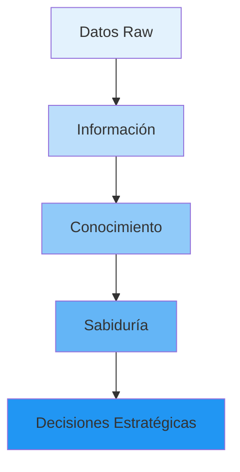
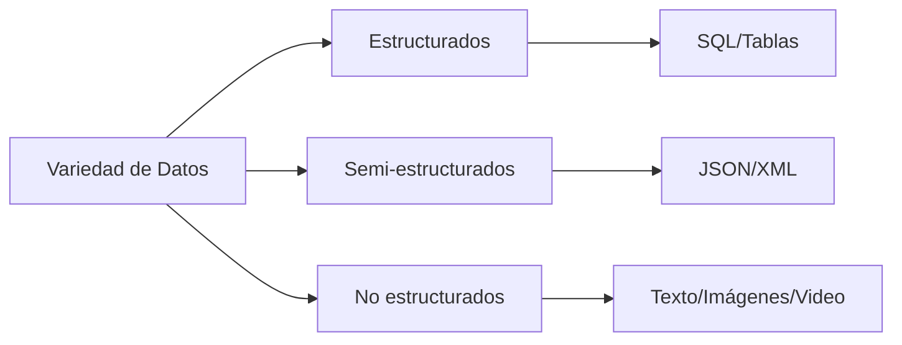
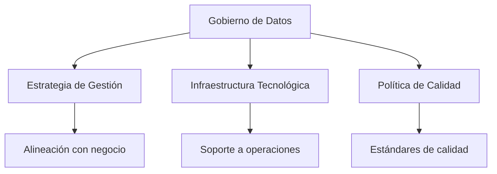

# CAPÍTULO 10: Fundamentos de Big Data y minería de datos

## 10.1. Introducción a Big Data

**¿Qué es Big Data?**

!!! abstract "Definición ONU"
    **Big Data** es el "Volumen masivo de datos, tanto estructurados como no-estructurados, los cuales son demasiado grandes y difíciles de procesar con las bases de datos y el software tradicionales" (ONU, 2012)

Big Data no es solo una cuestión de volumen, sino una transformación radical en cómo las organizaciones capturan, almacenan, procesan y extraen valor de los datos.

**Importancia de la información en la Industria 4.0:**

!!! quote "Relevancia Estratégica"
    La información es **"factor central y estratégico para el progreso social y económico"** y **"nuevo determinante de competitividad para organizaciones y países"** (United Nations Economic and Social Council, 2000)

**Dato alarmante:**

> El **93% de los ejecutivos** creen que su organización está perdiendo ingresos como consecuencia de no poder aprovechar al máximo la información que recogen. En promedio, estiman que la pérdida en ingresos mensuales es de un **14%** (Gartner)

**La información como activo principal:**



**La información es uno de los principales activos de las Compañías**, incluso más valioso que activos físicos en muchos casos.

**Comparación de activos:**

| Activo Tradicional | Activo Digital |
|-------------------|----------------|
| 💰 Capital financiero | 📊 Datos de clientes |
| 🏭 Infraestructura física | ☁️ Infraestructura cloud |
| 🚗 Equipamiento | 🤖 Algoritmos ML |
| 📦 Inventario | 💡 Conocimiento extraído |

---

## 10.2. Las 5 V's de Big Data

Big Data se caracteriza por **cinco dimensiones fundamentales**:

**1. Volumen:**

**Definición:** Cantidad masiva de datos generados.

**Unidades de medida:**

```
1 Bit = Binary Digit
8 Bits = 1 Byte
1024 Bytes = 1 Kilobyte (KB)
1024 Kilobytes = 1 Megabyte (MB)
1024 Megabytes = 1 Gigabyte (GB)
1024 Gigabytes = 1 Terabyte (TB)
1024 Terabytes = 1 Petabyte (PB)
1024 Petabytes = 1 Exabyte (EB)
1024 Exabytes = 1 Zettabyte (ZB)
1024 Zettabytes = 1 Yottabyte (YB)
1024 Yottabytes = 1 Brontobyte (BB)
1024 Brontobytes = 1 Geopbyte (GB)
```

**Ejemplos de volumen:**

| Fuente | Volumen Diario |
|--------|---------------|
| Facebook | 4 Petabytes |
| YouTube | 1 Petabyte (300 horas de video/minuto) |
| Twitter | 12 Terabytes de tweets |
| Sensores IoT | Millions de eventos/segundo |
| Secuenciación genoma | 100+ Gigabytes por persona |

!!! example "Ejemplo: Genoma Humano"
    - **Genoma completo:** ~3 mil millones de pares de bases
    - **Datos crudos:** ~100 GB por persona
    - **Proyecto genoma global:** cientos de Petabytes

**2. Velocidad:**

**Definición:** Rapidez con la que se generan y procesan los datos.

**Tipos de velocidad:**

=== "Batch Processing"
    - Procesamiento por lotes
    - Frecuencia: horas o días
    - Ejemplo: Reportes mensuales de ventas
    
=== "Real-time Processing"
    - Procesamiento en tiempo real
    - Latencia: milisegundos
    - Ejemplo: Detección fraude tarjetas crédito
    
=== "Streaming"
    - Flujo continuo de datos
    - Procesamiento inmediato
    - Ejemplo: Análisis de tráfico web en vivo

**Ejemplos de velocidad:**

- **Mercados financieros:** Millones de transacciones por segundo
- **Redes sociales:** 500 millones de tweets por día
- **Sensores IoT:** Datos cada milisegundo

**3. Variedad:**

**Definición:** Diversidad de tipos y fuentes de datos.

**Clasificación de datos:**



| Tipo | Descripción | Ejemplos | % del total |
|------|-------------|----------|-------------|
| **Estructurados** | Datos organizados en esquemas fijos | SQL, CSV, Excel | 10% |
| **Semi-estructurados** | Datos con estructura parcial | JSON, XML, logs | 10% |
| **No estructurados** | Sin estructura predefinida | Textos, imágenes, videos, audio | 80% |

!!! warning "Dato clave"
    **Los datos NO estructurados** representan el **80% del total** de datos generados, ofreciendo la mayor oportunidad para extraer nueva información.

**Fuentes de datos:**

- 📱 **Redes sociales:** Texto, imágenes, videos, reacciones
- 🌐 **Web:** Clickstream, logs, formularios
- 📧 **Email:** Contenido, metadatos, adjuntos
- 🎥 **Multimedia:** Videos, audio, streaming
- 🤖 **IoT:** Sensores, dispositivos conectados
- 🏥 **Médicos:** Imágenes médicas, historias clínicas, genomas

**4. Veracidad:**

**Definición:** Confiabilidad y calidad de los datos.

**Problemas de calidad:**

!!! danger "Desafíos de Veracidad"
    - **Inconsistencias:** Múltiples fuentes generan valores diferentes para un mismo atributo
    - **Subjetividad:** Opiniones personales afectan la calidad
    - **Errores sistemáticos:** Controles inadecuados en entrada de datos
    - **Datos faltantes:** Valores nulos o incompletos
    - **Formatos heterogéneos:** Diferentes estructuras dificultan integración

**Dimensiones de calidad de datos:**

| Dimensión | Descripción | Problema Común |
|-----------|-------------|----------------|
| **Exactitud** | Datos reflejan la realidad | Valores incorrectos |
| **Completitud** | Todos los datos requeridos presentes | Campos vacíos |
| **Consistencia** | Sin contradicciones internas | Duplicados |
| **Actualidad** | Datos vigentes y actualizados | Datos obsoletos |
| **Validez** | Cumplimiento de reglas de negocio | Formatos inválidos |

**Solución: gobierno de datos (ver sección siguiente)**

**5. Valor:**

**Definición:** Capacidad de extraer información útil para la toma de decisiones.


**Generar valor desde Big Data:**

1. **Identificar preguntas de negocio** relevantes
2. **Explorar y preparar datos** (80% del tiempo)
3. **Aplicar técnicas analíticas** (ML, estadística)
4. **Validar resultados** con expertos de negocio
5. **Implementar insights** en procesos operativos
6. **Medir impacto** (ROI, KPIs)

!!! tip "Principio 80-20"
    El **80% del esfuerzo** en proyectos Big Data se dedica a **preparación y limpieza de datos**. Solo el **20%** es modelado y análisis.

---

## 10.3. Gobierno de datos

**Definición:**

!!! abstract "Gobierno de Datos"
    El **Gobierno de Datos** es la asignación de responsabilidades y obligaciones en torno a la toma de decisiones sobre los datos y su administración en una organización.

**Diferencia clave:**

- **Gobierno:** Especifica **qué decisiones** tomar y **quién** es responsable
- **Administración:** Se centra en **ejecutar** las acciones que tales decisiones implican

**Objetivos del gobierno de datos:**



**Tres objetivos principales:**

1. **Desarrollo de estrategia** para gestión de datos alineada con estrategia organizacional
2. **Implementación de infraestructura** tecnológica para que datos brinden soporte al negocio
3. **Establecimiento de política de calidad** con buenas prácticas y estándares

**Orientación del gobierno de datos:**

El gobierno de datos se orienta a:

✅ **Definir decisiones** con respecto a los datos en enfoque global de la organización  
✅ **Definir roles** que se deben involucrar en el proceso de toma de decisiones  
✅ **Determinar participación** de cada rol en el proceso decisorio

**Marcos de referencia:**

**1. DMBoK (Data Management Body of Knowledge):**

**DAMA** (Data Management Association) define 11 áreas de conocimiento:

```
┌─────────────────────────────────────────────────────┐
│           DATA MANAGEMENT BODY OF KNOWLEDGE         │
│                                                     │
│  ┌───────────────┐  ┌───────────────┐             │
│  │ Data           │  │ Data          │             │
│  │ Governance     │  │ Architecture  │             │
│  └───────┬────────┘  └────────┬──────┘             │
│          │                    │                     │
│  ┌───────┴────────────────────┴──────┐             │
│  │      Data Quality Management      │             │
│  └───────────────┬───────────────────┘             │
│                  │                                  │
│  ┌───────────────┼───────────────────────┐         │
│  │               │                       │         │
│  ↓               ↓                       ↓         │
│ Metadata    Data Security    Data Integration     │
│ Management    & Privacy      & Interoperability   │
│                                                    │
│ Document &    Reference &    Data             │
│ Content Mgmt  Master Data    Warehousing        │
│                                                    │
│ Data Modeling & Data Storage & BI & Analytics    │
│ Design           Operations                       │
└─────────────────────────────────────────────────────┘
```

**Áreas clave:**

1. **Data Governance** (gobernanza de datos)
2. **Data Architecture** (arquitectura de datos)
3. **Data Modeling & Design** (modelado y diseño)
4. **Data Storage & Operations** (almacenamiento y operaciones)
5. **Data Security** (seguridad de datos)
6. **Data Integration & Interoperability** (integración e interoperabilidad)
7. **Document & Content Management** (gestión de documentos y contenido)
8. **Reference & Master Data** (datos de referencia y maestros)
9. **Data Warehousing & Business Intelligence** (almacenes de datos e inteligencia de negocios)
10. **Metadata Management** (gestión de metadatos)
11. **Data Quality** (calidad de datos)

**2. ISO 38505 - Gobierno de datos:**

La norma **ISO 38505** presenta **áreas de trabajo clave** en el gobierno de datos:

| Área | Descripción |
|------|-------------|
| **Accountability** | Definición clara de responsabilidades |
| **Strategy** | Alineamiento con objetivos de negocio |
| **Acquisition** | Adquisición y provisioning de datos |
| **Performance** | Medición y monitoreo de métricas |
| **Conformance** | Cumplimiento normativo y legal |
| **Human Behaviour** | Cultura y comportamiento organizacional |

**Relación entre gobierno corporativo y gobierno de TI:**

```
┌──────────────────────────────────────────────────────┐
│       GOBIERNO CORPORATIVO (Board, CEO)              │
│       - Estrategia organizacional                    │
│       - Objetivos de negocio                         │
│       - Protección de activos                        │
└─────────────────┬────────────────────────────────────┘
                  │
                  ↓
┌──────────────────────────────────────────────────────┐
│            GOBIERNO DE TI (CIO)                      │
│       - Alineamiento estratégico                     │
│       - Gestión de riesgos                           │
│       - Entrega de valor                             │
│       - Gestión de recursos                          │
└─────────────────┬────────────────────────────────────┘
                  │
                  ↓
┌──────────────────────────────────────────────────────┐
│        GOBIERNO DE DATOS (CDO, Data Stewards)        │
│       - Calidad de datos                             │
│       - Seguridad y privacidad                       │
│       - Ciclo de vida de datos                       │
│       - Metadata management                          │
└──────────────────────────────────────────────────────┘
```

**Problemas comunes de calidad de datos:**

!!! danger "Problemas Típicos"
    1. **Múltiples fuentes** generan valores diferentes para un mismo atributo
    2. **Subjetividad** (opinión del usuario) genera valores inconsistentes
    3. **Errores sistemáticos** en controles de entrada
    4. **Volumen creciente** dificulta acceso y recuperación
    5. **Sistemas distribuidos** producen definiciones y formatos inconsistentes
    6. **Datos no numéricos** complejos de indexar, etiquetar y buscar
    7. **Análisis automático** de datos distribuidos no produce resultados esperados
    8. **Necesidades cambiantes** de usuarios afectan calidad contextual

**Solución:** Implementar un programa integral de Gobierno de Datos con políticas, procesos, roles y tecnologías adecuadas.

---

## 10.4. Small Data vs Big Data

**¿Qué es Small Data?**

!!! abstract "Definición"
    **Small Data** es un conjunto de datos que poseen un formato y un volumen que lo hacen accesible, informativo y procesable.

**Objetivo:** Hacer entendible al Big Data, conectando, organizando y empaquetando los datos para facilitar las tareas de todos los miembros de la empresa cada día.

**Comparación:**

| Aspecto | Small Data | Big Data |
|---------|-----------|----------|
| **Volumen** | GBs - TBs | TBs - PBs - EBs |
| **Estructura** | Estructurado (SQL) | Estructurado + semi + no estructurado |
| **Herramientas** | Excel, SQL, R | Hadoop, Spark, NoSQL |
| **Análisis** | Estadística tradicional | ML, Deep Learning |
| **Tiempo de procesamiento** | Minutos - Horas | Horas - Días |
| **Infraestructura** | Servidor único | Cluster distribuido |
| **Expertise requerido** | Analista de datos | Data Scientist, Data Engineer |
| **Casos de uso** | Reportes, dashboards | Predicciones, recomendaciones |

!!! tip "Principio"
    No siempre necesitas Big Data. Muchos problemas de negocio se resuelven efectivamente con Small Data bien gestionado.

---

## 10.5. Data Warehouse vs Data Lake

**Data Warehouse:**

!!! abstract "Definición William Inmon"
    **Data Warehouse** es una colección de datos **orientada a un determinado tema**, **integrado**, **no volátil** y **variable en el tiempo**, que ayuda a la toma de decisiones.

**Características:**

- **Orientado a tema:** Organizado por áreas de negocio (ventas, finanzas, clientes)
- **Integrado:** Datos de múltiples fuentes consolidados
- **No volátil:** Datos históricos, no se modifican
- **Variable en el tiempo:** Incluye dimensión temporal

**Ejemplo de esquema Data Warehouse:**

```sql
-- Esquema estrella típico

-- Tabla de hechos (Fact Table)
CREATE TABLE fact_ventas (
    venta_id INT PRIMARY KEY,
    fecha_id INT,
    producto_id INT,
    cliente_id INT,
    tienda_id INT,
    cantidad INT,
    precio_unitario DECIMAL(10,2),
    total DECIMAL(10,2),
    FOREIGN KEY (fecha_id) REFERENCES dim_fecha(fecha_id),
    FOREIGN KEY (producto_id) REFERENCES dim_producto(producto_id),
    FOREIGN KEY (cliente_id) REFERENCES dim_cliente(cliente_id),
    FOREIGN KEY (tienda_id) REFERENCES dim_tienda(tienda_id)
);

-- Dimensiones
CREATE TABLE dim_fecha (
    fecha_id INT PRIMARY KEY,
    fecha DATE,
    dia INT,
    mes INT,
    año INT,
    trimestre INT,
    dia_semana VARCHAR(20)
);

CREATE TABLE dim_producto (
    producto_id INT PRIMARY KEY,
    nombre VARCHAR(200),
    categoria VARCHAR(100),
    marca VARCHAR(100),
    precio_lista DECIMAL(10,2)
);

CREATE TABLE dim_cliente (
    cliente_id INT PRIMARY KEY,
    nombre VARCHAR(200),
    segmento VARCHAR(50),
    pais VARCHAR(100),
    ciudad VARCHAR(100)
);
```

**Data Lake:**

!!! abstract "Definición"
    **Data Lake** es un repositorio centralizado diseñado para **almacenar, procesar y proteger grandes cantidades de datos** estructurados, semiestructurados o no estructurados. Puede almacenar datos en su formato nativo y procesar cualquier variedad de datos, ignorando los límites de tamaño.

**Arquitectura típica:**

```
┌────────────────────────────────────────────────────────┐
│                  DATA LAKE ZONES                       │
│                                                        │
│  ┌─────────────────────────────────────────────────┐  │
│  │  RAW ZONE (Datos crudos)                        │  │
│  │  - Formato original                             │  │
│  │  - Sin transformaciones                         │  │
│  │  - Inmutables                                   │  │
│  └────────────────┬────────────────────────────────┘  │
│                   ↓                                    │
│  ┌─────────────────────────────────────────────────┐  │
│  │  TRUSTED ZONE (Datos validados)                 │  │
│  │  - Limpiados                                    │  │
│  │  - Validados                                    │  │
│  │  - Catalogados                                  │  │
│  └────────────────┬────────────────────────────────┘  │
│                   ↓                                    │
│  ┌─────────────────────────────────────────────────┐  │
│  │  REFINED ZONE (Datos enriquecidos)              │  │
│  │  - Agregados                                    │  │
│  │  - Enriquecidos                                 │  │
│  │  - Listos para analytics                        │  │
│  └─────────────────────────────────────────────────┘  │
└────────────────────────────────────────────────────────┘
```

**Comparación Data Warehouse vs Data Lake:**

| Aspecto | Data Warehouse | Data Lake |
|---------|---------------|-----------|
| **Tipo de datos** | Estructurados (SQL) | Todos (estructurados, semi, no estructurados) |
| **Esquema** | Schema-on-write (definido antes) | Schema-on-read (definido al leer) |
| **Procesamiento** | SQL, ETL tradicional | Spark, Hadoop, Python |
| **Flexibilidad** | Baja (esquema rígido) | Alta (cualquier formato) |
| **Costo** | Alto (storage especializado) | Bajo (storage cloud commodity) |
| **Usuarios** | Analistas de negocio | Data Scientists, ML Engineers |
| **Tiempo de desarrollo** | Semanas/meses (modelado dimensional) | Días (ingestar datos directamente) |
| **Propósito** | Reportes históricos, BI | Exploración, ML, analytics avanzado |
| **Madurez** | Muy maduro (décadas) | Emergente (última década) |

**Ejemplo: Arquitectura híbrida (recomendada)**

```python
# Pipeline: Data Lake → Data Warehouse

import boto3
from pyspark.sql import SparkSession

# 1. Ingestar datos crudos a Data Lake (S3 Raw Zone)
s3 = boto3.client('s3')
s3.upload_file('ventas_2024.csv', 'mi-data-lake', 'raw/ventas/2024/')

# 2. Procesar con Spark y guardar en Trusted Zone
spark = SparkSession.builder.appName("DataLakeETL").getOrCreate()

df = spark.read.csv('s3://mi-data-lake/raw/ventas/2024/')

# Limpieza y validación
df_clean = df.filter(df.total > 0).dropna()

# Guardar en Trusted Zone (Parquet)
df_clean.write.parquet('s3://mi-data-lake/trusted/ventas/2024/')

# 3. Agregar y cargar a Data Warehouse (Redshift)
df_agg = df_clean.groupBy('producto_id', 'fecha').agg(
    sum('cantidad').alias('total_cantidad'),
    sum('total').alias('total_ventas')
)

df_agg.write \
    .format('jdbc') \
    .option('url', 'jdbc:redshift://redshift-cluster:5439/dw') \
    .option('dbtable', 'fact_ventas_diarias') \
    .option('user', 'admin') \
    .option('password', 'secure_password') \
    .mode('append') \
    .save()

print("✅ ETL completado: Data Lake → Data Warehouse")
```

---

## 10.6. Machine Learning vs Deep Learning

**Machine Learning:**

!!! abstract "Definición"
    **Machine Learning (ML)** son algoritmos matemáticos que permiten a las máquinas aprender imitando la forma en la que aprendemos los humanos, aunque el ML no son solo algoritmos sino también el enfoque desde el que se aborda el problema.

**Tipos de algoritmos ML:**

=== "Supervisado"
    - **Clasificación:** Predecir categorías (spam/no spam, fraude/legítimo)
    - **Regresión:** Predecir valores numéricos (precio casa, ventas)
    - Ejemplos: Decision Trees, Random Forest, SVM, Logistic Regression
    
=== "No Supervisado"
    - **Clustering:** Agrupar datos similares (segmentación clientes)
    - **Reducción dimensionalidad:** PCA, t-SNE
    - **Asociación:** Reglas de asociación (market basket)
    - Ejemplos: K-Means, DBSCAN, Apriori
    
=== "Por Refuerzo"
    - Aprender desde interacción con el entorno
    - Maximizar recompensas
    - Ejemplos: Q-Learning, Deep Q-Network, AlphaGo

**Deep Learning:**

!!! abstract "Definición"
    **Deep Learning (DL)** forma parte del aprendizaje automático. Es la nueva evolución del ML. Se trata de un algoritmo automático que imita la percepción humana inspirada en nuestro cerebro y la conexión entre neuronas.

**Características:**

- Arquitecturas de **redes neuronales profundas** (múltiples capas)
- Se conoce como **"redes neuronales profundas"** o **"deep neural networks"**
- El "deep" se refiere al número de **capas ocultas** (hidden layers)
- Requiere **grandes volúmenes de datos** para entrenamiento

**Comparación ML vs DL:**

| Aspecto | Machine Learning | Deep Learning |
|---------|-----------------|---------------|
| **Formato de datos** | Datos estructurados | Datos no estructurados (imágenes, texto, audio) |
| **Volumen datos requerido** | Base de datos típica (miles-millones registros) | Más de un millón de puntos de datos |
| **Feature engineering** | Manual (se requiere extraer features) | Automático (aprende features) |
| **Arquitectura** | Algoritmos clásicos (árboles, SVM) | Redes neuronales multicapa |
| **Tiempo de entrenamiento** | Minutos - Horas | Horas - Días - Semanas |
| **Hardware** | CPU suficiente | GPU/TPU necesarios |
| **Interpretabilidad** | Alta (modelos explicables) | Baja ("caja negra") |
| **Casos de uso** | Tablas, series temporales, predicciones simples | Visión computacional, NLP, voz |

**Ejemplo comparativo:**

```python
# MACHINE LEARNING: Clasificación con Random Forest
from sklearn.ensemble import RandomForestClassifier
from sklearn.model_selection import train_test_split
import pandas as pd

# Datos estructurados (CSV)
df = pd.read_csv('clientes.csv')

# Features manuales
X = df[['edad', 'ingresos', 'num_compras', 'antiguedad']]
y = df['churn']  # 0 = no abandona, 1 = abandona

X_train, X_test, y_train, y_test = train_test_split(X, y, test_size=0.2)

# Entrenar modelo (rápido: minutos)
modelo = RandomForestClassifier(n_estimators=100)
modelo.fit(X_train, y_train)

accuracy = modelo.score(X_test, y_test)
print(f"Accuracy: {accuracy:.2%}")  # Ejemplo: 87%

# ─────────────────────────────────────────────────────────

# DEEP LEARNING: Clasificación de imágenes
import tensorflow as tf
from tensorflow.keras import layers, models

# Datos no estructurados (imágenes)
(X_train, y_train), (X_test, y_test) = tf.keras.datasets.cifar10.load_data()

# Normalizar
X_train, X_test = X_train / 255.0, X_test / 255.0

# Red neuronal convolucional (aprende features automáticamente)
modelo = models.Sequential([
    layers.Conv2D(32, (3,3), activation='relu', input_shape=(32, 32, 3)),
    layers.MaxPooling2D((2, 2)),
    layers.Conv2D(64, (3,3), activation='relu'),
    layers.MaxPooling2D((2, 2)),
    layers.Conv2D(64, (3,3), activation='relu'),
    layers.Flatten(),
    layers.Dense(64, activation='relu'),
    layers.Dense(10, activation='softmax')
])

modelo.compile(optimizer='adam',
               loss='sparse_categorical_crossentropy',
               metrics=['accuracy'])

# Entrenar (lento: horas con GPU)
modelo.fit(X_train, y_train, epochs=10, batch_size=64,
           validation_data=(X_test, y_test))

accuracy = modelo.evaluate(X_test, y_test)[1]
print(f"Accuracy: {accuracy:.2%}")  # Ejemplo: 71%
```

**Cuándo usar cada uno:**

| Usa Machine Learning si... | Usa Deep Learning si... |
|----------------------------|------------------------|
| ✅ Tienes datos estructurados (tablas) | ✅ Tienes imágenes, texto, audio, video |
| ✅ Dataset < 100K registros | ✅ Dataset > 1M registros |
| ✅ Necesitas interpretabilidad | ✅ Precisión es más importante que explicabilidad |
| ✅ Recursos limitados (CPU) | ✅ Tienes GPUs disponibles |
| ✅ Tiempo de desarrollo corto | ✅ Tiempo para investigación y experimentación |

---

## 10.7. Relación Entre Big Data, AI Y Data Science

**Definiciones:**

!!! abstract "Conceptos Clave"
    - **Big Data:** Gran colección de conjuntos de datos que no se pueden almacenar en sistemas tradicionales (BD relacionales)
    - **Data Science:** Herramienta para abordar Big Data y luego extraer información significativa de los mismos
    - **Artificial Intelligence (AI):** Capacidad de las máquinas para imitar el comportamiento inteligente humano

**Diagrama de Venn:**

```
┌────────────────────────────────────────────────────────┐
│                                                        │
│    ┌───────────────────────────────────────┐          │
│    │        ARTIFICIAL INTELLIGENCE        │          │
│    │                                       │          │
│    │    ┌──────────────────────────┐      │          │
│    │    │   MACHINE LEARNING       │      │          │
│    │    │                          │      │          │
│    │    │   ┌───────────────┐      │      │          │
│    │    │   │DEEP LEARNING  │      │      │          │
│    │    │   │               │      │      │          │
│    │    │   └───────────────┘      │      │          │
│    │    └──────────────────────────┘      │          │
│    └───────────────────────────────────────┘          │
│                       ∩                                │
│    ┌───────────────────────────────────────┐          │
│    │          DATA SCIENCE                 │          │
│    │  (Statistics + Programming + Domain)  │          │
│    └───────────────────────────────────────┘          │
│                       ∩                                │
│    ┌───────────────────────────────────────┐          │
│    │             BIG DATA                  │          │
│    │     (Volume + Velocity + Variety)     │          │
│    └───────────────────────────────────────┘          │
│                                                        │
└────────────────────────────────────────────────────────┘
```

**Roles y responsabilidades:**

| Rol | Descripción | Skills Clave |
|-----|-------------|--------------|
| **Data Engineer** | Construye pipelines, infraestructura Big Data | Hadoop, Spark, SQL, Python, Cloud |
| **Data Scientist** | Analiza datos, crea modelos ML | Statistics, ML, Python/R, Jupyter |
| **ML Engineer** | Deploya modelos ML a producción | MLOps, Docker, Kubernetes, APIs |
| **Data Analyst** | Reporting, BI, dashboards | SQL, Excel, Tableau, Power BI |
| **AI Researcher** | Investiga nuevos algoritmos | Deep Learning, Research, Papers |

**Flujo de trabajo integrado:**

```python
# PROYECTO INTEGRADO: Big Data + Data Science + AI

# 1. BIG DATA ENGINEER: Preparar infraestructura
import boto3
from pyspark.sql import SparkSession

# Cluster Spark para Big Data
spark = SparkSession.builder \
    .appName("BigDataML") \
    .config("spark.executor.instances", "10") \
    .getOrCreate()

# Ingestar millones de registros desde S3
df = spark.read.parquet('s3://my-bucket/user-behavior/2024/')
print(f"Total registros: {df.count():,}")  # Ejemplo: 50,000,000

# ─────────────────────────────────────────────────────────

# 2. DATA SCIENTIST: Análisis exploratorio y modeling
import pandas as pd
import matplotlib.pyplot as plt
from sklearn.model_selection import train_test_split
from sklearn.ensemble import GradientBoostingClassifier

# Muestrear para análisis (convertir a Pandas)
df_sample = df.sample(fraction=0.01).toPandas()  # 1% = 500K registros

# EDA
print(df_sample.describe())
df_sample['target'].value_counts().plot(kind='bar')
plt.show()

# Feature engineering
df_sample['dias_desde_ultima_compra'] = (
    pd.Timestamp.now() - pd.to_datetime(df_sample['ultima_compra'])
).dt.days

# Preparar datos
features = ['edad', 'ingresos', 'num_compras', 'dias_desde_ultima_compra']
X = df_sample[features]
y = df_sample['compra_futura']  # 0 o 1

X_train, X_test, y_train, y_test = train_test_split(X, y, test_size=0.2)

# Entrenar modelo
modelo = GradientBoostingClassifier(n_estimators=100)
modelo.fit(X_train, y_train)

accuracy = modelo.score(X_test, y_test)
print(f"Accuracy: {accuracy:.2%}")  # Ejemplo: 84%

# ─────────────────────────────────────────────────────────

# 3. ML ENGINEER: Produccionizar modelo
import joblib
from flask import Flask, request, jsonify

# Guardar modelo
joblib.dump(modelo, 'modelo_compra_futura.pkl')
s3.upload_file('modelo_compra_futura.pkl', 'my-models', 'v1/')

# API REST para scoring
app = Flask(__name__)
modelo = joblib.load('modelo_compra_futura.pkl')

@app.route('/predict', methods=['POST'])
def predict():
    data = request.json
    features = [[
        data['edad'],
        data['ingresos'],
        data['num_compras'],
        data['dias_desde_ultima_compra']
    ]]
    
    prediction = modelo.predict(features)[0]
    probability = modelo.predict_proba(features)[0][1]
    
    return jsonify({
        'prediction': int(prediction),
        'probability': float(probability)
    })

if __name__ == '__main__':
    app.run(host='0.0.0.0', port=5000)

# Desplegar con Docker
# docker build -t ml-api:v1 .
# docker run -p 5000:5000 ml-api:v1

# ─────────────────────────────────────────────────────────

# 4. DATA ANALYST: Dashboard para negocio
import dash
from dash import dcc, html
import plotly.express as px

# Consumir API y visualizar resultados
app_dash = dash.Dash(__name__)

app_dash.layout = html.Div([
    html.H1("Predicción de Compra Futura"),
    dcc.Graph(id='predicciones'),
    dcc.Interval(id='interval', interval=5000)  # Actualizar cada 5 seg
])

@app_dash.callback(
    Output('predicciones', 'figure'),
    Input('interval', 'n_intervals')
)
def update_graph(n):
    # Consultar BD con predicciones recientes
    df_pred = pd.read_sql("SELECT * FROM predicciones ORDER BY fecha DESC LIMIT 1000", engine)
    
    fig = px.histogram(df_pred, x='probability', 
                       title='Distribución de Probabilidades de Compra')
    return fig

app_dash.run_server(debug=True, port=8050)
```

**Integración completa:**

1. **Data Engineer** construye pipeline Big Data (Spark, Data Lake)
2. **Data Scientist** explora datos y entrena modelo ML
3. **ML Engineer** despliega modelo como API REST
4. **Data Analyst** crea dashboard con predicciones para negocio
5. **AI enables** mejora continua con feedback loop

---

*Este capítulo continúa en la próxima sección con Minería de Datos y Metodologías (CRISP-DM, KDD)...*
