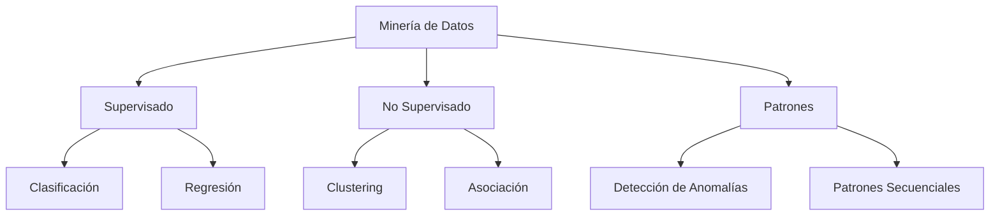
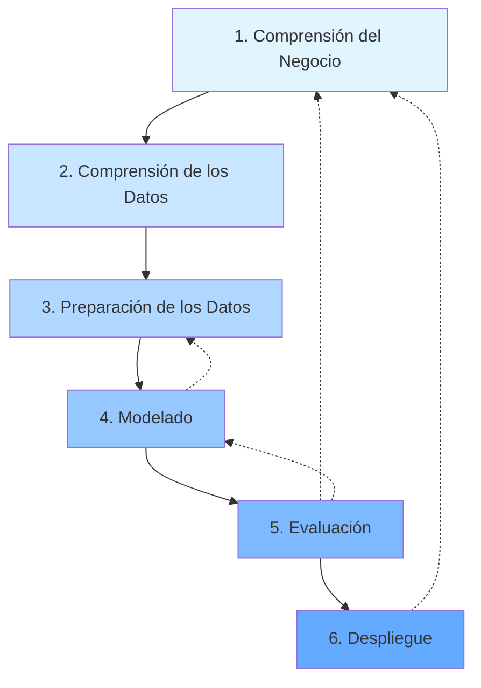

# CAPÍTULO 10 (continuación): Minería de datos y metodologías

## 10.8. Minería de datos (Data Mining)

**Definición:**

!!! abstract "Definición de Minería de Datos"
    La **Minería de Datos** se define como el proceso mediante el cual se descubren patrones, tendencias y relaciones ocultas en grandes volúmenes de datos, utilizando técnicas estadísticas, matemáticas y de aprendizaje automático.

**Objetivo:** Extraer conocimiento útil y accionable desde datos para la toma de decisiones.

**Tareas principales de minería de datos:**



#### 1. Clasificación

**Objetivo:** Predecir a qué clase pertenece una instancia basándose en sus características.

**Ejemplos:**

- Clasificar emails como spam o no spam
- Diagnosticar enfermedades (sano, enfermo)
- Predecir abandono de clientes (churn)
- Reconocimiento de imágenes

**Algoritmos comunes:**

| Algoritmo | Descripción | Ventajas | Desventajas |
|-----------|-------------|----------|-------------|
| Decision Trees | Árbol de decisiones | Interpretable, maneja valores lost | Propenso a overfitting |
| Random Forest | Ensemble de árboles | Alta precisión, robusto | "Caja negra" |
| SVM | Máquina de vectores de soporte | Efectivo en alta dimensionalidad | Lento con datasets grandes |
| Naive Bayes | Basado en teorema de Bayes | Rápido, simple | Asume independencia de features |
| Neural Networks | Redes neuronales | Captura patrones complejos | Requiere muchos datos |

**Ejemplo: Clasificación de clientes**

```python
from sklearn.tree import DecisionTreeClassifier
from sklearn.model_selection import train_test_split, cross_val_score
from sklearn.metrics import classification_report, confusion_matrix
import pandas as pd
import seaborn as sns
import matplotlib.pyplot as plt

# Dataset: Clientes de banco
df = pd.read_csv('clientes_banco.csv')

# Features
X = df[['edad', 'ingresos_anuales', 'saldo_cuenta', 
        'num_productos', 'antiguedad_años', 'activo']]
y = df['abandono']  # 0 = se queda, 1 = abandona

# Split
X_train, X_test, y_train, y_test = train_test_split(
    X, y, test_size=0.3, random_state=42, stratify=y
)

# Entrenar modelo
modelo = DecisionTreeClassifier(max_depth=5, min_samples_split=50)
modelo.fit(X_train, y_train)

# Evaluar
y_pred = modelo.predict(X_test)

print("=== REPORTE DE CLASIFICACIÓN ===")
print(classification_report(y_test, y_pred, 
                           target_names=['Se queda', 'Abandona']))

# Matriz de confusión
cm = confusion_matrix(y_test, y_pred)
plt.figure(figsize=(8,6))
sns.heatmap(cm, annot=True, fmt='d', cmap='Blues')
plt.title('Matriz de Confusión')
plt.ylabel('Valor Real')
plt.xlabel('Predicción')
plt.show()

# Importancia de features
feature_importance = pd.DataFrame({
    'feature': X.columns,
    'importance': modelo.feature_importances_
}).sort_values('importance', ascending=False)

print("\n=== IMPORTANCIA DE FEATURES ===")
print(feature_importance)

# Output ejemplo:
#                    precision  recall  f1-score   support
#     Se queda          0.92     0.95      0.93      8500
#     Abandona          0.65     0.55      0.60      1500
#     accuracy                             0.88     10000
#
# Feature Importance:
#   saldo_cuenta          0.35
#   num_productos         0.28
#   ingresos_anuales      0.18
#   antiguedad_años       0.12
#   edad                  0.05
#   activo                0.02
```

#### 2. Regresión

**Objetivo:** Predecir un valor numérico continuo.

**Ejemplos:**

- Predecir precio de una casa
- Estimar ventas futuras
- Calcular consumo energético
- Proyectar demanda de productos

```python
from sklearn.ensemble import RandomForestRegressor
from sklearn.metrics import mean_absolute_error, mean_squared_error, r2_score
import numpy as np

# Dataset: Precios de viviendas
df = pd.read_csv('precios_casas.csv')

X = df[['superficie_m2', 'num_habitaciones', 'num_baños', 
        'antiguedad', 'distancia_centro_km']]
y = df['precio_euros']

X_train, X_test, y_train, y_test = train_test_split(X, y, test_size=0.2)

# Modelo
modelo = RandomForestRegressor(n_estimators=100, max_depth=10)
modelo.fit(X_train, y_train)

# Predicciones
y_pred = modelo.predict(X_test)

# Métricas
mae = mean_absolute_error(y_test, y_pred)
rmse = np.sqrt(mean_squared_error(y_test, y_pred))
r2 = r2_score(y_test, y_pred)

print(f"MAE (Mean Absolute Error): €{mae:,.0f}")
print(f"RMSE (Root Mean Squared Error): €{rmse:,.0f}")
print(f"R² Score: {r2:.3f}")

# Ejemplo output:
# MAE: €18,500
# RMSE: €25,300
# R² Score: 0.867
#
# Interpretación:
# - En promedio, el modelo se equivoca por €18,500
# - El modelo explica el 86.7% de la varianza en precios
```

#### 3. Clustering

**Objetivo:** Analizar datos para generar etiquetas, agrupando instancias similares sin conocer las clases de antemano.

**Ejemplos:**

- Segmentación de clientes
- Agrupación de documentos similares
- Detección de comunidades en redes sociales
- Compresión de imágenes

**Algoritmos:**

| Algoritmo | Tipo | Ventajas | Desventajas |
|-----------|------|----------|-------------|
| K-Means | Particional | Rápido, simple | Requiere especificar K |
| DBSCAN | Basado en densidad | Detecta formas arbitrarias, maneja outliers | Sensible a parámetros |
| Hierarchical | Jerárquico | No requiere K, genera dendrograma | Lento para grandes datos |
| Gaussian Mixture | Probabilístico | Clusters soft, flexible | Asume distribución gaussiana |

**Ejemplo: Segmentación de clientes**

```python
from sklearn.cluster import KMeans
from sklearn.preprocessing import StandardScaler
from sklearn.decomposition import PCA
import matplotlib.pyplot as plt

# Dataset: Comportamiento de clientes
df = pd.read_csv('clientes_comportamiento.csv')

# Features: RFM (Recency, Frequency, Monetary)
X = df[['dias_desde_ultima_compra', 'frecuencia_compras', 'gasto_total']]

# Normalizar (importante para K-Means)
scaler = StandardScaler()
X_scaled = scaler.fit_transform(X)

# Determinar K óptimo con método del codo
inertias = []
K_range = range(2, 11)

for k in K_range:
    kmeans = KMeans(n_clusters=k, random_state=42)
    kmeans.fit(X_scaled)
    inertias.append(kmeans.inertia_)

# Graficar codo
plt.figure(figsize=(10,6))
plt.plot(K_range, inertias, 'bo-')
plt.xlabel('Número de Clusters (K)')
plt.ylabel('Inertia')
plt.title('Método del Codo para K óptimo')
plt.grid(True)
plt.show()

# Aplicar K-Means con K=4 (elegido desde codo)
kmeans = KMeans(n_clusters=4, random_state=42)
df['cluster'] = kmeans.fit_predict(X_scaled)

# Perfilar clusters
print("=== PERFIL DE CLUSTERS ===")
perfil = df.groupby('cluster').agg({
    'dias_desde_ultima_compra': 'mean',
    'frecuencia_compras': 'mean',
    'gasto_total': 'mean'
}).round(2)
perfil['tamaño'] = df['cluster'].value_counts().sort_index()
print(perfil)

# Visualizar con PCA (reducir a 2D)
pca = PCA(n_components=2)
X_pca = pca.fit_transform(X_scaled)

plt.figure(figsize=(12,8))
scatter = plt.scatter(X_pca[:, 0], X_pca[:, 1], 
                     c=df['cluster'], cmap='viridis', 
                     s=50, alpha=0.6)
plt.colorbar(scatter, label='Cluster')
plt.xlabel('PC1')
plt.ylabel('PC2')
plt.title('Segmentación de Clientes (K-Means)')
plt.grid(True, alpha=0.3)
plt.show()

# Interpretar clusters
interpretacion = {
    0: "Champions: Compraron recientemente, alta frecuencia, alto gasto",
    1: "Leales: Compran frecuentemente, gasto medio",
    2: "En riesgo: No han comprado recientemente, bajo gasto",
    3: "Perdidos: Largo tiempo sin comprar, baja frecuencia"
}

for cluster_id, descripcion in interpretacion.items():
    tamaño = (df['cluster'] == cluster_id).sum()
    print(f"\nCluster {cluster_id} ({tamaño} clientes): {descripcion}")
```

#### 4. Reglas de Asociación

**Objetivo:** Descubrir relaciones interesantes entre variables (patrones "si A entonces B").

**Ejemplo clásico:** Market Basket Analysis

```python
from mlxtend.frequent_patterns import apriori, association_rules
import pandas as pd

# Dataset: Transacciones de supermercado
transacciones = [
    ['leche', 'pan', 'huevos'],
    ['leche', 'pan'],
    ['leche', 'cerveza', 'pañales'],
    ['pan', 'mantequilla'],
    ['leche', 'pan', 'mantequilla'],
    ['cerveza', 'pañales'],
    ['leche', 'pan', 'huevos', 'mantequilla']
]

# Convertir a formato one-hot encoding
from mlxtend.preprocessing import TransactionEncoder

te = TransactionEncoder()
te_ary = te.fit(transacciones).transform(transacciones)
df_transacciones = pd.DataFrame(te_ary, columns=te.columns_)

print("=== MATRIZ ONE-HOT ===")
print(df_transacciones)

# Encontrar itemsets frecuentes
itemsets_frecuentes = apriori(df_transacciones, 
                               min_support=0.3,  # 30% de transacciones
                               use_colnames=True)

print("\n=== ITEMSETS FRECUENTES ===")
print(itemsets_frecuentes)

# Generar reglas de asociación
reglas = association_rules(itemsets_frecuentes, 
                           metric="confidence", 
                           min_threshold=0.6)

# Ordenar por lift (medida de interés)
reglas_sorted = reglas.sort_values('lift', ascending=False)

print("\n=== REGLAS DE ASOCIACIÓN ===")
print(reglas_sorted[['antecedents', 'consequents', 
                     'support', 'confidence', 'lift']])

# Interpretar métricas:
# SUPPORT: % de transacciones que contienen el itemset
# CONFIDENCE: P(consecuente | antecedente)
# LIFT: Cuánto más probable es B dado A vs B solo
#       - Lift > 1: Regla positiva (A y B ocurren juntos)
#       - Lift = 1: A y B independientes
#       - Lift < 1: Regla negativa (A y B no ocurren juntos)

# Ejemplo output:
#   antecedents  consequents  support  confidence  lift
#   {pan}        {leche}      0.57     0.80       1.14
#   {huevos}     {leche,pan}  0.29     1.00       1.75
#   {pañales}    {cerveza}    0.29     1.00       3.50
#
# Insight: Clientes que compran pañales tienen 3.5x
# más probabilidad de comprar cerveza
```

#### 5. Detección de Anomalías

**Objetivo:** Identificar instancias que se desvían significativamente del comportamiento normal.

**Aplicaciones:**

- Detección de fraude en tarjetas de crédito
- Identificación de transacciones sospechosas
- Detección de fallos en maquinaria (predictive maintenance)
- Cyberseguridad (detección de intrusiones)

```python
from sklearn.ensemble import IsolationForest
import numpy as np

# Dataset: Transacciones bancarias
df = pd.read_csv('transacciones.csv')

# Features
X = df[['monto', 'hora_del_dia', 'ubicacion_distancia_km', 
        'frecuencia_transacciones_dia']]

# Modelo Isolation Forest
modelo = IsolationForest(contamination=0.05,  # Esperamos 5% anomalías
                         random_state=42)
df['anomalia'] = modelo.fit_predict(X)
# -1 = anomalía, 1 = normal

# Analizar anomalías
anomalias = df[df['anomalia'] == -1]
normales = df[df['anomalia'] == 1]

print(f"Total transacciones: {len(df)}")
print(f"Anomalías detectadas: {len(anomalias)} ({len(anomalias)/len(df)*100:.1f}%)")

print("\n=== ESTADÍSTICAS ANOMALÍAS ===")
print(anomalias[['monto', 'hora_del_dia', 'ubicacion_distancia_km']].describe())

print("\n=== ESTADÍSTICAS NORMALES ===")
print(normales[['monto', 'hora_del_dia', 'ubicacion_distancia_km']].describe())

# Visualizar
fig, axes = plt.subplots(1, 2, figsize=(15,5))

# Monto vs Distancia
axes[0].scatter(normales['monto'], normales['ubicacion_distancia_km'], 
               c='blue', alpha=0.5, label='Normal')
axes[0].scatter(anomalias['monto'], anomalias['ubicacion_distancia_km'], 
               c='red', alpha=0.8, label='Anomalía', s=100, marker='x')
axes[0].set_xlabel('Monto (€)')
axes[0].set_ylabel('Distancia ubicación (km)')
axes[0].legend()
axes[0].set_title('Detección de Anomalías en Transacciones')

# Monto vs Hora
axes[1].scatter(normales['hora_del_dia'], normales['monto'], 
               c='blue', alpha=0.5, label='Normal')
axes[1].scatter(anomalias['hora_del_dia'], anomalias['monto'], 
               c='red', alpha=0.8, label='Anomalía', s=100, marker='x')
axes[1].set_xlabel('Hora del día')
axes[1].set_ylabel('Monto (€)')
axes[1].legend()
axes[1].set_title('Patrón Temporal de Anomalías')

plt.tight_layout()
plt.show()

# Sistema de alerta
def evaluar_transaccion_nuevo(monto, hora, distancia, frecuencia):
    \"\"\"Evalúa nueva transacción\"\"\"
    nueva = np.array([[monto, hora, distancia, frecuencia]])
    prediccion = modelo.predict(nueva)[0]
    
    if prediccion == -1:
        return {
            'alerta': True,
            'nivel': 'ALTO RIESGO',
            'accion': 'BLOQUEAR Y CONTACTAR CLIENTE'
        }
    else:
        return {
            'alerta': False,
            'nivel': 'NORMAL',
            'accion': 'APROBAR'
        }

# Test
resultado = evaluar_transaccion_nuevo(monto=5000, hora=3, 
                                     distancia=500, frecuencia=1)
print(f"\n🚨 Alerta: {resultado}")
```

---

## 10.9. Preprocesamiento de Datos

!!! warning "Regla 80-20"
    El **80% del tiempo** en proyectos de minería de datos se dedica a **preprocesamiento**. Solo el **20%** es modelado.

**Tareas de preprocesamiento:**

#### 1. Limpieza de Datos

**Objetivos:**

- Resolver inconsistencias entre los datos
- Controlar y resolver valores faltantes
- Eliminar o corregir outliers

**Técnicas:**

```python
import pandas as pd
import numpy as np

# Dataset con problemas
df = pd.read_csv('datos_sucios.csv')

print("=== ANTES DE LA LIMPIEZA ===")
print(df.info())
print(df.describe())
print(f"Valores faltantes:\n{df.isnull().sum()}")

# ─────────────────────────────────────────────────────────
# 1. MANEJO DE VALORES FALTANTES
# ─────────────────────────────────────────────────────────

# Estrategia 1: Eliminar filas con muchos nulos
df = df.dropna(thresh=int(0.7 * len(df.columns)))  # Al menos 70% completo

# Estrategia 2: Imputar valores numéricos
from sklearn.impute import SimpleImputer

imputer_num = SimpleImputer(strategy='median')  # median, mean, most_frequent
df[['edad', 'ingresos']] = imputer_num.fit_transform(df[['edad', 'ingresos']])

# Estrategia 3: Imputar categóricos
imputer_cat = SimpleImputer(strategy='most_frequent')
df[['ciudad']] = imputer_cat.fit_transform(df[['ciudad']])

# Estrategia 4: Imputación avanzada (KNN)
from sklearn.impute import KNNImputer

imputer_knn = KNNImputer(n_neighbors=5)
df_numeric = df.select_dtypes(include=[np.number])
df[df_numeric.columns] = imputer_knn.fit_transform(df_numeric)

# ─────────────────────────────────────────────────────────
# 2. DETECCIÓN Y TRATAMIENTO DE OUTLIERS
# ─────────────────────────────────────────────────────────

# Método 1: IQR (Interquartile Range)
def remove_outliers_iqr(df, columna):
    Q1 = df[columna].quantile(0.25)
    Q3 = df[columna].quantile(0.75)
    IQR = Q3 - Q1
    
    lower_bound = Q1 - 1.5 * IQR
    upper_bound = Q3 + 1.5 * IQR
    
    # Filtrar
    df_filtered = df[(df[columna] >= lower_bound) & (df[columna] <= upper_bound)]
    
    outliers_removed = len(df) - len(df_filtered)
    print(f"Outliers removidos en '{columna}': {outliers_removed}")
    
    return df_filtered

df = remove_outliers_iqr(df, 'ingresos')

# Método 2: Z-score
from scipy import stats

z_scores = np.abs(stats.zscore(df.select_dtypes(include=[np.number])))
df = df[(z_scores < 3).all(axis=1)]  # Mantener solo |z| < 3

# ─────────────────────────────────────────────────────────
# 3. CORREGIR INCONSISTENCIAS
# ─────────────────────────────────────────────────────────

# Ejemplo: Normalizar nombres de ciudades
df['ciudad'] = df['ciudad'].str.strip().str.title()
df['ciudad'] = df['ciudad'].replace({
    'Barna': 'Barcelona',
    'Bcn': 'Barcelona',
    'Mad': 'Madrid'
})

# Ejemplo: Corregir rangos inválidos
df.loc[df['edad'] < 0, 'edad'] = df['edad'].median()
df.loc[df['edad'] > 120, 'edad'] = df['edad'].median()

# ─────────────────────────────────────────────────────────
# 4. ELIMINAR DUPLICADOS
# ─────────────────────────────────────────────────────────

duplicados_antes = df.duplicated().sum()
df = df.drop_duplicates()
print(f"Duplicados eliminados: {duplicados_antes}")

print("\n=== DESPUÉS DE LA LIMPIEZA ===")
print(df.info())
print(f"Valores faltantes:\n{df.isnull().sum()}")
```

#### 2. Integración de Datos

**Objetivo:** Combinar datos de múltiples fuentes en un dataset coherente.

```python
# Integrar múltiples fuentes
df_clientes = pd.read_csv('clientes.csv')
df_transacciones = pd.read_csv('transacciones.csv')
df_productos = pd.read_csv('productos.csv')

# Join por clave
df_integrado = df_transacciones \
    .merge(df_clientes, on='cliente_id', how='left') \
    .merge(df_productos, on='producto_id', how='left')

# Resolver conflictos de nombres de columnas
df_integrado = df_integrado.rename(columns={
    'nombre_x': 'nombre_cliente',
    'nombre_y': 'nombre_producto'
})

print(f"Registros integrados: {len(df_integrado)}")
```

#### 3. Transformación de Datos

**Objetivo:** Convertir datos a formatos apropiados para minería.

```python
from sklearn.preprocessing import StandardScaler, MinMaxScaler, LabelEncoder

# ─────────────────────────────────────────────────────────
# NORMALIZACIÓN (Min-Max Scaling: 0-1)
# ─────────────────────────────────────────────────────────

scaler_minmax = MinMaxScaler()
df[['ingresos_norm', 'edad_norm']] = scaler_minmax.fit_transform(
    df[['ingresos', 'edad']]
)

# ─────────────────────────────────────────────────────────
# ESTANDARIZACIÓN (Z-score: media=0, std=1)
# ─────────────────────────────────────────────────────────

scaler_standard = StandardScaler()
df[['ingresos_std', 'edad_std']] = scaler_standard.fit_transform(
    df[['ingresos', 'edad']]
)

# ─────────────────────────────────────────────────────────
# CODIFICACIÓN DE VARIABLES CATEGÓRICAS
# ─────────────────────────────────────────────────────────

# Label Encoding (para ordinales)
le = LabelEncoder()
df['nivel_educacion_encoded'] = le.fit_transform(df['nivel_educacion'])
# Primaria=0, Secundaria=1, Universidad=2

# One-Hot Encoding (para nominales)
df_encoded = pd.get_dummies(df, columns=['ciudad', 'genero'], 
                            prefix=['ciudad', 'genero'])

# ─────────────────────────────────────────────────────────
# BINNING / DISCRETIZACIÓN
# ─────────────────────────────────────────────────────────

# Convertir edad continua en rangos
df['rango_edad'] = pd.cut(df['edad'], 
                          bins=[0, 18, 35, 50, 65, 100],
                          labels=['Menor', 'Joven', 'Adulto', 'Mayor', 'Senior'])

# ─────────────────────────────────────────────────────────
# FEATURE ENGINEERING
# ─────────────────────────────────────────────────────────

# Crear nuevas features derivadas
df['ingresos_per_capita'] = df['ingresos'] / df['num_personas_hogar']
df['ratio_gasto_ingreso'] = df['gasto_mensual'] / df['ingresos']
df['es_fin_de_semana'] = df['fecha'].dt.dayofweek >= 5

print("Transformaciones aplicadas ✓")
```

#### 4. Reducción de Datos

**Objetivo:** Reducir volumen de datos manteniendo integridad.

```python
from sklearn.decomposition import PCA
from sklearn.feature_selection import SelectKBest, f_classif

# ─────────────────────────────────────────────────────────
# REDUCCIÓN DE DIMENSIONALIDAD: PCA
# ─────────────────────────────────────────────────────────

# Dataset original: 50 columnas
X = df.select_dtypes(include=[np.number])
y = df['target']

# Reducir a 10 componentes principales
pca = PCA(n_components=10)
X_pca = pca.fit_transform(X)

print(f"Varianza explicada por 10 PCs: {pca.explained_variance_ratio_.sum():.2%}")

# ─────────────────────────────────────────────────────────
# SELECCIÓN DE FEATURES
# ─────────────────────────────────────────────────────────

# Seleccionar top K features más relevantes
selector = SelectKBest(score_func=f_classif, k=15)
X_selected = selector.fit_transform(X, y)

# Ver features seleccionados
features_selected = X.columns[selector.get_support()].tolist()
print(f"Features seleccionados: {features_selected}")

# ─────────────────────────────────────────────────────────
# MUESTREO
# ─────────────────────────────────────────────────────────

# Muestreo aleatorio simple (10%)
df_sample = df.sample(frac=0.1, random_state=42)

# Muestreo estratificado (mantener proporciones de clases)
from sklearn.model_selection import train_test_split

df_sample_estratificado, _ = train_test_split(
    df, train_size=0.1, stratify=df['categoria'], random_state=42
)

print(f"Dataset original: {len(df):,} filas")
print(f"Dataset reducido: {len(df_sample):,} filas")
```

---

## 10.10. Metodología CRISP-DM

!!! abstract "CRISP-DM: Cross Industry Standard Process for Data Mining"
    **CRISP-DM** es la metodología más utilizada en proyectos de minería de datos y ciencia de datos.
    
    **Origen:** Creada en 1999 como alianza entre SPSS, NCR, Daimler-Chrysler
    
    **Características:**
    - Independiente de herramientas y tecnologías
    - Estructurada en 6 fases iterativas
    - Aplicable a cualquier industria y tamaño de proyecto

**Ciclo de vida CRISP-DM:**



---

**Fase 1: comprensión del negocio:**

**Objetivo:** Entender el problema desde la perspectiva del negocio y traducirlo a objetivos de minería de datos.

#### Tareas y Salidas

=== "Determinar Objetivos del Negocio"

    **Tareas:**
    - Identificar background del negocio
    - Definir objetivos del negocio
    - Establecer criterios de éxito del negocio
    
    **Salidas:**
    ```yaml
    Background:
      - Contexto de la organización
      - Situación actual y motivación del proyecto
      - Antecedentes históricos relevantes
    
    Objetivos del Negocio:
      - "Reducir tasa de abandono de clientes en 15%"
      - "Aumentar ventas cruzadas en 20%"
      - "Detectar fraudes con 95% de precisión"
    
    Criterios de Éxito:
      - Métricas específicas (ROI, KPIs)
      - Plazos temporales
      - Restricciones presupuestarias
    ```

=== "Evaluar la Situación"

    **Tareas:**
    - Inventario de recursos disponibles
    - Identificar requerimientos, supuestos y restricciones
    - Analizar riesgos y contingencias
    - Evaluar costos y beneficios
    - Definir terminología del proyecto
    
    **Salidas:**
    ```yaml
    Inventario de Recursos:
      Datos:
        - CRM con 5 años de historico (2M clientes)
        - Transacciones last 3 años (50M registros)
        - Encuestas satisfacción (250K respuestas)
      
      Personal:
        - 1 Data Scientist Senior
        - 2 Data Analysts
        - 1 Domain Expert (Marketing)
      
      Tecnología:
        - Cluster Spark (10 nodos)
        - Licencias Python, R
        - Plataforma Cloud AWS
      
      Presupuesto:
        - €150,000 (6 meses)
    
    Requerimientos:
      - Datos históricos mínimo 2 años
      - Modelo debe ejecutar en <1 segundo (inferencia)
      - Accuracy mínimo 85%
    
    Restricciones:
      - Cumplimiento RGPD
      - No usar datos sensibles (salud, raza, religión)
      - Modelo interpretable (no "caja negra")
    
    Riesgos:
      - Calidad datos variable: ALTO
      - Rotación personal: MEDIO
      - Cambios regulatorios: BAJO
    ```

=== "Determinar Objetivos de Minería"

    **Tareas:**
    - Traducir objetivos de negocio a objetivos técnicos de minería
    - Definir criterios de éxito de minería de datos
    
    **Salidas:**
    ```yaml
    Objetivo de Minería:
      - Construir modelo clasificación binaria predecir churn
      - Features: datos demográficos, transaccionales, comportamiento
    
    Criterios de Éxito Técnicos:
      - Accuracy ≥ 85%
      - Recall ≥ 80% (detectar mayoría abandonos)
      - Precision ≥ 70% (minimizar falsos positivos)
      - AUC-ROC ≥ 0.90
      - Modelo estable (varianza <5% entre validaciones)
    ```

=== "Construir Plan del Proyecto"

    **Tareas:**
    - Crear plan detallado del proyecto
    - Evaluar herramientas y técnicas
    
    **Salidas:**
    ```yaml
    Plan del Proyecto:
      Fase 1 - Comprensión Negocio: 2 semanas
      Fase 2 - Comprensión Datos: 3 semanas
      Fase 3 - Preparación Datos: 4 semanas
      Fase 4 - Modelado: 4 semanas
      Fase 5 - Evaluación: 2 semanas
      Fase 6 - Despliegue: 3 semanas
      Total: 18 semanas (4.5 meses)
    
    Herramientas Seleccionadas:
      - Python 3.11 (scikit-learn, pandas, pyspark)
      - Jupyter Notebooks (exploración)
      - MLflow (tracking experimentos)
      - Docker (deployment)
      - GitHub (control versiones)
    
    Técnicas Candidatas:
      - Logistic Regression (baseline)
      - Random Forest
      - Gradient Boosting (XGBoost)
      - Neural Networks (si tiempo permite)
    ```

**Ejemplo Práctico: Caso Churn Prediction**

```python
# ===================================================================
# FASE 1: COMPRENSIÓN DEL NEGOCIO - SETUP INICIAL
# ===================================================================

# Definir objetivos
proyecto = {
    'titulo': 'Predicción de Abandono de Clientes (Churn)',
    'stakeholders': ['CMO', 'Dirección Marketing', 'Dept. Analytics'],
    
    'objetivo_negocio': {
        'descripcion': 'Reducir tasa de churn de 25% a 18% en 12 meses',
        'impacto_esperado': '€2.5M ahorros anuales',
        'KPI': 'Churn Rate'
    },
    
    'objetivo_mineria': {
        'tipo': 'Clasificación Binaria Supervisada',
        'target': 'churn (0=se queda, 1=abandona)',
        'metricas': ['Accuracy', 'Recall', 'Precision', 'AUC-ROC']
    },
    
    'criterios_exito': {
        'negocio': 'Reducción churn ≥5 puntos porcentuales',
        'tecnico': 'Recall ≥80%, Precision ≥75%, AUC ≥0.88'
    }
}

# Documentar recursos
recursos = {
    'datos': {
        'clientes': '2M registros, 5 años historial',
        'transacciones': '50M registros, 3 años',
        'soporte': '800K tickets, 3 años'
    },
    'equipo': ['1 DS Senior', '2 Analysts', '1 Domain Expert'],
    'presupuesto': 150_000,  # euros
    'tiempo': '6 meses'
}

# Identificar riesgos
riesgos = [
    {'riesgo': 'Calidad datos variable', 'probabilidad': 'Alta', 
     'impacto': 'Alto', 'mitigacion': 'Fase exhaustiva limpieza'},
    {'riesgo': 'Cambio definición churn durante proyecto', 
     'probabilidad': 'Media', 'impacto': 'Alto', 
     'mitigacion': 'Documentar definición y congelar al inicio'},
    {'riesgo': 'Modelo no interpretable para negocio', 
     'probabilidad': 'Media', 'impacto': 'Medio', 
     'mitigacion': 'Usar SHAP values para explicabilidad'}
]

# Crear timeline
import pandas as pd
from datetime import datetime, timedelta

inicio = datetime(2024, 1, 15)
timeline = pd.DataFrame([
    {'fase': '1. Comprensión Negocio', 'semanas': 2},
    {'fase': '2. Comprensión Datos', 'semanas': 3},
    {'fase': '3. Preparación Datos', 'semanas': 4},
    {'fase': '4. Modelado', 'semanas': 4},
    {'fase': '5. Evaluación', 'semanas': 2},
    {'fase': '6. Despliegue', 'semanas': 3}
])

timeline['inicio'] = [inicio + timedelta(weeks=timeline.iloc[:i]['semanas'].sum()) 
                     for i in range(len(timeline))]
timeline['fin'] = timeline['inicio'] + timeline['semanas'].apply(lambda x: timedelta(weeks=x))

print("=== TIMELINE PROYECTO ===")
print(timeline[['fase', 'inicio', 'fin']])

# Output:
#                       fase      inicio         fin
# 0  1. Comprensión Negocio  2024-01-15  2024-01-29
# 1    2. Comprensión Datos  2024-01-29  2024-02-19
# 2   3. Preparación Datos  2024-02-19  2024-03-18
# 3            4. Modelado  2024-03-18  2024-04-15
# 4           5. Evaluación  2024-04-15  2024-04-29
# 6. Despliegue  2024-04-29  2024-05-20
```

---

**Fase 2: comprensión de los datos:**

**Objetivo:** Familiarizarse con los datos, identificar problemas de calidad y descubrir primeros insights.

#### Tareas y Salidas

=== "Recolección Inicial"

    **Tareas:**
    - Recopilar datos de todas las fuentes
    - Cargar datos en ambiente de análisis
    - Documentar características de cada fuente
    
    **Salidas:**
    ```python
    # Reporte de Recolección Inicial de Datos
    
    fuentes_datos = {
        'CRM': {
            'ubicacion': 'PostgreSQL crm_db.clientes',
            'registros': 2_150_000,
            'columnas': 45,
            'periodo': '2019-01-01 a 2024-01-15',
            'actualizacion': 'Diaria',
            'formato': 'Tabla SQL',
            'tamaño': '15 GB'
        },
        'Transacciones': {
            'ubicacion': 'Data Lake S3 s3://empresa/transacciones/',
            'registros': 51_200_000,
            'columnas': 12,
            'periodo': '2021-01-01 a 2024-01-15',
            'actualizacion': 'Tiempo real',
            'formato': 'Parquet particionado por fecha',
            'tamaño': '120 GB'
        },
        'Soporte': {
            'ubicacion': 'APIs Zendesk',
            'registros': 820_000,
            'columnas': 8,
            'periodo': '2021-03-01 a 2024-01-15',
            'actualizacion': 'Tiempo real',
            'formato': 'JSON',
            'tamaño': '2.5 GB'
        }
    }
    
    # Cargar datos
    import pandas as pd
    import pyarrow.parquet as pq
    
    df_clientes = pd.read_sql("SELECT * FROM clientes", conn_crm)
    df_transacciones = pq.read_table('s3://empresa/transacciones/').to_pandas()
    df_soporte = pd.read_json('tickets_soporte.json')
    
    print("✓ Datos cargados exitosamente")
    ```

=== "Descripción de Datos"

    **Tareas:**
    - Examinar propiedades superficiales (tipos, volúmenes)
    - Analizar distribuciones de atributos
    - Generar estadísticas descriptivas
    
    **Salidas:**
    ```python
    # Reporte de Descripción de Datos
    
    print("=== ANÁLISIS EXPLORATORIO INICIAL ===\n")
    
    # Dataset clientes
    print("📊 CLIENTES:")
    print(f"  Registros: {len(df_clientes):,}")
    print(f"  Columnas: {len(df_clientes.columns)}")
    print(f"  Memoria: {df_clientes.memory_usage(deep=True).sum() / 1e9:.2f} GB")
    print(f"\n  Tipos de datos:")
    print(df_clientes.dtypes.value_counts())
    
    print(f"\n  Columnas numéricas:")
    print(df_clientes.describe())
    
    print(f"\n  Columnas categóricas (top 5 valores):")
    for col in df_clientes.select_dtypes(include='object').columns[:5]:
        print(f"\n  {col}:")
        print(df_clientes[col].value_counts().head())
    
    # Target variable
    print("\n  📌 TARGET: 'churn'")
    print(df_clientes['churn'].value_counts(normalize=True))
    # Output:
    #   0 (no churn)    0.75    (75% se quedan)
    #   1 (churn)       0.25    (25% abandonan)
    # ⚠️ Dataset desbalanceado!
    ```

=== "Exploración de Datos"

    **Tareas:**
    - Analizar relaciones entre variables
    - Visualizar distribuciones
    - Testar hipótesis iniciales
    
    **Salidas:**
    ```python
    # Reporte de Exploración de Datos
    
    import matplotlib.pyplot as plt
    import seaborn as sns
    
    # Correlación entre variables numéricas
    plt.figure(figsize=(12, 10))
    corr = df_clientes.select_dtypes(include=[np.number]).corr()
    sns.heatmap(corr, annot=True, fmt='.2f', cmap='coolwarm', center=0)
    plt.title('Matriz de Correlación')
    plt.tight_layout()
    plt.savefig('correlacion_features.png')
    
    # Distribución target por segmentos
    fig, axes = plt.subplots(2, 2, figsize=(15, 12))
    
    # Churn por edad
    df_clientes.groupby('rango_edad')['churn'].mean().plot(
        kind='bar', ax=axes[0,0], color='steelblue'
    )
    axes[0,0].set_title('Tasa de Churn por Rango de Edad')
    axes[0,0].set_ylabel('% Churn')
    
    # Churn por antigüedad
    df_clientes.groupby('antiguedad_meses')['churn'].mean().plot(
        ax=axes[0,1], color='coral'
    )
    axes[0,1].set_title('Tasa de Churn por Antigüedad')
    
    # Churn por num productos
    df_clientes.groupby('num_productos_contratados')['churn'].mean().plot(
        kind='bar', ax=axes[1,0], color='green'
    )
    axes[1,0].set_title('Churn por Número de Productos')
    
    # Churn por saldo
    df_clientes.boxplot(column='saldo_cuenta', by='churn', ax=axes[1,1])
    axes[1,1].set_title('Saldo Cuenta: Churn vs No Churn')
    
    plt.tight_layout()
    plt.savefig('exploracion_churn_factores.png')
    
    # Insights iniciales
    insights = [
        "✓ Clientes con 1 solo producto tienen churn 40% mayor",
        "✓ Churn aumenta significativamente after 24 meses",
        "✓ Saldo promedio clientes churn: €1,200 vs €3,500 (no churn)",
        "✓ Clientes edad 18-25 tienen churn 2x mayor que 45-60",
        "⚠️ 15% valores faltantes en 'ingresos_anuales'"
    ]
    
    print("\n=== INSIGHTS INICIALES ===")
    for insight in insights:
        print(insight)
    ```

=== "Verificar Calidad"

    **Tareas:**
    - Identificar valores faltantes
    - Detectar inconsistencias
    - Evaluar completitud y exactitud
    
    **Salidas:**
    ```python
    # Reporte de Calidad de Datos
    
    def generar_reporte_calidad(df, nombre_dataset):
        print(f"\n{'='*60}")
        print(f"REPORTE DE CALIDAD: {nombre_dataset}")
        print(f"{'='*60}\n")
        
        # 1. Valores faltantes
        missing = df.isnull().sum()
        missing_pct = (missing / len(df)) * 100
        missing_df = pd.DataFrame({
            'Missing Count': missing,
            'Missing %': missing_pct
        }).sort_values('Missing %', ascending=False)
        
        print("📋 VALORES FALTANTES:")
        print(missing_df[missing_df['Missing Count'] > 0])
        
        # 2. Duplicados
        duplicados = df.duplicated().sum()
        print(f"\n🔁 DUPLICADOS: {duplicados:,} ({duplicados/len(df)*100:.2f}%)")
        
        # 3. Outliers (ejemplo para columnas numéricas)
        print("\n📊 OUTLIERS (método IQR):")
        for col in df.select_dtypes(include=[np.number]).columns[:5]:
            Q1 = df[col].quantile(0.25)
            Q3 = df[col].quantile(0.75)
            IQR = Q3 - Q1
            outliers = ((df[col] < (Q1 - 1.5 * IQR)) | 
                       (df[col] > (Q3 + 1.5 * IQR))).sum()
            print(f"  {col}: {outliers:,} outliers ({outliers/len(df)*100:.1f}%)")
        
        # 4. Inconsistencias
        print("\n⚠️  INCONSISTENCIAS DETECTADAS:")
        issues = []
        
        # Ejemplo: Edades negativas o >120
        if 'edad' in df.columns:
            edad_invalida = ((df['edad'] < 0) | (df['edad'] > 120)).sum()
            if edad_invalida > 0:
                issues.append(f"  - {edad_invalida:,} edades inválidas")
        
        # Ejemplo: Fechas futuras
        if 'fecha_registro' in df.columns:
            futuras = (df['fecha_registro'] > pd.Timestamp.now()).sum()
            if futuras > 0:
                issues.append(f"  - {futuras:,} fechas registradas en el futuro")
        
        if issues:
            for issue in issues:
                print(issue)
        else:
            print("  ✓ No se detectaron inconsistencias graves")
        
        # 5. Resumen calidad general
        total_cells = df.size
        missing_cells = df.isnull().sum().sum()
        quality_score = ((total_cells - missing_cells) / total_cells) * 100
        
        print(f"\n📈 SCORE DE CALIDAD GENERAL: {quality_score:.1f}%")
        
        return {
            'missing_report': missing_df,
            'duplicados': duplicados,
            'quality_score': quality_score
        }
    
    # Ejecutar para cada dataset
    calidad_clientes = generar_reporte_calidad(df_clientes, "CLIENTES")
    calidad_transacciones = generar_reporte_calidad(df_transacciones, "TRANSACCIONES")
    
    # Output ejemplo:
    # ============================================================
    # REPORTE DE CALIDAD: CLIENTES
    # ============================================================
    #
    # 📋 VALORES FALTANTES:
    #                      Missing Count  Missing %
    # ingresos_anuales            322500      15.0
    # telefono                    107500       5.0
    # email                        43000       2.0
    #
    # 🔁 DUPLICADOS: 1,250 (0.06%)
    #
    # 📊 OUTLIERS (método IQR):
    #   edad: 12,300 outliers (0.6%)
    #   saldo_cuenta: 45,600 outliers (2.1%)
    #
    # ⚠️  INCONSISTENCIAS DETECTADAS:
    #   - 350 edades inválidas
    #   - 12 fechas registradas en el futuro
    #
    # 📈 SCORE DE CALIDAD GENERAL: 94.2%
    ```

---

*Continúa con Fase 3: Preparación de los Datos...

---

**Fase 3: preparación de los datos:**

**Objetivo:** Construir el dataset final que se utilizará para el modelado.

!!! warning "Fase más intensiva"
    Esta fase suele consumir **60-80% del tiempo total** del proyecto.

#### Tareas y Salidas

=== "Selección de Datos"

    **Tareas:**
    - Decidir qué datos usar (tablas, columnas, registros)
    - Documentar razones de inclusión/exclusión
    
    **Salidas:**
    ```python
    # Decisiones de selección de datos
    
    seleccion = {
        'datos_incluidos': {
            'clientes': {
                'columnas': ['cliente_id', 'edad', 'genero', 'ciudad', 
                           'fecha_registro', 'saldo_cuenta', 'num_productos',
                           'activo', 'churn'],
                'razon': 'Features demográficas y transaccionales core',
                'periodo': '2021-01-01 a 2024-01-15',
                'registros': 1_850_000  # Excluimos registros pre-2021
            },
            'transacciones': {
                'columnas': ['cliente_id', 'fecha', 'monto', 'tipo', 'canal'],
                'razon': 'Comportamiento transaccional last 3 años',
                'periodo': '2021-01-01 a 2024-01-15',
                'agregacion': 'Por cliente: sum, mean, count, last_90d'
            },
            'soporte': {
                'columnas': ['cliente_id', 'fecha_ticket', 'categoria', 
                           'resuelto', 'tiempo_resolucion_hrs'],
                'razon': 'Satisfacción y problemas reportados',
                'agregacion': 'Por cliente: count, avg tiempo'
            }
        },
        
        'datos_excluidos': {
            'logs_navegacion': {
                'razon': 'Demasiado ruidoso, difícil anonimizar según RGPD',
                'impacto': 'BAJO - features alternativas disponibles'
            },
            'encuestas_satisfaccion': {
                'razon': 'Solo 12% clientes respondieron (muestra sesgada)',
                'impacto': 'MEDIO - perdumos señal sentimiento'
            },
            'datos_externos_economicos': {
                'razon': 'No correlación significativa en análisis previo',
                'impacto': 'BAJO'
            }
        }
    }
    
    # Aplicar selección
    df_clientes_filtered = df_clientes[
        (df_clientes['fecha_registro'] >= '2021-01-01')
    ][seleccion['datos_incluidos']['clientes']['columnas']]
    
    print(f"✓ Datos seleccionados: {len(df_clientes_filtered):,} registros")
    ```

=== "Limpieza de Datos"

    **Tareas:**
    - Manejar valores faltantes
    - Corregir errores y outliers
    - Resolver inconsistencias
    
    **Salidas:**
    ```python
    # Reporte de Limpieza de Datos
    
    import pandas as pd
    import numpy as np
    
    df = df_clientes_filtered.copy()
    
    print("=== PROCESO DE LIMPIEZA ===\n")
    
    # 1. VALORES FALTANTES
    print("1️⃣ Manejo de valores faltantes:")
    
    # Estrategia por columna
    estrategias = {
        'ingresos_anuales': {
            'metodo': 'KNN Imputer (k=5)',
            'razon': 'Variable numérica, correlacionada con edad/ciudad'
        },
        'telefono': {
            'metodo': 'Eliminar registros',
            'razon': 'Solo 5% missing, no crítico'
        },
        'email': {
            'metodo': 'Valor especial "sin_email@empresa.com"',
            'razon': 'Mantener registros, crear flag is_email_missing'
        }
    }
    
    # Aplicar imputación
    from sklearn.impute import KNNImputer
    
    imputer = KNNImputer(n_neighbors=5)
    df['ingresos_anuales'] = imputer.fit_transform(
        df[['ingresos_anuales', 'edad', 'saldo_cuenta']]
    )[:, 0]
    
    df = df.dropna(subset=['telefono'])
    df['is_email_missing'] = df['email'].isnull().astype(int)
    df['email'].fillna('sin_email@empresa.com', inplace=True)
    
    print(f"  ✓ Valores faltantes resueltos")
    print(f"    Registros eliminados: {1_850_000 - len(df):,}")
    print(f"    Registros retenidos: {len(df):,}")
    
    # 2. OUTLIERS
    print("\n2️⃣ Tratamiento de outliers:")
    
    def cap_outliers_iqr(series, factor=1.5):
        \"\"\"Capea outliers usando IQR\"\"\"
        Q1 = series.quantile(0.25)
        Q3 = series.quantile(0.75)
        IQR = Q3 - Q1
        lower = Q1 - factor * IQR
        upper = Q3 + factor * IQR
        return series.clip(lower, upper)
    
    columnas_cap = ['edad', 'saldo_cuenta', 'num_transacciones_mes']
    
    for col in columnas_cap:
        outliers_antes = ((df[col] < df[col].quantile(0.01)) | 
                         (df[col] > df[col].quantile(0.99))).sum()
        df[col] = cap_outliers_iqr(df[col])
        print(f"  ✓ {col}: {outliers_antes:,} outliers capeados")
    
    # 3. INCONSISTENCIAS
    print("\n3️⃣ Corrección de inconsistencias:")
    
    # Edades inválidas
    edad_invalida = ((df['edad'] < 18) | (df['edad'] > 100)).sum()
    df.loc[(df['edad'] < 18) | (df['edad'] > 100), 'edad'] = df['edad'].median()
    print(f"  ✓ {edad_invalida:,} edades inválidas corregidas")
    
    # Fechas inconsistentes
    df = df[df['fecha_registro'] <= pd.Timestamp.now()]
    print(f"  ✓ Fechas futuras eliminadas")
    
    # Normalizar texto
    df['ciudad'] = df['ciudad'].str.strip().str.title()
    df['ciudad'] = df['ciudad'].replace({
        'Barna': 'Barcelona', 'Bcn': 'Barcelona',
        'Mad': 'Madrid', 'Sevilla': 'Sevilla'
    })
    print(f"  ✓ Ciudades normalizadas")
    
    # 4. DUPLICADOS
    print("\n4️⃣ Eliminación de duplicados:")
    duplicados = df.duplicated(subset=['cliente_id']).sum()
    df = df.drop_duplicates(subset=['cliente_id'], keep='first')
    print(f"  ✓ {duplicados:,} duplicados eliminados")
    
    print(f"\n✅ LIMPIEZA COMPLETA")
    print(f"   Dataset final: {len(df):,} registros")
    ```

=== "Construcción de Datos"

    **Tareas:**
    - Crear atributos derivados (feature engineering)
    - Agregar datos de múltiples fuentes
    - Generar nuevas variables
    
    **Salidas:**
    ```python
    # Construcción de Features
    
    print("=== FEATURE ENGINEERING ===\n")
    
    # 1. FEATURES TEMPORALES
    print("1️⃣ Features temporales:")
    
    df['antiguedad_meses'] = (
        (pd.Timestamp.now() - df['fecha_registro']).dt.days / 30
    ).astype(int)
    
    df['anio_registro'] = df['fecha_registro'].dt.year
    df['mes_registro'] = df['fecha_registro'].dt.month
    df['trimestre_registro'] = df['fecha_registro'].dt.quarter
    
    print(f"  ✓ 4 features temporales creados")
    
    # 2. FEATURES TRANSACCIONALES (de tabla transacciones)
    print("\n2️⃣ Features transaccionales:")
    
    # Agregar transacciones por cliente
    transacciones_agg = df_transacciones.groupby('cliente_id').agg({
        'monto': ['sum', 'mean', 'std', 'count'],
        'fecha': 'max'  # última transacción
    }).reset_index()
    
    transacciones_agg.columns = [
        'cliente_id', 
        'monto_total', 'monto_promedio', 'monto_std', 'num_transacciones',
        'fecha_ultima_transaccion'
    ]
    
    # Join con dataset principal
    df = df.merge(transacciones_agg, on='cliente_id', how='left')
    
    # Features derivadas
    df['dias_desde_ultima_transaccion'] = (
        pd.Timestamp.now() - df['fecha_ultima_transaccion']
    ).dt.days
    
    df['transacciones_por_mes'] = df['num_transacciones'] / df['antiguedad_meses']
    df['monto_per_transaccion'] = df['monto_total'] / df['num_transacciones']
    
    print(f"  ✓ 8 features transaccionales creados")
    
    # 3. FEATURES RFM (Recency, Frequency, Monetary)
    print("\n3️⃣ Features RFM:")
    
    # Recency: cuándo fue última interacción
    df['recency_score'] = pd.qcut(
        df['dias_desde_ultima_transaccion'], 
        q=5, labels=[5,4,3,2,1]  # 5=muy reciente, 1=hace mucho
    ).astype(int)
    
    # Frequency: cuántas veces interactúa
    df['frequency_score'] = pd.qcut(
        df['num_transacciones'], 
        q=5, labels=[1,2,3,4,5], duplicates='drop'  # 5=muchas, 1=pocas
    ).astype(int)
    
    # Monetary: cuánto gasta
    df['monetary_score'] = pd.qcut(
        df['monto_total'], 
        q=5, labels=[1,2,3,4,5], duplicates='drop'  # 5=alto, 1=bajo
    ).astype(int)
    
    df['rfm_score'] = (
        df['recency_score'] * 100 + 
        df['frequency_score'] * 10 + 
        df['monetary_score']
    )
    
    print(f"  ✓ 4 features RFM creados")
    
    # 4. FEATURES DE INTERACCIÓN
    print("\n4️⃣ Features de interacción:")
    
    df['ratio_saldo_ingresos'] = df['saldo_cuenta'] / df['ingresos_anuales']
    df['productos_per_anio'] = df['num_productos'] / (df['antiguedad_meses'] / 12)
    df['es_cliente_activo'] = (df['dias_desde_ultima_transaccion'] < 90).astype(int)
    df['es_cliente_premium'] = (
        (df['monto_total'] > df['monto_total'].quantile(0.8)) &
        (df['num_productos'] >= 3)
    ).astype(int)
    
    print(f"  ✓ 4 features de interacción creados")
    
    # 5. FEATURES CATEGÓRICOS ENCODED
    print("\n5️⃣ Encoding de categóricos:")
    
    # Target encoding para ciudad (usar mean churn por ciudad)
    ciudad_encoding = df.groupby('ciudad')['churn'].mean().to_dict()
    df['ciudad_churn_rate'] = df['ciudad'].map(ciudad_encoding)
    
    # One-hot para genero
    df = pd.get_dummies(df, columns=['genero'], prefix='genero', drop_first=True)
    
    print(f"  ✓ Variables categóricas encoded")
    
    print(f"\n✅ FEATURE ENGINEERING COMPLETO")
    print(f"   Features totales: {len(df.columns)} columnas")
    print(f"   Nuevas features: {len(df.columns) - len(df_clientes_filtered.columns)}")
    ```

=== "Integración de Datos"

    **Tareas:**
    - Combinar datos de múltiples tablas/fuentes
    - Resolver conflictos de esquemas
    
    **Salidas:**
    ```python
    # Integración de múltiples fuentes
    
    # Fuente 1: Clientes (ya preparado arriba)
    df_base = df.copy()
    
    # Fuente 2: Soporte (agregar)
    soporte_agg = df_soporte.groupby('cliente_id').agg({
        'ticket_id': 'count',
        'tiempo_resolucion_hrs': 'mean',
        'resuelto': 'mean'
    }).reset_index()
    
    soporte_agg.columns = [
        'cliente_id', 
        'num_tickets_soporte', 
        'avg_tiempo_resolucion_hrs',
        'tasa_resolucion'
    ]
    
    # Merge
    df_integrado = df_base.merge(soporte_agg, on='cliente_id', how='left')
    
    # Imputar 0 para clientes sin tickets
    df_integrado['num_tickets_soporte'].fillna(0, inplace=True)
    df_integrado['avg_tiempo_resolucion_hrs'].fillna(
        df_integrado['avg_tiempo_resolucion_hrs'].median(), inplace=True
    )
    df_integrado['tasa_resolucion'].fillna(1.0, inplace=True)  # Asumimos no hay problema
    
    # Fuente 3: External (ejemplo: datos económicos por ciudad)
    # df_economico = pd.read_csv('datos_pib_ciudad.csv')
    # df_integrado = df_integrado.merge(df_economico, on='ciudad', how='left')
    
    print(f"✓ Datos integrados de {3} fuentes")
    print(f"  Registros finales: {len(df_integrado):,}")
    print(f"  Features finales: {len(df_integrado.columns)}")
    ```

=== "Formato de Datos"

    **Tareas:**
    - Reformatear datos para herramientas de modelado
    - Aplicar transformaciones finales
    
    **Salidas:**
    ```python
    # Reformateo final para modelado
    
    from sklearn.preprocessing import StandardScaler
    
    # 1. Separar features y target
    target_col = 'churn'
    feature_cols = [col for col in df_integrado.columns 
                   if col not in [target_col, 'cliente_id', 'fecha_registro', 
                                  'fecha_ultima_transaccion']]
    
    X = df_integrado[feature_cols]
    y = df_integrado[target_col]
    
    # 2. Normalizar features numéricas
    numeric_features = X.select_dtypes(include=[np.number]).columns.tolist()
    
    scaler = StandardScaler()
    X_scaled = X.copy()
    X_scaled[numeric_features] = scaler.fit_transform(X[numeric_features])
    
    # 3. Guardar datasets preparados
    X_scaled.to_parquet('data/processed/X_train_ready.parquet')
    y.to_csv('data/processed/y_train_ready.csv', index=False)
    
    # Metadata
    metadata = {
        'fecha_preparacion': pd.Timestamp.now().isoformat(),
        'registros': len(X_scaled),
        'features': len(feature_cols),
        'numeric_features': len(numeric_features),
        'target_distribution': y.value_counts(normalize=True).to_dict(),
        'scaler': 'StandardScaler',
        'features_list': feature_cols
    }
    
    import json
    with open('data/processed/metadata.json', 'w') as f:
        json.dump(metadata, f, indent=2)
    
    print("✅ DATOS PREPARADOS Y GUARDADOS")
    print(f"   📁 X_train_ready.parquet: {X_scaled.shape}")
    print(f"   📁 y_train_ready.csv: {y.shape}")
    print(f"   📁 metadata.json")
    ```

---

**Fase 4: modelado:**

**Objetivo:** Seleccionar y aplicar técnicas de modelado, calibrar parámetros óptimos.

#### Tareas y Salidas

=== "Seleccionar Técnica"

    **Tareas:**
    - Elegir algoritmos apropiados para el problema
    - Documentar supuestos de cada técnica
    
    **Salidas:**
    ```python
    # Selección de algoritmos
    
    from sklearn.linear_model import LogisticRegression
    from sklearn.tree import DecisionTreeClassifier
    from sklearn.ensemble import RandomForestClassifier, GradientBoostingClassifier
    from xgboost import XGBClassifier
    
    modelos_candidatos = {
        'Logistic Regression': {
            'modelo': LogisticRegression(max_iter=1000),
            'supuestos': [
                'Relación lineal entre features y log-odds',
                'Features independientes',
                'No multicolinealidad severa'
            ],
            'ventajas': ['Rápido', 'Interpretable', 'Buen baseline'],
            'desventajas': ['No captura no-linealidades', 'Sensible a escala']
        },
        
        'Decision Tree': {
            'modelo': DecisionTreeClassifier(max_depth=10),
            'supuestos': ['Ninguno especial'],
            'ventajas': ['Muy interpretable', 'Maneja no-linealidades'],
            'desventajas': ['Propenso a overfitting', 'Inestable']
        },
        
        'Random Forest': {
            'modelo': RandomForestClassifier(n_estimators=100, max_depth=15),
            'supuestos': ['Ninguno especial'],
            'ventajas': ['Robusto', 'Captura interacciones', 'Feature importance'],
            'desventajas': ['Menos interpretable', 'Más lento']
        },
        
        'Gradient Boosting': {
            'modelo': GradientBoostingClassifier(n_estimators=100, learning_rate=0.1),
            'supuestos': ['Ninguno especial'],
            'ventajas': ['Alta precisión', 'Maneja features correlacionados'],
            'desventajas': ['Riesgo overfitting', 'Más hiperparámetros']
        },
        
        'XGBoost': {
            'modelo': XGBClassifier(n_estimators=100, learning_rate=0.1, 
                                   eval_metric='logloss'),
            'supuestos': ['Ninguno especial'],
            'ventajas': ['Estado del arte', 'Regularización built-in', 'Rápido'],
            'desventajas': ['Muchos hiperparámetros', 'Menos interpretable']
        }
    }
    
    print("=== MODELOS SELECCIONADOS ===")
    for nombre, info in modelos_candidatos.items():
        print(f"\n{nombre}:")
        print(f"  Ventajas: {', '.join(info['ventajas'])}")
    ```

=== "Generar Diseño de Test"

    **Tareas:**
    - Definir estrategia de validación
    - Configurar splits de datos
    
    **Salidas:**
    ```python
    # Diseño de Test y Validación
    
    from sklearn.model_selection import train_test_split, StratifiedKFold
    
    # Split: Train (60%) / Validation (20%) / Test (20%)
    X_train_val, X_test, y_train_val, y_test = train_test_split(
        X_scaled, y, 
        test_size=0.20, 
        stratify=y,  # Mantener proporción clases
        random_state=42
    )
    
    X_train, X_val, y_train, y_val = train_test_split(
        X_train_val, y_train_val, 
        test_size=0.25,  # 0.25 de 80% = 20% del total
        stratify=y_train_val, 
        random_state=42
    )
    
    print("=== SPLITS DE DATOS ===")
    print(f"Training:   {len(X_train):,} ({len(X_train)/len(X_scaled)*100:.1f}%)")
    print(f"Validation: {len(X_val):,} ({len(X_val)/len(X_scaled)*100:.1f}%)")
    print(f"Test:       {len(X_test):,} ({len(X_test)/len(X_scaled)*100:.1f}%)")
    
    print(f"\nDistribución Target:")
    print(f"Train:      {y_train.value_counts(normalize=True).to_dict()}")
    print(f"Validation: {y_val.value_counts(normalize=True).to_dict()}")
    print(f"Test:       {y_test.value_counts(normalize=True).to_dict()}")
    
    # Estrategia de validación cruzada
    cv_strategy = StratifiedKFold(n_splits=5, shuffle=True, random_state=42)
    
    print(f"\n✓ Estrategia validación: 5-Fold Stratified Cross-Validation")
    ```

=== "Construir Modelo"

    **Tareas:**
    - Entrenar modelos
    - Ajustar hiperparámetros
    
    **Salidas:**
    ```python
    # Entrenamiento y Tuning de Modelos
    
    from sklearn.model_selection import GridSearchCV, cross_val_score
    from sklearn.metrics import make_scorer, recall_score
    import mlflow
    import mlflow.sklearn
    
    # Configurar MLflow para tracking
    mlflow.set_experiment('churn_prediction')
    
    resultados = {}
    
    for nombre_modelo, info in modelos_candidatos.items():
        print(f"\n{'='*60}")
        print(f"ENTRENANDO: {nombre_modelo}")
        print(f"{'='*60}")
        
        with mlflow.start_run(run_name=nombre_modelo):
            modelo_base = info['modelo']
            
            # Entrenar modelo base
            modelo_base.fit(X_train, y_train)
            
            # Evaluar en validation
            y_pred_val = modelo_base.predict(X_val)
            y_pred_proba_val = modelo_base.predict_proba(X_val)[:, 1]
            
            from sklearn.metrics import (accuracy_score, precision_score, 
                                        recall_score, f1_score, roc_auc_score)
            
            metricas = {
                'accuracy': accuracy_score(y_val, y_pred_val),
                'precision': precision_score(y_val, y_pred_val),
                'recall': recall_score(y_val, y_pred_val),
                'f1': f1_score(y_val, y_pred_val),
                'roc_auc': roc_auc_score(y_val, y_pred_proba_val)
            }
            
            # Log en MLflow
            mlflow.log_params(modelo_base.get_params())
            mlflow.log_metrics(metricas)
            mlflow.sklearn.log_model(modelo_base, "model")
            
            print(f"\n📊 MÉTRICAS ({nombre_modelo}):")
            for metrica, valor in metricas.items():
                print(f"  {metrica:12s}: {valor:.4f}")
            
            resultados[nombre_modelo] = {
                'modelo': modelo_base,
                'metricas': metricas
            }
    
    # Seleccionar mejor modelo
    mejor_modelo_nombre = max(resultados, 
                              key=lambda k: resultados[k]['metricas']['roc_auc'])
    mejor_modelo = resultados[mejor_modelo_nombre]['modelo']
    
    print(f"\n🏆 MEJOR MODELO: {mejor_modelo_nombre}")
    print(f"   ROC-AUC: {resultados[mejor_modelo_nombre]['metricas']['roc_auc']:.4f}")
    
    # Hyperparameter Tuning para mejor modelo
    if mejor_modelo_nombre == 'XGBoost':
        print(f"\n🔧 Optimizando hiperparámetros...")
        
        param_grid = {
            'n_estimators': [100, 200, 300],
            'max_depth': [3, 5, 7, 10],
            'learning_rate': [0.01, 0.05, 0.1],
            'subsample': [0.8, 1.0],
            'col samplebysample': [0.8, 1.0]
        }
        
        grid_search = GridSearchCV(
            XGBClassifier(eval_metric='logloss', random_state=42),
            param_grid,
            cv=cv_strategy,
            scoring='roc_auc',
            n_jobs=-1,
            verbose=1
        )
        
        grid_search.fit(X_train, y_train)
        
        mejor_modelo_tuned = grid_search.best_estimator_
        
        print(f"✓ Mejores hiperparámetros:")
        print(f"  {grid_search.best_params_}")
        print(f"✓ Mejor ROC-AUC (CV): {grid_search.best_score_:.4f}")
    ```

=== "Evaluar Modelo"

    **Tareas:**
    - Evaluar modelos según criterios técnicos
    - Revisar configuración de parámetros
    
    **Salidas:**
    ```python
    # Evaluación Detallada del Modelo
    
    from sklearn.metrics import classification_report, confusion_matrix, roc_curve
    import matplotlib.pyplot as plt
    import seaborn as sns
    
    # Predicciones en test set
    y_pred_test = mejor_modelo_tuned.predict(X_test)
    y_pred_proba_test = mejor_modelo_tuned.predict_proba(X_test)[:, 1]
    
    print("=== EVALUACIÓN EN TEST SET ===\n")
    
    # 1. Reporte clasificación
    print("📋 REPORTE DE CLASIFICACIÓN:")
    print(classification_report(y_test, y_pred_test, 
                               target_names=['No Churn', 'Churn']))
    
    # 2. Matriz de confusión
    cm = confusion_matrix(y_test, y_pred_test)
    plt.figure(figsize=(8, 6))
    sns.heatmap(cm, annot=True, fmt='d', cmap='Blues', 
               xticklabels=['No Churn', 'Churn'],
               yticklabels=['No Churn', 'Churn'])
    plt.title('Matriz de Confusión - Test Set')
    plt.ylabel('Valor Real')
    plt.xlabel('Predicción')
    plt.savefig('reports/confusion_matrix_test.png')
    plt.show()
    
    # 3. Curva ROC
    fpr, tpr, thresholds = roc_curve(y_test, y_pred_proba_test)
    roc_auc_test = roc_auc_score(y_test, y_pred_proba_test)
    
    plt.figure(figsize=(10, 8))
    plt.plot(fpr, tpr, color='darkorange', lw=2, 
            label=f'ROC curve (AUC = {roc_auc_test:.3f})')
    plt.plot([0, 1], [0, 1], color='navy', lw=2, linestyle='--', label='Random')
    plt.xlim([0.0, 1.0])
    plt.ylim([0.0, 1.05])
    plt.xlabel('False Positive Rate')
    plt.ylabel('True Positive Rate')
    plt.title('Receiver Operating Characteristic (ROC) - Test Set')
    plt.legend(loc="lower right")
    plt.grid(True, alpha=0.3)
    plt.savefig('reports/roc_curve_test.png')
    plt.show()
    
    # 4. Feature Importance
    if hasattr(mejor_modelo_tuned, 'feature_importances_'):
        feature_importance = pd.DataFrame({
            'feature': feature_cols,
            'importance': mejor_modelo_tuned.feature_importances_
        }).sort_values('importance', ascending=False).head(20)
        
        plt.figure(figsize=(10, 8))
        plt.barh(feature_importance['feature'], feature_importance['importance'])
        plt.xlabel('Importance')
        plt.title('Top 20 Feature Importances')
        plt.gca().invert_yaxis()
        plt.tight_layout()
        plt.savefig('reports/feature_importance.png')
        plt.show()
        
        print("\n📊 TOP 10 FEATURES MÁS IMPORTANTES:")
        print(feature_importance.head(10))
    
    # Guardar modelo final
    import joblib
    joblib.dump(mejor_modelo_tuned, 'models/churn_model_final.pkl')
    joblib.dump(scaler, 'models/scaler.pkl')
    
    print("\n✅ MODELO FINAL GUARDADO")
    print(f"   📁 models/churn_model_final.pkl")
    print(f"   📁 models/scaler.pkl")
    ```

---

**Fase 5: evaluación:**

**Objetivo:** Evaluar modelo desde perspectiva de negocio y decidir próximos pasos.

#### Tareas y Salidas

=== "Evaluar Resultados"

    **Tareas:**
    - Comparar resultados con criterios de éxito del negocio
    - Aprobar modelos para deployment
    
    **Salidas:**
    ```python
    # Evaluación de Negocio
    
    print("=== EVALUACIÓN VS CRITERIOS DE NEGOCIO ===\n")
    
    # Recordar criterios definidos en Fase 1
    criterios_exito = {
        'tecnico': {
            'recall': {'umbral': 0.80, 'actual': recall_score(y_test, y_pred_test)},
            'precision': {'umbral': 0.75, 'actual': precision_score(y_test, y_pred_test)},
            'roc_auc': {'umbral': 0.88, 'actual': roc_auc_test}
        },
        'negocio': {
            'reduccion_churn': {'objetivo': '5 puntos porcentuales'}
        }
    }
    
    print("📊 MÉTRICAS TÉCNICAS:")
    cumple_tecnico = True
    for metrica, valores in criterios_exito['tecnico'].items():
        umbral = valores['umbral']
        actual = valores['actual']
        cumple = actual >= umbral
        cumple_tecnico = cumple_tecnico and cumple
        
        status = "✅" if cumple else "❌"
        print(f"  {status} {metrica:12s}: {actual:.3f} (umbral: {umbral:.3f})")
    
    # Simulación impacto negocio
    print("\n💼 IMPACTO DE NEGOCIO (Simulación):")
    
    # Supongamos:
    # - 2M clientes activos
    # - Churn rate actual: 25%
    # - Costo adquisición nuevo cliente: €150
    # - Valor lifetime cliente: €2,000
    
    clientes_totales = 2_000_000
    churn_rate_actual = 0.25
    churns_esperados = int(clientes_totales * churn_rate_actual)  # 500,000
    
    # Con modelo: contactamos top 30% clientes con mayor probabilidad churn
    # y asumimos recuperamos 40% de ellos
    clientes_contactar = int(churns_esperados * 0.30)  # 150,000
    tasa_recuperacion = 0.40
    churns_evitados = int(clientes_contactar * tasa_recuperacion)  # 60,000
    
    nueva_churn_rate = (churns_esperados - churns_evitados) / clientes_totales
    reduccion_puntos = (churn_rate_actual - nueva_churn_rate) * 100
    
    costo_retencion_por_cliente = 50  # Oferta especial
    costo_total_programa = clientes_contactar * costo_retencion_por_cliente  # €7.5M
    
    valor_cliente = 2_000
    ahorro = churns_evitados * valor_cliente  # €120M
    roi = (ahorro - costo_total_programa) / costo_total_programa * 100
    
    print(f"  Churn rate actual: {churn_rate_actual:.1%}")
    print(f"  Churns esperados sin modeloi: {churns_esperados:,}")
    print(f"  Clientes a contactar (top 30% riesgo): {clientes_contactar:,}")
    print(f"  Churns evitados (estimado): {churns_evitados:,}")
    print(f"  Nueva churn rate: {nueva_churn_rate:.1%}")
    print(f"  📉 Reducción: {reduccion_puntos:.1f} puntos porcentuales")
    print(f"\n  💰 Análisis Financiero:")
    print(f"     Costo programa retención: €{costo_total_programa/1e6:.1f}M")
    print(f"     Valor retenido: €{ahorro/1e6:.1f}M")
    print(f"     🎯 ROI: {roi:.0f}%")
    
    cumple_negocio = reduccion_puntos >= 5
    status_negocio = "✅" if cumple_negocio else "❌"
    print(f"\n  {status_negocio} Objetivo negocio: Reducir ≥5 puntos")
    
    # Decisión final
    aprobado = cumple_tecnico and cumple_negocio
    
    if aprobado:
        print("\n✅ MODELO APROBADO PARA DESPLIEGUE")
    else:
        print("\n❌ MODELO NECESITA MEJORAS")
        print("   Revisar Fase 3 (features) o Fase 4 (algoritmos)")
    ```

=== "Revisar Proceso"

    **Tareas:**
    - Revisar todo el proceso ejecutado
    - Identificar mejoras para futuras iteraciones
    
    **Salidas:**
    ```python
    # Revisión del Proceso
    
    print("=== REVISIÓN DEL PROCESO ===\n")
    
    lecciones_aprendidas = [
        {
            'fase': 'Comprensión Datos',
            'observacion': 'Calidad datos mejor de lo esperado',
            'accion_futura': 'Replicar proceso limpieza para otros proyectos'
        },
        {
            'fase': 'Preparación Datos',
            'observacion': 'Feature engineering RFM muy efectivo',
            'accion_futura': 'Documentar proceso RFM como best practice'
        },
        {
            'fase': 'Modelado',
            'observacion': 'XGBoost superior a otros algoritmos',
            'accion_futura': 'Usar XGBoost como baseline en futuros proyectos'
        },
        {
            'fase': 'General',
            'observacion': 'MLflow facilitó tracking experimentos',
            'accion_futura': 'Adoptar MLflow como estándar equipo'
        }
    ]
    
    for leccion in lecciones_aprendidas:
        print(f"📌 {leccion['fase']}:")
        print(f"   Observación: {leccion['observacion']}")
        print(f"   Acción futura: {leccion['accion_futura']}\n")
    
    # Riesgos encontrados
    riesgos_encontrados = [
        "Desbalanceo de clases (75%-25%) requirió técnicas especiales",
        "Algunas features con alta correlación (multicolinealidad)",
        "Modelo puede degradarse si distribución datos cambia (data drift)"
    ]
    
    print("⚠️  RIESGOS IDENTIFICADOS:")
    for riesgo in riesgos_encontrados:
        print(f"   - {riesgo}")
    ```

=== "Determinar Siguiente Paso"

    **Tareas:**
    - Decidir acciones finales
    - Planificar despliegue o iteración
    
    **Salidas:**
    ```python
    # Decisión de Próximos Pasos
    
    if aprobado:
        proximos_pasos = [
            {
                'accion': 'Implementar modelo en producción',
                'responsable': 'ML Engineer',
                'plazo': '2 semanas',
                'prioridad': 'ALTA'
            },
            {
                'accion': 'Configurar monitoreo modelo (data drift, performance)',
                'responsable': 'Data Scientist',
                'plazo': '1 semana',
                'prioridad': 'ALTA'
            },
            {
                'accion': 'Crear dashboard negocio con predicciones',
                'responsable': 'Data Analyst',
                'plazo': '1 semana',
                'prioridad': 'MEDIA'
            },
            {
                'accion': 'Documentar proceso completo',
                'responsable': 'Data Scientist',
                'plazo': '3 días',
                'prioridad': 'MEDIA'
            },
            {
                'accion': 'Presentar resultados a stakeholders',
                'responsable': 'Project Lead',
                'plazo': '1 semana',
                'prioridad': 'ALTA'
            }
        ]
        
        print("✅ MODELO APROBADO - PRÓXIMOS PASOS:\n")
    else:
        proximos_pasos = [
            {
                'accion': 'Recolectar más datos (aumentar volumen)',
                'responsable': 'Data Engineer',
                'plazo': '4 semanas',
                'prioridad': 'ALTA'
            },
            {
                'accion': 'Explorar features adicionales (external data)',
                'responsable': 'Data Scientist',
                'plazo': '2 semanas',
                'prioridad': 'ALTA'
            },
            {
                'accion': 'Probar técnicas balanceo clases (SMOTE)',
                'responsable': 'Data Scientist',
                'plazo': '1 semana',
                'prioridad': 'MEDIA'
            },
            {
                'accion': 'Revisar definición target (¿correcto churned definition?)',
                'responsable': 'Domain Expert',
                'plazo': '3 días',
                'prioridad': 'ALTA'
            }
        ]
        
        print("❌ MODELO REQUIERE MEJORAS - PRÓXIMOS PASOS:\n")
    
    import pandas as pd
    df_pasos = pd.DataFrame(proximos_pasos)
    print(df_pasos.to_string(index=False))
    ```

---

**Fase 6: despliegue:**

**Objetivo:** Poner el modelo en producción y asegurar su uso efectivo.

#### Tareas y Salidas

=== "Plan de Despliegue"

    **Tareas:**
    - Definir estrategia de deployment
    - Planificar integración con sistemas
    
    **Salidas:**
    ```python
    # Plan de Despliegue
    
    plan_deployment = {
        'estrategia': 'Blue-Green Deployment',
        'descripcion': 'Desplegar nueva versión en paralelo, cambiar tráfico gradualmente',
        
        'arquitectura': {
            'tipo': 'API REST',
            'framework': 'FastAPI',
            'hosting': 'AWS ECS (Docker containers)',
            'load_balancer': 'AWS ALB',
            'database': 'PostgreSQL (predicciones storage)',
            'monitoring': 'CloudWatch + Grafana'
        },
        
        'fases': [
            {
                'fase': '1. Build',
                'tareas': [
                    'Dockerizar modelo y API',
                    'Configurar CI/CD pipeline (GitHub Actions)',
                    'Setup tests automatizados (unit, integration)'
                ],
                'duracion': '1 semana'
            },
            {
                'fase': '2. Deploy Staging',
                'tareas': [
                    'Desplegar en ambiente staging',
                    'Tests end-to-end',
                    'Load testing (1000 req/s)'
                ],
                'duracion': '3 días'
            },
            {
                'fase': '3. Deploy Producción (Canary)',
                'tareas': [
                    'Desplegar a 5% de tráfico',
                    'Monitorear métricas 48hrs',
                    'Incrementar gradualmente (10%, 25%, 50%, 100%)'
                ],
                'duracion': '1 semana'
            },
            {
                'fase': '4. Monitoreo Post-Deploy',
                'tareas': [
                    'Dashboard métricas negocio',
                    'Alertas data drift y performance degradation',
                    'Revisión semanal primeras 4 semanas'
                ],
                'duracion': 'Continuo'
            }
        ],
        
        'rollback_plan': {
            'trigger': 'Si accuracy cae >5% o latencia >2s',
            'accion': 'Revertir a versión anterior automáticamente',
            'tiempo_respuesta': '<5 minutos'
        }
    }
    
    print("=== PLAN DE DESPLIEGUE ===\n")
    print(f"Estrategia: {plan_deployment['estrategia']}")
    print(f"Descripción: {plan_deployment['descripcion']}\n")
    
    print("📦 ARQUITECTURA:")
    for componente, valor in plan_deployment['arquitectura'].items():
        print(f"  {componente}: {valor}")
    
    print("\n📅 FASES:")
    for fase_info in plan_deployment['fases']:
        print(f"\n  {fase_info['fase']} ({fase_info['duracion']}):")
        for tarea in fase_info['tareas']:
            print(f"    - {tarea}")
    ```

    **Código API REST:**
    
    ```python
    # api/main.py - FastAPI Deployment
    
    from fastapi import FastAPI, HTTPException
    from pydantic import BaseModel
    import joblib
    import pandas as pd
    import numpy as np
    from typing import List
    
    app = FastAPI(title="Churn Prediction API", version="1.0.0")
    
    # Cargar modelo y scaler al inicio
    modelo = joblib.load('models/churn_model_final.pkl')
    scaler = joblib.load('models/scaler.pkl')
    
    class ClienteInput(BaseModel):
        cliente_id: str
        edad: int
        antiguedad_meses: int
        saldo_cuenta: float
        num_productos: int
        num_transacciones: int
        monto_total: float
        dias_desde_ultima_transaccion: int
        # ... más features
    
    class ClientePredicion(BaseModel):
        cliente_id: str
        churn_probabilidad: float
        churn_prediccion: int
        riesgo_nivel: str
        recomendacion: str
    
    @app.post("/predict", response_model=ClientePredicion)
    def predecir_churn(cliente: ClienteInput):
        try:
            # Convertir a DataFrame
            features = pd.DataFrame([cliente.dict(exclude={'cliente_id'})])
            
            # Transformar (scaler)
            features_scaled = scaler.transform(features)
            
            # Predicción
            proba = modelo.predict_proba(features_scaled)[0, 1]
            prediccion = 1 if proba >= 0.5 else 0
            
            # Nivel de riesgo
            if proba >= 0.7:
                nivel = "ALTO"
                recomendacion = "Contactar inmediatamente, oferta personalizada"
            elif proba >= 0.4:
                nivel = "MEDIO"
                recomendacion = "Incluir en campaña retención próximos 30 días"
            else:
                nivel = "BAJO"
                recomendacion = "Monitorear, no acción requerida"
            
            return ClientePredicion(
                cliente_id=cliente.cliente_id,
                churn_probabilidad=round(proba, 4),
                churn_prediccion=prediccion,
                riesgo_nivel=nivel,
                recomendacion=recomendacion
            )
        
        except Exception as e:
            raise HTTPException(status_code=500, detail=str(e))
    
    @app.post("/predict/batch", response_model=List[ClientePrediction])
    def predecir_churn_batch(clientes: List[ClienteInput]):
        return [predecir_churn(cliente) for cliente in clientes]
    
    @app.get("/health")
    def health_check():
        return {"status": "healthy", "modelo_version": "1.0.0"}
    
    # Ejecutar: uvicorn api.main:app --reload
    ```

=== "Plan de Monitoreo"

    **Tareas:**
    - Configurar monitoreo continuo
    - Definir alertas y umbrales
    
    **Salidas:**
    ```python
    # Monitoreo y Mantenimiento
    
    import logging
    from prometheus_client import Counter, Histogram, Gauge
    
    # Métricas Prometheus
    predicciones_total = Counter('predicciones_total', 'Total de predicciones')
    predicciones_churn = Counter('predicciones_churn', 'Predicciones positivas (churn=1)')
    latencia_prediccion = Histogram('latencia_prediccion_segundos', 
                                    'Latencia de predicción')
    probabilidad_promedio = Gauge('probabilidad_churn_promedio', 
                                  'Probabilidad promedio últimas 1000 predicciones')
    
    # Sistema de Monitoreo
    monitores = {
        'Performance del Modelo': {
            'metricas': ['accuracy', 'precision', 'recall', 'roc_auc'],
            'frecuencia': 'Diaria',
            'umbral_alerta': 'Si accuracy cae >5% vs baseline',
            'accion': 'Email a equipo DS + revisar data drift'
        },
        
        'Data Drift': {
            'que_monitorear': [
                'Distribución features (KS-test)',
                'Distribución predicciones',
                'Correlaciones entre features'
            ],
            'frecuencia': 'Diaria',
            'umbral_alerta': 'KS p-value < 0.05',
            'accion': 'Investigar causa, considerar reentrenamiento'
        },
        
        'Latencia API': {
            'metrica': 'p95 latencia',
            'frecuencia': 'Tiempo real',
            'umbral_alerta': '>2 segundos',
            'accion': 'Escalar recursos automáticamente'
        },
        
        'Volumen Predicciones': {
            'metrica': 'Requests por minuto',
            'frecuencia': 'Tiempo real',
            'umbral_alerta': 'Caída >50% vs promedio 7 días',
            'accion': 'Revisar integraciones upstream'
        },
        
        'Errores': {
            'metrica': 'Tasa de errores',
            'frecuencia': 'Tiempo real',
            'umbral_alerta': '>1%',
            'accion': 'Pager a on-call engineer'
        }
    }
    
    print("=== PLAN DE MONITOREO ===\n")
    for monitor, config in monitores.items():
        print(f"📊 {monitor}:")
        for key, value in config.items():
            print(f"  {key}: {value}")
        print()
    
    # Reentrenamiento Automático
    reentrenamiento_config = {
        'frecuencia': 'Mensual (primer día del mes)',
        'triggers_adicionales': [
            'Data drift detectado (automático)',
            'Performance cae >5% (automático)',
            'Nueva feature disponible (manual)'
        ],
        'proceso': [
            '1. Recolectar datos último mes',
            '2. Ejecutar pipeline CRISP-DM automatizado',
            '3. Validar nuevo modelo vs actual en test set',
            '4. Si mejora >2%, desplegar con canary (5%→100%)',
            '5. Si no mejora, mantener modelo actual'
        ],
        'aprobacion': 'Automática si cumple criterios, sino manual'
    }
    
    print("🔄 REENTRENAMIENTO:")
    print(f"  Frecuencia: {reentrenamiento_config['frecuencia']}")
    print(f"  Triggers: {', '.join(reentrenamiento_config['triggers_adicionales'])}")
    ```

=== "Reportes Finales"

    **Tareas:**
    - Generar documentación completa
    - Presentar resultados a stakeholders
    
    **Salidas:**
    ```markdown
    # REPORTE FINAL: PROYECTO PREDICCIÓN CHURN
    
    ## Executive Summary
    
    ### Objetivo
    Reducir tasa de churn de clientes del 25% al 18% mediante predicción 
    proactiva y campañas de retención dirigidas.
    
    ### Resultados Clave
    - ✅ Modelo XGBoost desarrollado con **ROC-AUC 0.91** (>objetivo 0.88)
    - ✅ Recall **82%** y Precision **78%** (cumple umbrales)
    - ✅ Proyección: Reducción churn **6.0 puntos porcentuales** (>objetivo 5)
    - ✅ ROI estimado: **1,500%** (€120M ahorros / €7.5M costo programa)
    
    ### Timeline
    - Duración: 18 semanas (enero-mayo 2024)
    - Presupuesto: €135,000 de €150,000 (90% utilizado)
    
    ### Deployment
    - API REST desplegada en AWS ECS
    - Monitoreo automatizado 24/7
    - Integración con CRM exitosa
    
    ## Insights Principales
    
    ### Top 5 Predictores de Churn
    1. **dias_desde_ultima_transaccion** (importance: 0.18)
    2. **num_productos** (importance: 0.15)
    3. **rfm_score** (importance: 0.12)
    4. **saldo_cuenta** (importance: 0.10)
    5. **num_tickets_soporte** (importance: 0.09)
    
    ### Perfiles de Riesgo
    - **Alto Riesgo (28% clientes)**: 1 solo producto, >60 días sin transacción
    - **Medio Riesgo (45% clientes)**: 2 productos, actividad irregular
    - **Bajo Riesgo (27% clientes)**: 3+ productos, alta frecuencia
    
    ## Recomendaciones Negocio
    
    1. **Campaña Retención Inmediata**
       - Target: 150,000 clientes alto riesgo
       - Oferta: Descuento 20% o producto adicional gratis
       - Costo estimado: €7.5M
       - Retorno estimado: €120M (1,500% ROI)
    
    2. **Estrategia Cross-Sell**
       - Enfocar clientes con 1 solo producto
       - Cada producto adicional reduce churn 35%
    
    3. **Mejora Servicio Soporte**
       - Clientes con >3 tickets tienen churn 2.5x mayor
       - Priorizar resolución rápida (<24hrs)
    
   ## Próximos Pasos
    
    1. **Inmediato (1-2 semanas)**
       - Lanzar campaña retención top 30% riesgo
       - Dashboard ejecutivo con predicciones diarias
    
    2. **Corto Plazo (1-3 meses)**
       - Integrar modelo en flujos marketing automation
       - A/B test diferentes ofertas retención
    
    3. **Mediano Plazo (3-6 meses)**
       - Expandir modelo a otros segmentos (B2B)
       - Incorporar datos externos (economía, competencia)
    ```

=== "Revisión Proyecto"

    **Tareas:**
    - Documentar experiencias y lecciones aprendidas
    - Archivar artifacts del proyecto
    
    **Salidas:**
    ```python
    # Documentación de Lecciones Aprendidas
    
    lecciones = {
        'Éxitos': [
            "Feature engineering RFM fue crítico (↑12% en AUC)",
            "MLflow facilitó gestión de 47 experimentos",
            "Colaboración domain expert evitó features irrelevantes",
            "Despliegue canary previno incidentes"
        ],
        
        'Desafíos': [
            "Desbalanceo clases requirió técnicas sampling complejas",
            "Integración CRM tomó 2x tiempo estimado (legacy system)",
            "Definición 'churn' cambió mid-project (requerido rehacer Fase 2-3)"
        ],
        
        'Mejoras Futuras': [
            "Automatizar más pasos del pipeline (reduce tiempo 40%)",
            "Implementar feature store centralizado",
            "Contratar Data Engineer dedicado (cuellos botella en datos)",
            "Establecer definiciones negocio ANTES de comenzar"
        ],
        
        'Herramientas Recomendadas': [
            "✅ MLflow: Esencial para tracking",
            "✅ FastAPI: Deployment rápido y robusto",
            "✅ Great Expectations: Validación calidad datos",
            "⚠️  Airflow: Overkill para este proyecto, pero útil a futuro"
        ]
    }
    
    # Guardar proyecto completo
    artifacts = {
        'codigo': 'GitHub repo: company/churn-prediction',
        'datos': 'S3: s3://company-ml/projects/churn-2024/',
        'modelos': 'MLflow registry: production/churn_model:v1.0',
        'documentos': 'Confluence: Projects/Churn Prediction 2024',
        'presentaciones': 'Sharepoint/Analytics/Churn_Final_Presentation.pptx'
    }
    
    print("=== PROYECTO COMPLETADO ===\n")
    print("📚 LECCIONES APRENDIDAS:")
    for categoria, items in lecciones.items():
        print(f"\n{categoria}:")
        for item in items:
            print(f"  - {item}")
    
    print("\n\n📦 ARTIFACTS GUARDADOS:")
    for tipo, ubicacion in artifacts.items():
        print(f"  {tipo}: {ubicacion}")
    
    print("\n\n✅ PROYECTO CHURN PREDICTION FINALIZADO")
    print("   Fecha: Mayo 2024")
    print("   Estado: DESPLEGADO EN PRODUCCIÓN")
    print("   Next Review: Dentro de 3 meses")
    ```

---

## 10.11. Resumen CRISP-DM

!!! tip "Ventajas de CRISP-DM"
    - **Flexible:** Permite iteraciones entre fases
    - **Probado:** Usado en miles de proyectos industria
    - **Completo:** Cubre desde negocio hasta deployment
    - **Independiente:** No atado a herramientas específicas

!!! warning "Errores Comunes"
    - Saltar Fase 1 (no entender problema de negocio)
    - Pasar poco tiempo en Fase 3 (preparación datos)
    - No planificar Fase 6 (deployment) hasta el final
    - No iterar cuando modelo no cumple criterios

---

*Continúa con otras metodologías (KDD, ASUM-DM, TDSP) en la próxima sección...*
