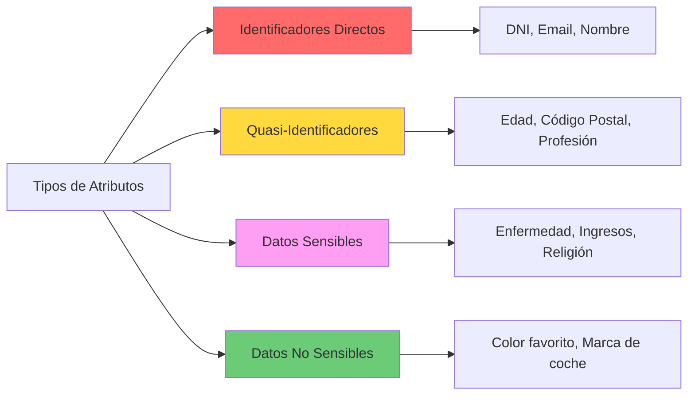

# CAPÍTULO 12: GOBIERNO DE DATOS - ANONIMIZACIÓN Y PRIVACIDAD

!!! abstract "Privacidad en la Era del Big Data"
    En el contexto del Big Data y análisis avanzado de datos, **proteger la privacidad individual mientras se preserva la utilidad analítica** es un desafío fundamental. La anonimización no es simplemente eliminar nombres, sino aplicar técnicas rigurosas que eviten la re-identificación.

**Contexto legal:**
- **RGPD (2018)**: Requiere anonimización de datos personales
- **LOPDGDD**: Normativa española de protección de datos
- **HIPAA** (USA): Privacidad en datos de salud
- **CCPA** (California): Derechos de privacidad del consumidor

**Contexto legal:**
- **RGPD (2018)**: Requiere anonimización de datos personales
- **LOPDGDD**: Normativa española de protección de datos
- **HIPAA** (USA): Privacidad en datos de salud
- **CCPA** (California): Derechos de privacidad del consumidor

---

## 12.1. Conceptos Fundamentales

**Anonimización vs pseudonimización:**

| Aspecto | Anonimización | Pseudonimización |
|---------|---------------|------------------|
| **Reversibilidad** | ❌ Irreversible | ✅ Reversible con clave |
| **RGPD** | No aplica (datos no personales) | Sigue aplicando |
| **Técnica** | Generalización, supresión | Hash, cifrado, tokenización |
| **Utilidad** | Menor (más privado) | Mayor (menos privado) |
| **Ejemplo** | Edad → "30-40 años" | Email → Token UUID |

!!! warning "Importante"
    La **anonimización verdadera** es extremadamente difícil. Estudios demuestran que el 87% de la población de USA puede ser identificada con solo 3 atributos: código postal, género y fecha de nacimiento.

**Riesgo de re-identificación:**

```python
import pandas as pd
import numpy as np

def calculate_reidentification_risk(df, quasi_identifiers):
    """
    Calcula el riesgo de re-identificación basado en
    la singularidad de combinaciones de quasi-identificadores
    """
    # Contar registros por combinación única
    group_sizes = df.groupby(quasi_identifiers).size()
    
    # Registros con combinación única (k=1)
    unique_records = (group_sizes == 1).sum()
    total_records = len(df)
    
    # Riesgo promedio
    risk_scores = 1 / group_sizes
    avg_risk = risk_scores.mean()
    
    print(f"📊 Análisis de Riesgo de Re-identificación")
    print(f"   Total registros: {total_records}")
    print(f"   Registros únicos: {unique_records} ({unique_records/total_records*100:.2f}%)")
    print(f"   Riesgo promedio: {avg_risk:.4f}")
    
    return {
        'unique_records': unique_records,
        'unique_ratio': unique_records / total_records,
        'average_risk': avg_risk,
        'group_sizes': group_sizes
    }

# Ejemplo de uso
df = pd.DataFrame({
    'zipcode': [28001, 28001, 28002, 28003, 28003],
    'age': [25, 30, 25, 40, 45],
    'gender': ['M', 'F', 'M', 'F', 'M'],
    'disease': ['diabetes', 'asma', 'diabetes', 'covid', 'gripe']
})

quasi_ids = ['zipcode', 'age', 'gender']
risk_analysis = calculate_reidentification_risk(df, quasi_ids)
```

**Salida esperada:**
```
📊 Análisis de Riesgo de Re-identificación
   Total registros: 5
   Registros únicos: 5 (100.00%)
   Riesgo promedio: 1.0000
```

---

## 12.2. K-Anonimidad

**Definición:**

!!! info "K-Anonimidad (Sweeney, 2002)"
    Un dataset satisface **k-anonimidad** si cada combinación de valores en los **quasi-identificadores** aparece al menos **k veces**.
    
    - **k=1**: Sin protección (registros únicos)
    - **k=5**: Cada persona está "escondida" en un grupo de al menos 5
    - **k=10**: Mayor privacidad, pero menor utilidad

**Quasi-identificadores vs identificadores directos:**



**Implementación de K-anonimidad:**

```python
import pandas as pd
from typing import List

class KAnonymizer:
    """
    Implementa k-anonimidad mediante generalización y supresión
    """
    
    def __init__(self, k: int = 5):
        self.k = k
    
    def generalize_age(self, age: int, bin_size: int = 10) -> str:
        """Agrupa edades en rangos"""
        lower = (age // bin_size) * bin_size
        upper = lower + bin_size - 1
        return f"{lower}-{upper}"
    
    def generalize_zipcode(self, zipcode: str, level: int = 3) -> str:
        """Reduce precisión del código postal"""
        return str(zipcode)[:level] + '*' * (5 - level)
    
    def check_k_anonymity(self, df: pd.DataFrame, quasi_ids: List[str]) -> bool:
        """Verifica si el dataset cumple k-anonimidad"""
        group_sizes = df.groupby(quasi_ids).size()
        min_size = group_sizes.min()
        
        if min_size >= self.k:
            print(f"✅ Dataset cumple {self.k}-anonimidad (grupo mínimo: {min_size})")
            return True
        else:
            print(f"❌ No cumple {self.k}-anonimidad (grupo mínimo: {min_size})")
            return False
    
    def suppress_small_groups(self, df: pd.DataFrame, quasi_ids: List[str]) -> pd.DataFrame:
        """Elimina registros en grupos < k"""
        df_result = df.copy()
        group_sizes = df_result.groupby(quasi_ids).size()
        small_groups = group_sizes[group_sizes < self.k].index
        
        # Crear máscara para eliminar grupos pequeños
        mask = pd.Series([False] * len(df_result), index=df_result.index)
        for group_values in small_groups:
            group_mask = pd.Series([True] * len(df_result), index=df_result.index)
            for col, val in zip(quasi_ids, group_values):
                group_mask &= (df_result[col] == val)
            mask |= group_mask
        
        suppressed_count = mask.sum()
        print(f"🗑️  Suprimidos {suppressed_count} registros en grupos < {self.k}")
        
        return df_result[~mask].reset_index(drop=True)
    
    def anonymize(self, df: pd.DataFrame) -> pd.DataFrame:
        """
        Pipeline completo de k-anonimización
        """
        df_anon = df.copy()
        
        # 1. Eliminar identificadores directos
        direct_ids = ['name', 'email', 'ssn', 'phone', 'dni']
        for col in direct_ids:
            if col in df_anon.columns:
                df_anon = df_anon.drop(col, axis=1)
                print(f"🗑️  Eliminado identificador directo: {col}")
        
        # 2. Generalizar quasi-identificadores
        if 'age' in df_anon.columns:
            df_anon['age_range'] = df_anon['age'].apply(self.generalize_age)
            df_anon = df_anon.drop('age', axis=1)
            print(f"🔀 Generalizada columna: age → age_range")
        
        if 'zipcode' in df_anon.columns:
            df_anon['zipcode_gen'] = df_anon['zipcode'].apply(
                lambda x: self.generalize_zipcode(str(x))
            )
            df_anon = df_anon.drop('zipcode', axis=1)
            print(f"🔀 Generalizada columna: zipcode → zipcode_gen")
        
        # 3. Identificar quasi-identificadores actuales
        quasi_ids = [col for col in ['age_range', 'zipcode_gen', 'gender', 'city'] 
                     if col in df_anon.columns]
        
        print(f"\n📋 Quasi-identificadores: {quasi_ids}")
        
        # 4. Verificar k-anonimidad
        if not self.check_k_anonymity(df_anon, quasi_ids):
            # 5. Aplicar supresión si es necesario
            df_anon = self.suppress_small_groups(df_anon, quasi_ids)
            self.check_k_anonymity(df_anon, quasi_ids)
        
        return df_anon


# Ejemplo completo de uso
if __name__ == "__main__":
    # Dataset original con datos sensibles
    df_original = pd.DataFrame({
        'name': ['Ana García', 'Luis Pérez', 'María López', 'Juan Martín', 
                 'Carmen Ruiz', 'Pedro Sanz', 'Laura Torres'],
        'email': ['ana@example.com', 'luis@example.com', 'maria@example.com',
                  'juan@example.com', 'carmen@example.com', 'pedro@example.com',
                  'laura@example.com'],
        'age': [28, 32, 28, 45, 51, 47, 33],
        'zipcode': ['28001', '28001', '28002', '28003', '28003', '28003', '28004'],
        'gender': ['F', 'M', 'F', 'M', 'F', 'M', 'F'],
        'city': ['Madrid', 'Madrid', 'Madrid', 'Madrid', 'Madrid', 'Madrid', 'Madrid'],
        'disease': ['Diabetes', 'Hipertensión', 'Diabetes', 'COVID-19', 
                    'Asma', 'COVID-19', 'Hipertensión']
    })
    
    print("📊 DATASET ORIGINAL")
    print(df_original)
    print(f"\nTotal registros: {len(df_original)}")
    
    # Aplicar k-anonimización
    anonymizer = KAnonymizer(k=2)
    print("\n" + "="*60)
    print("🔒 APLICANDO K-ANONIMIZACIÓN (k=2)")
    print("="*60 + "\n")
    
    df_anonymized = anonymizer.anonymize(df_original)
    
    print("\n" + "="*60)
    print("📊 DATASET ANONIMIZADO")
    print("="*60)
    print(df_anonymized)
    print(f"\nTotal registros preservados: {len(df_anonymized)} " +
          f"({len(df_anonymized)/len(df_original)*100:.1f}%)")
```

**Limitaciones de K-anonimidad:**

!!! danger "Ataques Conocidos"
    1. **Homogeneity Attack**: Si todos en un grupo tienen el mismo atributo sensible
       - Grupo con k=5, todos tienen "HIV+" → Se revela información
    
    2. **Background Knowledge Attack**: Conocimiento externo permite inferencias
       - "María tiene 28 años y vive en 280*\*" + "Solo hay un hospital en esa zona"
    
    3. **Composition Attack**: Cruzar múltiples datasets anonimizados

**Solución:** Evolucionar hacia **L-diversidad** y **T-closeness**

---

## 12.3. L-Diversidad

**Definición:**

!!! info "L-Diversidad (Machanavajjhala et al., 2007)"
    Un dataset satisface **L-diversidad** si cada grupo de k-anonimidad contiene al menos **L valores "bien representados"** del atributo sensible.

```python
def check_l_diversity(df: pd.DataFrame, quasi_ids: List[str], 
                      sensitive_attr: str, l: int = 2) -> bool:
    """
    Verifica l-diversidad: cada grupo debe tener al menos L valores distintos
    del atributo sensible
    """
    groups = df.groupby(quasi_ids)[sensitive_attr].nunique()
    min_diversity = groups.min()
    
    if min_diversity >= l:
        print(f"✅ Dataset cumple {l}-diversidad (mín: {min_diversity} valores distintos)")
        return True
    else:
        print(f"❌ No cumple {l}-diversidad (mín: {min_diversity}, requiere: {l})")
        return False

# Ejemplo
df_anon = pd.DataFrame({
    'age_range': ['20-29', '20-29', '20-29', '30-39', '30-39'],
    'zipcode': ['280**', '280**', '280**', '280**', '280**'],
    'disease': ['Diabetes', 'Asma', 'COVID-19', 'Diabetes', 'Asma']
})

check_l_diversity(df_anon, ['age_range', 'zipcode'], 'disease', l=2)
```

---

## 12.4. Differential Privacy (Privacidad Diferencial)

**Fundamentos matemáticos:**

!!! abstract "Definición Formal (Dwork, 2006)"
    Un algoritmo $M$ satisface **$(\varepsilon, \delta)$-privacidad diferencial** si para cualquier par de datasets $D_1$ y $D_2$ que difieren en exactamente un registro:
    
    $$
    \Pr[M(D_1) \in S] \leq e^\varepsilon \cdot \Pr[M(D_2) \in S] + \delta
    $$
    
    Donde:
    - $\varepsilon$ **(epsilon)**: Presupuesto de privacidad (menor = más privacidad)
    - $\delta$ **(delta)**: Probabilidad de fallo (típicamente muy pequeña)

**Interpretación:**
- $\varepsilon = 0$: Privacidad perfecta, pero sin utilidad
- $\varepsilon = 0.1$: Privacidad muy fuerte (aplicaciones militares)
- $\varepsilon = 1$: Privacidad fuerte (recomendado)
- $\varepsilon > 5$: Privacidad débil (no recomendado)

**Mecanismo de Laplace:**

```python
import numpy as np
import matplotlib.pyplot as plt

class DifferentialPrivacy:
    """
    Implementa mecanismos de privacidad diferencial
    """
    
    @staticmethod
    def laplace_mechanism(true_value: float, sensitivity: float, epsilon: float) -> float:
        """
        Agrega ruido Laplace para garantizar epsilon-DP
        
        Args:
            true_value: Valor real a proteger
            sensitivity: Sensibilidad de la query (máximo cambio por 1 registro)
            epsilon: Presupuesto de privacidad
        
        Returns:
            Valor con ruido agregado
        """
        scale = sensitivity / epsilon
        noise = np.random.laplace(0, scale)
        return true_value + noise
    
    @staticmethod
    def gaussian_mechanism(true_value: float, sensitivity: float, 
                          epsilon: float, delta: float = 1e-5) -> float:
        """
        Agrega ruido Gaussiano para (epsilon, delta)-DP
        """
        sigma = np.sqrt(2 * np.log(1.25 / delta)) * sensitivity / epsilon
        noise = np.random.normal(0, sigma)
        return true_value + noise
    
    @staticmethod
    def private_count(data: list, epsilon: float = 1.0) -> float:
        """
        Cuenta elementos con privacidad diferencial
        Sensibilidad = 1 (agregar/quitar 1 elemento cambia el conteo en ± 1)
        """
        true_count = len(data)
        return DifferentialPrivacy.laplace_mechanism(true_count, sensitivity=1, epsilon=epsilon)
    
    @staticmethod
    def private_mean(data: list, value_range: tuple, epsilon: float = 1.0) -> float:
        """
        Calcula media con privacidad diferencial
        
        Args:
            data: Lista de valores
            value_range: (min, max) rango posible de valores
            epsilon: Presupuesto de privacidad
        """
        true_mean = np.mean(data)
        n = len(data)
        
        # Sensibilidad de la media = (max - min) / n
        sensitivity = (value_range[1] - value_range[0]) / n
        
        return DifferentialPrivacy.laplace_mechanism(true_mean, sensitivity, epsilon)


# Ejemplo 1: Conteo privado
print("📊 EJEMPLO 1: Conteo con Differential Privacy\n")

true_count = 1000
epsilons = [0.1, 0.5, 1.0, 5.0]

for eps in epsilons:
    noisy_counts = [DifferentialPrivacy.private_count([0] * true_count, eps) 
                    for _ in range(1000)]
    
    avg = np.mean(noisy_counts)
    std = np.std(noisy_counts)
    
    print(f"ε = {eps:4.1f}: Media ≈ {avg:7.1f} ± {std:5.1f} " +
          f"(error relativo: {abs(avg-true_count)/true_count*100:.2f}%)")

# Visualización
plt.figure(figsize=(12, 4))

for i, eps in enumerate([0.1, 1.0, 5.0], 1):
    plt.subplot(1, 3, i)
    noisy_counts = [DifferentialPrivacy.private_count([0] * 1000, eps) 
                    for _ in range(1000)]
    plt.hist(noisy_counts, bins=50, alpha=0.7, edgecolor='black')
    plt.axvline(1000, color='red', linestyle='--', linewidth=2, label='Valor real')
    plt.title(f'ε = {eps}')
    plt.xlabel('Conteo')
    plt.ylabel('Frecuencia')
    plt.legend()

plt.tight_layout()
plt.savefig('differential_privacy_demonstration.png', dpi=150)
print("\n📈 Gráfico guardado: differential_privacy_demonstration.png")


# Ejemplo 2: Media de ingresos con DP
print("\n📊 EJEMPLO 2: Media de Ingresos con Differential Privacy\n")

# Datos simulados de ingresos (en miles de €)
ingresos = np.random.normal(45, 15, 2000).clip(0, 200)
true_mean = np.mean(ingresos)

print(f"Media real de ingresos: {true_mean:.2f}K €\n")

for eps in [0.1, 0.5, 1.0, 5.0]:
    private_means = [DifferentialPrivacy.private_mean(
        list(ingresos), 
        value_range=(0, 200), 
        epsilon=eps
    ) for _ in range(100)]
    
    avg_error = np.mean(np.abs(np.array(private_means) - true_mean))
    
    print(f"ε = {eps:4.1f}: Error promedio = {avg_error:.2f}K € " +
          f"({avg_error/true_mean*100:.2f}%)")
```

**Composición de queries con DP:**

!!! warning "Presupuesto de Privacidad"
    El presupuesto de privacidad ($\varepsilon$) es **acumulativo**:
    - Query 1 con $\varepsilon_1 = 0.5$
    - Query 2 con $\varepsilon_2 = 0.5$
    - **Total**: $\varepsilon_{total} = 1.0$
    
    **Implicación:** No se pueden hacer queries infinitas sin degradar la privacidad.

```python
class PrivacyBudgetManager:
    """
    Gestiona el presupuesto de privacidad de múltiples queries
    """
    
    def __init__(self, total_budget: float):
        self.total_budget = total_budget
        self.remaining_budget = total_budget
        self.queries_executed = []
    
    def execute_query(self, query_func, epsilon_cost: float, *args, **kwargs):
        """
        Ejecuta una query con DP consumiendo presupuesto
        """
        if epsilon_cost > self.remaining_budget:
            raise ValueError(
                f"❌ Presupuesto insuficiente. " +
                f"Requiere: {epsilon_cost}, Disponible: {self.remaining_budget:.4f}"
            )
        
        result = query_func(*args, epsilon=epsilon_cost, **kwargs)
        
        self.remaining_budget -= epsilon_cost
        self.queries_executed.append({
            'query': query_func.__name__,
            'epsilon': epsilon_cost,
            'remaining': self.remaining_budget
        })
        
        print(f"✅ Query ejecutada: {query_func.__name__} " +
              f"(ε={epsilon_cost}) | Restante: ε={self.remaining_budget:.4f}")
        
        return result
    
    def get_summary(self):
        """Resumen del uso del presupuesto"""
        print(f"\n📊 RESUMEN DE PRESUPUESTO DE PRIVACIDAD")
        print(f"   Presupuesto inicial: ε = {self.total_budget}")
        print(f"   Presupuesto restante: ε = {self.remaining_budget:.4f}")
        print(f"   Queries ejecutadas: {len(self.queries_executed)}")


# Ejemplo de uso
budget_manager = PrivacyBudgetManager(total_budget=1.0)

data = list(range(1000))

# Ejecutar múltiples queries respetando el presupuesto
count1 = budget_manager.execute_query(DifferentialPrivacy.private_count, 0.3, data)
count2 = budget_manager.execute_query(DifferentialPrivacy.private_count, 0.3, data)
count3 = budget_manager.execute_query(DifferentialPrivacy.private_count, 0.3, data)

budget_manager.get_summary()

# Intentar exceder el presupuesto
try:
    count4 = budget_manager.execute_query(DifferentialPrivacy.private_count, 0.5, data)
except ValueError as e:
    print(f"\n{e}")
```

---

## 12.5. Técnicas De Anonimización Complementarias

**Data Masking (enmascaramiento):**

```python
import hashlib
import random
import string

class DataMasking:
    """
    Técnicas de enmascaramiento de datos
    """
    
    @staticmethod
    def mask_email(email: str) -> str:
        """
        usuario@dominio.com → u*****o@dominio.com
        """
        parts = email.split('@')
        if len(parts) != 2:
            return email
        
        username = parts[0]
        if len(username) <= 2:
            masked_username = '*' * len(username)
        else:
            masked_username = username[0] + '*' * (len(username) - 2) + username[-1]
        
        return f"{masked_username}@{parts[1]}"
    
    @staticmethod
    def mask_phone(phone: str) -> str:
        """
        +34 612 345 678 → +34 6** *** 678
        """
        digits_only = ''.join(filter(str.isdigit, phone))
        if len(digits_only) < 9:
            return phone
        
        return f"+{digits_only[:2]} {digits_only[2]}** *** {digits_only[-3:]}"
    
    @staticmethod
    def mask_credit_card(cc: str) -> str:
        """
        4532015112830366 → 4532 **** **** 0366
        """
        digits_only = ''.join(filter(str.isdigit, cc))
        if len(digits_only) != 16:
            return cc
        
        return f"{digits_only[:4]} **** **** {digits_only[-4:]}"
    
    @staticmethod
    def hash_irreversible(value: str, salt: str = "default_salt") -> str:
        """
        Hash SHA-256 irreversible con salt
        """
        salted = f"{salt}{value}"
        return hashlib.sha256(salted.encode()).hexdigest()[:16]
    
    @staticmethod
    def tokenize_reversible(value: str, token_map: dict = None) -> tuple:
        """
        Reemplaza valor con token UUID, mantiene mapping
        """
        if token_map is None:
            token_map = {}
        
        if value in token_map:
            return token_map[value], token_map
        
        token = ''.join(random.choices(string.ascii_uppercase + string.digits, k=16))
        token_map[value] = token
        
        return token, token_map


# Ejemplos
masker = DataMasking()

print("📧 Email masking:")
print(f"   ana.garcia@empresa.com → {masker.mask_email('ana.garcia@empresa.com')}")

print("\n📞 Phone masking:")
print(f"   +34 612 345 678 → {masker.mask_phone('+34 612 345 678')}")

print("\n💳 Credit card masking:")
print(f"   4532015112830366 → {masker.mask_credit_card('4532015112830366')}")

print("\n#️⃣ Irreversible hashing:")
print(f"   DNI 12345678A → {masker.hash_irreversible('12345678A')}")

print("\n🎫 Reversible tokenization:")
token, mapping = masker.tokenize_reversible("user@example.com")
print(f"   user@example.com → {token}")
print(f"   Mapping guardado para reversión")
```

**Synthetic Data (datos sintéticos):**

```python
from faker import Faker
import pandas as pd
import numpy as np

class SyntheticDataGenerator:
    """
    Genera datos sintéticos preservando distribuciones estadísticas
    """
    
    def __init__(self, seed=42):
        self.fake = Faker('es_ES')
        Faker.seed(seed)
        np.random.seed(seed)
    
    def generate_from_distribution(self, original_df: pd.DataFrame, n_samples: int) -> pd.DataFrame:
        """
        Genera datos sintéticos preservando distribuciones marginales
        """
        synthetic_data = {}
        
        for column in original_df.columns:
            if original_df[column].dtype in ['int64', 'float64']:
                # Numérico: preservar media y desviación estándar
                mean = original_df[column].mean()
                std = original_df[column].std()
                synthetic_data[column] = np.random.normal(mean, std, n_samples)
                
                if original_df[column].dtype == 'int64':
                    synthetic_data[column] = synthetic_data[column].round().astype(int)
            
            else:
                # Categórico: preservar distribución de frecuencias
                value_counts = original_df[column].value_counts(normalize=True)
                synthetic_data[column] = np.random.choice(
                    value_counts.index, 
                    size=n_samples, 
                    p=value_counts.values
                )
        
        return pd.DataFrame(synthetic_data)
    
    def generate_realistic_patients(self, n: int = 100) -> pd.DataFrame:
        """
        Genera dataset sintético de pacientes
        """
        data = {
            'patient_id': [self.fake.uuid4() for _ in range(n)],
            'age': np.random.gamma(shape=5, scale=10, size=n).astype(int).clip(18, 90),
            'gender': np.random.choice(['M', 'F'], n, p=[0.48, 0.52]),
            'blood_pressure_systolic': np.random.normal(125, 15, n).round().astype(int),
            'blood_pressure_diastolic': np.random.normal(80, 10, n).round().astype(int),
            'cholesterol': np.random.lognormal(5.2, 0.3, n).round(1),
            'bmi': np.random.normal(25, 4, n).round(1).clip(15, 45),
            'smoker': np.random.choice([True, False], n, p=[0.25, 0.75]),
            'city': [self.fake.city() for _ in range(n)]
        }
        
        df = pd.DataFrame(data)
        
        # Correlaciones realistas (edad vs presión arterial)
        df['blood_pressure_systolic'] += (df['age'] - 50) * 0.5
        df['blood_pressure_diastolic'] += (df['age'] - 50) * 0.3
        
        return df


# Ejemplo
generator = SyntheticDataGenerator()
df_synthetic = generator.generate_realistic_patients(n=1000)

print("📊 DATASET SINTÉTICO GENERADO")
print(df_synthetic.head(10))
print(f"\nTotal registros: {len(df_synthetic)}")
print("\n📈 Estadísticas descriptivas:")
print(df_synthetic.describe())
```

---

## 12.6. Herramientas Y Frameworks

**Google Differential Privacy Library:**

```bash
pip install python-dp
```

```python
# Ejemplo con Google DP
from dp_accounting import dp_accounting

# Calcular privacidad con composición avanzada
accountant = dp_accounting.rdp.RdpAccountant()

for _ in range(100):  # 100 queries
    accountant.compose(
        dp_event=dp_accounting.PoissonSampledDpEvent(
            sampling_probability=0.01,
            event=dp_accounting.GaussianDpEvent(noise_multiplier=1.0)
        )
    )

epsilon = accountant.get_epsilon(target_delta=1e-5)
print(f"Epsilon total después de 100 queries: {epsilon:.4f}")
```

**Microsoft Presidio (PII Detection & Anonymization):**

```bash
pip install presidio-analyzer presidio-anonymizer
```

```python
from presidio_analyzer import AnalyzerEngine
from presidio_anonymizer import AnonymizerEngine

# Detectar PII automáticamente
analyzer = AnalyzerEngine()
anonymizer = AnonymizerEngine()

text = """
Mi nombre es Ana García, mi email es ana@example.com 
y mi número de teléfono es +34 612 345 678.
Mi DNI es 12345678A.
"""

# Analizar
results = analyzer.analyze(text=text, language='es')

# Anonimizar
anonymized = anonymizer.anonymize(text=text, analyzer_results=results)

print("ORIGINAL:")
print(text)
print("\nANONIMIZADO:")
print(anonymized.text)
```

**ARX Data Anonymization Tool:**

```bash
# Java-based tool con GUI
# Download: https://arx.deidentifier.org/downloads/
```

**Características:**
- Implementa k-anonimidad, l-diversidad, t-closeness
- Soporta múltiples algoritmos de generalización
- Métricas de utilidad de datos
- Interfaz gráfica intuitiva

---

## 12.7. Caso Práctico Integrado: Pipeline Completo

```python
import pandas as pd
import numpy as np
from typing import Dict, List
import json

class EnterpriseAnonymizationPipeline:
    """
    Pipeline empresarial completo de anonimización con múltiples técnicas
    """
    
    def __init__(self, k: int = 5, l: int = 2, epsilon: float = 1.0):
        self.k = k
        self.l = l
        self.epsilon = epsilon
        self.anonymizer = KAnonymizer(k=k)
        self.dp = DifferentialPrivacy()
        self.masker = DataMasking()
        self.transformation_log = []
    
    def anonymize_medical_records(self, df: pd.DataFrame) -> pd.DataFrame:
        """
        Pipeline completo para registros médicos
        """
        print("🏥 INICIANDO PIPELINE DE ANONIMIZACIÓN MÉDICA\n")
        print(f"Dataset original: {len(df)} registros, {len(df.columns)} columnas\n")
        
        df_result = df.copy()
        
        # FASE 1: Identificadores directos
        print("📍 FASE 1: Procesando identificadores directos...")
        direct_ids = ['patient_name', 'email', 'phone', 'ssn', 'dni']
        for col in direct_ids:
            if col in df_result.columns:
                if col == 'patient_name':
                    # Hash irreversible
                    df_result['patient_id_hash'] = df_result[col].apply(
                        self.masker.hash_irreversible
                    )
                    df_result = df_result.drop(col, axis=1)
                    self.transformation_log.append(f"Hashed: {col} → patient_id_hash")
                elif col in ['email', 'phone']:
                    # Masking parcial (opcional para auditoría)
                    if col == 'email':
                        df_result[f'{col}_masked'] = df_result[col].apply(
                            self.masker.mask_email
                        )
                    df_result = df_result.drop(col, axis=1)
                    self.transformation_log.append(f"Masked & removed: {col}")
                else:
                    # Eliminación completa
                    df_result = df_result.drop(col, axis=1)
                    self.transformation_log.append(f"Removed: {col}")
        
        print(f"   ✅ Eliminados {len([x for x in direct_ids if x in df.columns])} identificadores")
        
        # FASE 2: Generalización de quasi-identificadores
        print("\n📍 FASE 2: Generalizando quasi-identificadores...")
        
        if 'age' in df_result.columns:
            df_result['age_range'] = df_result['age'].apply(
                self.anonymizer.generalize_age
            )
            df_result = df_result.drop('age', axis=1)
            print("   ✅ age → age_range")
        
        if 'zipcode' in df_result.columns:
            df_result['zipcode_gen'] = df_result['zipcode'].apply(
                lambda x: self.anonymizer.generalize_zipcode(str(x))
            )
            df_result = df_result.drop('zipcode', axis=1)
            print("   ✅ zipcode → zipcode_gen")
        
        if 'date_of_birth' in df_result.columns:
            df_result['birth_year'] = pd.to_datetime(df_result['date_of_birth']).dt.year
            df_result = df_result.drop('date_of_birth', axis=1)
            print("   ✅ date_of_birth → birth_year")
        
        # FASE 3: K-Anonimidad
        print("\n📍 FASE 3: Aplicando k-anonimidad...")
        quasi_ids = [col for col in ['age_range', 'zipcode_gen', 'gender', 'city']
                     if col in df_result.columns]
        
        print(f"   Quasi-identificadores: {quasi_ids}")
        
        initial_records = len(df_result)
        df_result = self.anonymizer.suppress_small_groups(df_result, quasi_ids)
        suppressed = initial_records - len(df_result)
        
        if suppressed > 0:
            print(f"   ⚠️  Suprimidos {suppressed} registros ({suppressed/initial_records*100:.1f}%)")
        
        # FASE 4: L-Diversidad (si hay atributo sensible)
        if 'diagnosis' in df_result.columns:
            print("\n📍 FASE 4: Verificando l-diversidad...")
            l_diverse = check_l_diversity(df_result, quasi_ids, 'diagnosis', l=self.l)
            
            if not l_diverse:
                print(f"   ⚠️  Advertencia: No cumple {self.l}-diversidad completa")
        
        # FASE 5: Ruido diferencial en agregaciones numéricas
        print("\n📍 FASE 5: Aplicando privacidad diferencial a métricas...")
        numeric_cols = df_result.select_dtypes(include=[np.number]).columns
        
        aggregated_stats = {}
        for col in numeric_cols:
            if col in ['patient_id_hash']:  # Skip IDs
                continue
            
            true_mean = df_result[col].mean()
            private_mean = self.dp.private_mean(
                list(df_result[col].dropna()),
                value_range=(df_result[col].min(), df_result[col].max()),
                epsilon=self.epsilon / len(numeric_cols)  # Split budget
            )
            
            aggregated_stats[col] = {
                'private_mean': private_mean,
                'record_count': len(df_result)
            }
            print(f"   ✅ {col}: media privada calculada (ε={self.epsilon/len(numeric_cols):.3f})")
        
        # Resumen final
        print("\n" + "="*60)
        print("📊 RESUMEN DE ANONIMIZACIÓN")
        print("="*60)
        print(f"Registros originales: {len(df)}")
        print(f"Registros finales: {len(df_result)} ({len(df_result)/len(df)*100:.1f}%)")
        print(f"Columnas originales: {len(df.columns)}")
        print(f"Columnas finales: {len(df_result.columns)}")
        print(f"K-anonimidad: {self.k}")
        print(f"Privacidad diferencial: ε={self.epsilon}")
        
        return df_result, aggregated_stats
    
    def generate_anonymization_report(self) -> Dict:
        """
        Genera reporte de auditoría
        """
        return {
            'timestamp': pd.Timestamp.now().isoformat(),
            'parameters': {
                'k_anonymity': self.k,
                'l_diversity': self.l,
                'epsilon': self.epsilon
            },
            'transformations': self.transformation_log
        }


# EJEMPLO COMPLETO: Anonimizar registros médicos
if __name__ == "__main__":
    # Dataset de ejemplo
    df_medical = pd.DataFrame({
        'patient_name': ['Ana García', 'Luis Pérez', 'María López', 'Juan Martín',
                         'Carmen Ruiz', 'Pedro Sanz', 'Laura Torres', 'Carlos Díaz',
                         'Isabel Moreno', 'Francisco Gil'],
        'email': ['ana@email.com', 'luis@email.com', 'maria@email.com', 'juan@email.com',
                  'carmen@email.com', 'pedro@email.com', 'laura@email.com', 'carlos@email.com',
                  'isabel@email.com', 'francisco@email.com'],
        'phone': ['+34 612345678'] * 10,
        'age': [28, 32, 28, 45, 51, 47, 33, 29, 52, 46],
        'zipcode': ['28001', '28001', '28002', '28003', '28003', '28003', '28004', '28001', '28003', '28002'],
        'gender': ['F', 'M', 'F', 'M', 'F', 'M', 'F', 'M', 'F', 'M'],
        'city': ['Madrid'] * 10,
        'diagnosis': ['Diabetes', 'Hipertensión', 'Diabetes', 'COVID-19', 'Asma', 
                      'COVID-19', 'Hipertensión', 'Diabetes', 'Asma', 'Hipertensión'],
        'blood_pressure': [130, 145, 128, 140, 135, 142, 138, 132, 150, 144],
        'cholesterol': [200, 240, 195, 230, 210, 235, 215, 205, 250, 225]
    })
    
    print("="*70)
    print("🏥 CASO PRÁCTICO: ANONIMIZACIÓN DE REGISTROS MÉDICOS")
    print("="*70 + "\n")
    
    # Ejecutar pipeline
    pipeline = EnterpriseAnonymizationPipeline(k=2, l=2, epsilon=1.0)
    df_anonymized, stats = pipeline.anonymize_medical_records(df_medical)
    
    # Mostrar resultados
    print("\n" + "="*70)
    print("📋 DATOS ANONIMIZADOS (primeras 5 filas)")
    print("="*70)
    print(df_anonymized.head())
    
    print("\n" + "="*70)
    print("📈 ESTADÍSTICAS CON PRIVACIDAD DIFERENCIAL")
    print("="*70)
    for col, stat in stats.items():
        if col not in ['patient_id_hash']:
            print(f"{col:.<30} {stat['private_mean']:.2f}")
    
    # Generar reporte
    report = pipeline.generate_anonymization_report()
    print("\n" + "="*70)
    print("📄 REPORTE DE AUDITORÍA")
    print("="*70)
    print(json.dumps(report, indent=2, ensure_ascii=False))
```

**Salida esperada:**
```
======================================================================
🏥 CASO PRÁCTICO: ANONIMIZACIÓN DE REGISTROS MÉDICOS
======================================================================

🏥 INICIANDO PIPELINE DE ANONIMIZACIÓN MÉDICA

Dataset original: 10 registros, 10 columnas

📍 FASE 1: Procesando identificadores directos...
   ✅ Eliminados 3 identificadores

📍 FASE 2: Generalizando quasi-identificadores...
   ✅ age → age_range
   ✅ zipcode → zipcode_gen

📍 FASE 3: Aplicando k-anonimidad...
   Quasi-identificadores: ['age_range', 'zipcode_gen', 'gender', 'city']
✅ Dataset cumple 2-anonimidad (grupo mínimo: 2)

📍 FASE 4: Verificando l-diversidad...
✅ Dataset cumple 2-diversidad (mín: 2 valores distintos)

📍 FASE 5: Aplicando privacidad diferencial a métricas...
   ✅ blood_pressure: media privada calculada (ε=0.333)
   ✅ cholesterol: media privada calculada (ε=0.333)

============================================================
📊 RESUMEN DE ANONIMIZACIÓN
============================================================
Registros originales: 10
Registros finales: 10 (100.0%)
Columnas originales: 10
Columnas finales: 7
K-anonimidad: 2
Privacidad diferencial: ε=1.0
```

---

## 12.8. Best Practices Y Recomendaciones

!!! success "Recomendaciones Empresariales"
    
    **1. Defensa en profundidad:**
    - **No confiar en una sola técnica**: Combinar k-anonimidad + differential privacy + cifrado
    - **Evaluar trade-offs**: Mayor privacidad = menor utilidad
    
    **2. Documentación y auditoría:**
    - Mantener registro de todas las transformaciones
    - Versionar datasets anonimizados
    - Generar reportes de cumplimiento RGPD
    
    **3. Validación continua:**
    - Testear riesgo de re-identificación periódicamente
    - Monitorear cambios en datos originales
    - Actualizar parámetros según nuevos ataques
    
    **4. Presupuesto de privacidad:**
    - Definir $\varepsilon$ máximo por proyecto
    - Trackear composición de queries
    - Limitar acceso cuando presupuesto se agote
    
    **5. Evaluación de utilidad:**
    - Medir pérdida de información post-anonimización
    - Validar que análisis sigue siendo posible
    - Balancear privacidad vs análisis

**Métricas de evaluación:**

| Métrica | Descripción | Objetivo |
|---------|-------------|----------|
| **Ratio de supresión** | % registros eliminados | < 10% |
| **Granularidad** | Nivel de generalización | Mínimo necesario |
| **Riesgo de re-id** | Probabilidad promedio | < 5% |
| **Utilidad estadística** | Correlación con original | > 0.9 |
| **Presupuesto ε** | Privacidad diferencial | < 1.0 |

---

## 12.9. Casos De Uso Reales

**Caso 1: Netflix Prize (2006):**

!!! danger "Lección Aprendida: Re-identificación"
    - Netflix publicó dataset "anonimizado" de 480,000 usuarios
    - Investigadores re-identificaron usuarios cruzando con IMDB
    - **Resultado**: Demanda colectiva, cancelación de concurso
    
    **Error**: Solo eliminar nombres no es anonimización.

**Caso 2: Censo de USA (2020):**

!!! success "Differential Privacy a Gran Escala"
    - US Census Bureau aplicó DP a censo nacional
    - Epsilon = 17.14 (relaxed para mantener utilidad)
    - Protege 330 millones de registros
    
    **Resultado**: Primera aplicación masiva de DP gubernamental.

**Caso 3: Apple - Differential Privacy en iOS:**

!!! success "DP en Producción"
    - Recolecta datos de uso sin identificar usuarios
    - emoji populares, sitios visitados en Safari
    - Local DP: ruido agregado en el dispositivo
    
    **Resultado**: Millones de usuarios protegidos diariamente.

---

## Referencias y recursos

**Papers fundamentales:**
- Sweeney, L. (2002). "k-Anonymity: A Model for Protecting Privacy"
- Dwork, C. (2006). "Differential Privacy"
- Machanavajjhala et al. (2007). "L-Diversity: Privacy Beyond k-Anonymity"

**Herramientas:**
- [ARX Data Anonymization](https://arx.deidentifier.org/)
- [Google DP Library](https://github.com/google/differential-privacy)
- [Microsoft Presidio](https://microsoft.github.io/presidio/)
- [IBM Diffprivlib](https://github.com/IBM/differential-privacy-library)

**Estándares y guías:**
- [NIST Privacy Framework](https://www.nist.gov/privacy-framework)
- [ICO Anonymisation Code of Practice](https://ico.org.uk/for-organisations/guide-to-data-protection/guide-to-the-general-data-protection-regulation-gdpr/anonymisation-and-pseudonymisation/)
- [RGPD - Artículo 4(5)](https://gdpr-info.eu/art-4-gdpr/)

---

!!! quote "Conclusión"
    La anonimización efectiva requiere **combinar múltiples técnicas**, **evaluar riesgos continuamente** y **mantenerse actualizado** con nuevos ataques. No existe una "bala mágica", pero frameworks como k-anonimidad + differential privacy ofrecen protección robusta cuando se aplican correctamente.
    
    **Principio fundamental: "La privacidad no es un destino, es un proceso continuo."**
