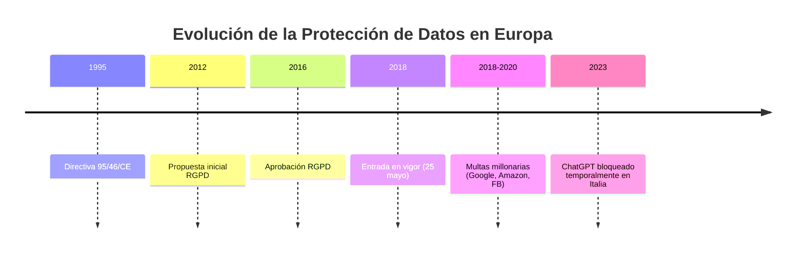

# CAPÍTULO 12: Gobierno de datos - Protección de datos (RGPD)

!!! abstract "Marco Legal Europeo"
    El **Reglamento General de Protección de Datos (RGPD)** o **General Data Protection Regulation (GDPR)** entró en vigor el **25 de mayo de 2018**, estableciendo el estándar más riguroso del mundo para la protección de datos personales.
    
    **Alcance global**: Aplica a cualquier organización que procese datos de ciudadanos de la UE, independientemente de su ubicación geográfica.

**Contexto histórico:**



---

## 12.1. Conceptos fundamentales del RGPD

**Definiciones clave:**

| Término | Definición | Ejemplo |
|---------|------------|---------|
| **Dato Personal** | Información sobre persona física identificada o identificable | Nombre, email, IP, cookie ID |
| **Tratamiento** | Cualquier operación sobre datos | Recopilación, almacenamiento, análisis, borrado |
| **Responsable del Tratamiento** | Entidad que determina finalidad y medios | Empresa que gestiona BBDD de clientes |
| **Encargado del Tratamiento** | Entidad que trata datos por cuenta del responsable | Proveedor cloud (AWS, Azure) |
| **Interesado** | Persona física titular de los datos | Usuario, cliente, empleado |
| **Violación de Seguridad** | Brecha de seguridad que compromete datos | Fuga de datos, ransomware, acceso no autorizado |

**Datos personales: categorías:**

```python
class TiposDatoPersonal:
    """
    Clasificación de datos personales según RGPD
    """
    
    # Datos básicos (Art. 4)
    DATOS_IDENTIFICATIVOS = [
        'nombre', 'apellidos', 'dni', 'pasaporte', 
        'email', 'teléfono', 'dirección', 'ip'
    ]
    
    # Categorías especiales (Art. 9) - Sensibles
    DATOS_SENSIBLES = [
        'origen_racial_etnico',
        'opiniones_politicas',
        'convicciones_religiosas',
        'afiliacion_sindical',
        'datos_geneticos',
        'datos_biometricos',
        'datos_salud',
        'vida_sexual',
        'orientacion_sexual'
    ]
    
    # Datos penales (Art. 10)
    DATOS_PENALES = [
        'infracciones_penales',
        'condenas',
        'medidas_seguridad'
    ]
    
    @staticmethod
    def clasificar_dato(nombre_campo: str, valor) -> str:
        """
        Clasifica un dato según categoría RGPD
        """
        nombre_lower = nombre_field.lower()
        
        if any(sensible in nombre_lower for sensible in [
            'salud', 'enfermedad', 'medico', 'biometric', 'genetic'
        ]):
            return "SENSIBLE (Art. 9) - Requiere consentimiento explícito"
        
        elif any(penal in nombre_lower for penal in [
            'condena', 'delito', 'infraccion'
        ]):
            return "PENAL (Art. 10) - Autoridad competente requerida"
        
        elif any(basico in nombre_lower for basico in [
            'nombre', 'email', 'telefono', 'direccion', 'dni'
        ]):
            return "IDENTIFICATIVO (Art. 4) - Protección estándar"
        
        else:
            return "NO CLASIFICADO - Revisar manualmente"


# Ejemplo de uso
print(TiposDatoPersonal.clasificar_dato('email_usuario', 'ana@example.com'))
# Output: IDENTIFICATIVO (Art. 4) - Protección estándar

print(TiposDatoPersonal.clasificar_dato('historial_medico', '...'))
# Output: SENSIBLE (Art. 9) - Requiere consentimiento explícito
```

---

## 12.2. Principios fundamentales (Art. 5)

**Los 7 principios del RGPD:**

!!! info "Principios Vinculantes"
    El incumplimiento de estos principios puede resultar en multas de hasta **20 millones de € o 4% del volumen de negocio anual global**.

#### 1. **Licitud, Lealtad y Transparencia**

El tratamiento debe ser:
- **Lícito**: Basado en una de las 6 bases legales (Art. 6)
- **Leal**: Sin engaño al interesado
- **Transparente**: Información clara sobre el tratamiento

```python
class BaseJuridicaTratamiento:
    """
    Las 6 bases legales para el tratamiento de datos (Art. 6)
    """
    
    CONSENTIMIENTO = "a) Consentimiento explícito del interesado"
    CONTRATO = "b) Necesario para ejecutar un contrato"
    OBLIGACION_LEGAL = "c) Cumplir obligación legal"
    INTERES_VITAL = "d) Proteger intereses vitales (vida)"
    INTERES_PUBLICO = "e) Misión de interés público"
    INTERES_LEGITIMO = "f) Interés legítimo del responsable"
    
    @staticmethod
    def validar_consentimiento(consentimiento: dict) -> bool:
        """
        Valida que el consentimiento cumpla requisitos RGPD
        """
        requisitos = {
            'informado': False,  # Info clara antes de consentir
            'especifico': False,  # Finalidad concreta
            'inequivoco': False,  # Acción afirmativa clara
            'revocable': False    # Fácil retirar consentimiento
        }
        
        # Validaciones
        if 'texto_informativo' in consentimiento and len(consentimiento['texto_informativo']) > 50:
            requisitos['informado'] = True
        
        if 'finalidad' in consentimiento and consentimiento['finalidad']:
            requisitos['especifico'] = True
        
        if consentimiento.get('accion_afirmativa') == True:  # NOT pre-checked box
            requisitos['inequivoco'] = True
        
        if 'mecanismo_revocacion' in consentimiento:
            requisitos['revocable'] = True
        
        cumplimiento = all(requisitos.values())
        
        if not cumplimiento:
            print("❌ Consentimiento NO VÁLIDO según RGPD:")
            for req, cumple in requisitos.items():
                print(f"   {req}: {'✅' if cumple else '❌'}")
        
        return cumplimiento


# Ejemplo: Validar consentimiento
consentimiento_usuario = {
    'texto_informativo': 'Al aceptar, autorizas el uso de tus datos para...',
    'finalidad': 'Marketing y análisis estadístico',
    'accion_afirmativa': True,  # Usuario hizo click activo
    'mecanismo_revocacion': 'Enlace en cada email + panel de usuario'
}

BaseJuridicaTratamiento.validar_consentimiento(consentimiento_usuario)
```

#### 2. **Limitación de la Finalidad**

Los datos solo pueden usarse para los fines comunicados inicialmente.

```python
class GestorFinalidades:
    """
    Controla que los datos solo se usen para finalidades autorizadas
    """
    
    def __init__(self):
        self.finalidades_autorizadas = set()
        self.tratamientos_realizados = []
    
    def agregar_finalidad(self, finalidad: str, consentimiento: bool):
        """
        Registra nueva finalidad autorizada
        """
        if consentimiento:
            self.finalidades_autorizadas.add(finalidad)
            print(f"✅ Finalidad autorizada: {finalidad}")
        else:
            print(f"❌ Finalidad NO autorizada: {finalidad}")
    
    def validar_tratamiento(self, tratamiento: str, finalidad: str) -> bool:
        """
        Valida si un tratamiento está permitido
        """
        if finalidad in self.finalidades_autorizadas:
            self.tratamientos_realizados.append({
                'tratamiento': tratamiento,
                'finalidad': finalidad,
                'timestamp': pd.Timestamp.now()
            })
            print(f"✅ Tratamiento permitido: {tratamiento} (finalidad: {finalidad})")
            return True
        else:
            print(f"❌ VIOLACIÓN RGPD: Tratamiento '{tratamiento}' no autorizado para finalidad '{finalidad}'")
            return False


# Ejemplo
gestor = GestorFinalidades()

# Usuario consiente marketing pero NO compartir con terceros
gestor.agregar_finalidad('envio_newsletter', consentimiento=True)
gestor.agregar_finalidad('compartir_con_socios', consentimiento=False)

# Intentar realizar tratamientos
gestor.validar_tratamiento('Enviar email promocional', 'envio_newsletter')  # ✅ OK
gestor.validar_tratamiento('Vender datos a broker', 'compartir_con_socios')  # ❌ VIOLACIÓN
```

#### 3. **Minimización de Datos**

Solo recoger los datos **estrictamente necesarios** para la finalidad.

```python
def minimizar_datos_formulario(datos_completos: dict, finalidad: str) -> dict:
    """
    Aplica minimización según finalidad
    """
    # Mapeo: finalidad → campos necesarios
    campos_necesarios = {
        'envio_producto': ['nombre', 'direccion', 'telefono', 'email'],
        'newsletter': ['email'],
        'facturacion': ['nombre', 'dni', 'direccion', 'email'],
        'soporte_tecnico': ['email', 'telefono']
    }
    
    if finalidad not in campos_necesarios:
        raise ValueError(f"Finalidad '{finalidad}' no reconocida")
    
    campos_permitidos = campos_necesarios[finalidad]
    datos_minimizados = {k: v for k, v in datos_completos.items() 
                         if k in campos_permitidos}
    
    campos_eliminados = set(datos_completos.keys()) - set(campos_permitidos)
    
    print(f"📊 Minimización para finalidad '{finalidad}':")
    print(f"   Datos originales: {len(datos_completos)} campos")
    print(f"   Datos minimizados: {len(datos_minimizados)} campos")
    print(f"   Eliminados: {campos_eliminados}")
    
    return datos_minimizados


# Ejemplo
datos_usuario = {
    'nombre': 'Ana García',
    'dni': '12345678A',
    'email': 'ana@example.com',
    'telefono': '+34 612345678',
    'direccion': 'Calle Mayor 1, Madrid',
    'fecha_nacimiento': '1990-05-15',  # NO necesario
    'estado_civil': 'Soltera',  # NO necesario
    'hobby': 'Lectura'  # NO necesario
}

datos_min = minimizar_datos_formulario(datos_usuario, 'newsletter')
print(f"\n✅ Datos almacenados: {datos_min}")
```

#### 4. **Exactitud**

Los datos deben ser exactos y actualizados.

```python
import pandas as pd
from datetime import datetime, timedelta

class ValidadorCalidadDatos:
    """
    Valida exactitud de datos personales
    """
    
    @staticmethod
    def validar_email(email: str) -> bool:
        import re
        pattern = r'^[a-zA-Z0-9._%+-]+@[a-zA-Z0-9.-]+\.[a-zA-Z]{2,}$'
        return re.match(pattern, email) is not None
    
    @staticmethod
    def validar_dni_espanol(dni: str) -> bool:
        """Valida DNI español con letra correcta"""
        if len(dni) != 9:
            return False
        
        letras = 'TRWAGMYFPDXBNJZSQVHLCKE'
        numero = dni[:8]
        letra = dni[8].upper()
        
        try:
            return letras[int(numero) % 23] == letra
        except:
            return False
    
    @staticmethod
    def verificar_actualizacion(ultima_actualizacion: pd.Timestamp, 
                                 max_dias: int = 365) -> bool:
        """
        Verifica si los datos están actualizados
        """
        dias_transcurridos = (pd.Timestamp.now() - ultima_actualizacion).days
        
        if dias_transcurridos > max_dias:
            print(f"⚠️  Datos desactualizados ({dias_transcurridos} días)")
            return False
        else:
            print(f"✅ Datos actualizados ({dias_transcurridos} días)")
            return True


# Ejemplo
validador = ValidadorCalidadDatos()

print("Validación de email:")
print(validador.validar_email('ana@example.com'))  # True
print(validador.validar_email('email_invalido'))   # False

print("\nValidación de DNI:")
print(validador.validar_dni_espanol('12345678Z'))  # True
print(validador.validar_dni_espanol('12345678A'))  # False

print("\nVerificación de actualización:")
fecha_antigua = pd.Timestamp.now() - timedelta(days=400)
validador.verificar_actualizacion(fecha_antigua, max_dias=365)
```

#### 5. **Limitación del Plazo de Conservación**

Los datos solo deben conservarse el tiempo **estrictamente necesario**.

```python
class GestorRetencionDatos:
    """
    Gestiona plazos de conservación y borrado automático
    """
    
    # Plazos típicos según finalidad
    PLAZOS_RETENCION = {
        'marketing_sin_compra': 365,  # 1 año sin actividad
        'cliente_activo': 365 * 5,    # 5 años desde última compra
        'datos_fiscales': 365 * 6,    # 6 años (obligación legal España)
        'cv_no_seleccionado': 365 * 2,  # 2 años
        'logs_acceso': 90              # 3 meses
    }
    
    def __init__(self):
        self.registros = []
    
    def calcular_fecha_borrado(self, fecha_creacion: pd.Timestamp, 
                               finalidad: str) -> pd.Timestamp:
        """
        Calcula cuándo debe borrarse un registro
        """
        if finalidad not in self.PLAZOS_RETENCION:
            raise ValueError(f"Finalidad '{finalidad}' no tiene plazo definido")
        
        dias_retencion = self.PLAZOS_RETENCION[finalidad]
        fecha_borrado = fecha_creacion + timedelta(days=dias_retencion)
        
        return fecha_borrado
    
    def identificar_borrados_pendientes(self, df: pd.DataFrame, 
                                         finalidad_col: str = 'finalidad',
                                         fecha_col: str = 'fecha_creacion') -> pd.DataFrame:
        """
        Identifica registros que deben borrarse
        """
        df['fecha_borrado'] = df.apply(
            lambda row: self.calcular_fecha_borrado(row[fecha_col], row[finalidad_col]),
            axis=1
        )
        
        df['dias_hasta_borrado'] = (df['fecha_borrado'] - pd.Timestamp.now()).dt.days
        
        # Registros a borrar (fecha pasada)
        df_borrar = df[df['dias_hasta_borrado'] < 0].copy()
        
        print(f"📊 Análisis de Retención:")
        print(f"   Total registros: {len(df)}")
        print(f"   A borrar: {len(df_borrar)} ({len(df_borrar)/len(df)*100:.1f}%)")
        
        return df_borrar


# Ejemplo
gestor_retencion = GestorRetencionDatos()

# Dataset de ejemplo
df_usuarios = pd.DataFrame({
    'user_id': ['U001', 'U002', 'U003', 'U004'],
    'email': ['user1@example.com', 'user2@example.com', 
              'user3@example.com', 'user4@example.com'],
    'fecha_creacion': [
        pd.Timestamp.now() - timedelta(days=400),  # Expirado
        pd.Timestamp.now() - timedelta(days=300),  # Válido
        pd.Timestamp.now() - timedelta(days=800),  # Expirado
        pd.Timestamp.now() - timedelta(days=50)    # Válido
    ],
    'finalidad': ['marketing_sin_compra'] * 4
})

df_a_borrar = gestor_retencion.identificar_borrados_pendientes(df_usuarios)

print("\n📋 Registros a borrar:")
print(df_a_borrar[['user_id', 'email', 'dias_hasta_borrado']])
```

#### 6. **Integridad y Confidencialidad**

Medidas técnicas y organizativas para proteger los datos.

```python
import hashlib
from cryptography.fernet import Fernet

class SeguridadDatos:
    """
    Implementa medidas de seguridad RGPD
    """
    
    def __init__(self):
        self.clave_cifrado = Fernet.generate_key()
        self.cipher = Fernet(self.clave_cifrado)
    
    def cifrar_dato_sensible(self, dato: str) -> bytes:
        """
        Cifrado AES para datos sensibles
        """
        return self.cipher.encrypt(dato.encode())
    
    def descifrar_dato(self, dato_cifrado: bytes) -> str:
        """
        Descifrado de datos
        """
        return self.cipher.decrypt(dato_cifrado).decode()
    
    def hash_identificador(self, identificador: str, salt: str = 'rgpd_salt') -> str:
        """
        Hash irreversible para identificadores
        """
        return hashlib.pbkdf2_hmac(
            'sha256',
            identificador.encode(),
            salt.encode(),
            100000  # Iteraciones
        ).hex()[:32]
    
    def pseudonimizar_registro(self, registro: dict) -> dict:
        """
        Pseudonimiza campos sensibles
        """
        campos_sensibles = ['dni', 'email', 'telefono']
        registro_pseudo = registro.copy()
        
        for campo in campos_sensibles:
            if campo in registro_pseudo:
                # Generar pseudónimo consistente
                registro_pseudo[campo] = self.hash_identificador(
                    str(registro_pseudo[campo])
                )
        
        return registro_pseudo


# Ejemplo
seguridad = SeguridadDatos()

# Cifrado
dato_original = "Paciente tiene HIV+"
dato_cifrado = seguridad.cifrar_dato_sensible(dato_original)
print(f"Original: {dato_original}")
print(f"Cifrado: {dato_cifrado}")
print(f"Descifrado: {seguridad.descifrar_dato(dato_cifrado)}")

# Pseudonimización
registro = {
    'nombre': 'Ana García',
    'dni': '12345678Z',
    'email': 'ana@example.com',
    'ciudad': 'Madrid'
}

registro_pseudo = seguridad.pseudonimizar_registro(registro)
print(f"\nOriginal: {registro}")
print(f"Pseudonimizado: {registro_pseudo}")
```

#### 7. **Responsabilidad Proactiva (Accountability)**

Demostrar cumplimiento continuamente.

```python
class RegistroActividadesRGPD:
    """
    Registro de actividades de tratamiento (Art. 30)
    Obligatorio para organizaciones > 250 empleados
    """
    
    def __init__(self, nombre_organizacion: str):
        self.organizacion = nombre_organizacion
        self.actividades = []
    
    def registrar_actividad(self, actividad: dict):
        """
        Registra una actividad de tratamiento
        """
        # Campos obligatorios según Art. 30
        campos_requeridos = [
            'nombre_tratamiento',
            'finalidad',
            'categorias_datos',
            'destinatarios',
            'plazo_supresion',
            'medidas_seguridad'
        ]
        
        for campo in campos_requeridos:
            if campo not in actividad:
                raise ValueError(f"Campo obligatorio faltante: {campo}")
        
        actividad['fecha_registro'] = pd.Timestamp.now()
        actividad['responsable'] = self.organizacion
        self.actividades.append(actividad)
        
        print(f"✅ Actividad registrada: {actividad['nombre_tratamiento']}")
    
    def generar_reporte_cumplimiento(self) -> str:
        """
        Genera reporte para auditoría
        """
        reporte = f"=" * 70 + "\n"
        reporte += f"REGISTRO DE ACTIVIDADES DE TRATAMIENTO\n"
        reporte += f"Organización: {self.organizacion}\n"
        reporte += f"Fecha: {pd.Timestamp.now().strftime('%Y-%m-%d %H:%M:%S')}\n"
        reporte += f"=" * 70 + "\n\n"
        
        for i, act in enumerate(self.actividades, 1):
            reporte += f"ACTIVIDAD {i}: {act['nombre_tratamiento']}\n"
            reporte += f"  Finalidad: {act['finalidad']}\n"
            reporte += f"  Categorías de datos: {', '.join(act['categorias_datos'])}\n"
            reporte += f"  Destinatarios: {', '.join(act['destinatarios'])}\n"
            reporte += f"  Plazo de supresión: {act['plazo_supresion']}\n"
            reporte += f"  Medidas de seguridad: {', '.join(act['medidas_seguridad'])}\n"
            reporte += f"  Fecha registro: {act['fecha_registro']}\n"
            reporte += "\n"
        
        return reporte


# Ejemplo
registro = RegistroActividadesRGPD("Hospital Universitario Madrid")

# Registrar actividad de tratamiento
registro.registrar_actividad({
    'nombre_tratamiento': 'Gestión de historiales médicos',
    'finalidad': 'Prestación de servicios sanitarios',
    'categorias_datos': ['Datos de salud', 'Datos identificativos'],
    'destinatarios': ['Personal médico', 'Lab externos autorizados'],
    'plazo_supresion': '10 años tras última consulta',
    'medidas_seguridad': ['Cifrado AES-256', 'Control de acceso por roles', 'Auditoría continua']
})

print("\n" + registro.generar_reporte_cumplimiento())
```

---

## 12.3. Derechos de los interesados

**Los 8 derechos RGPD:**

| Derecho | Artículo | Descripción | Plazo Respuesta |
|---------|----------|-------------|-----------------|
| **Acceso** | Art. 15 | Conocer qué datos se tratan | 1 mes |
| **Rectificación** | Art. 16 | Corregir datos inexactos | 1 mes |
| **Supresión** ("Derecho al olvido") | Art. 17 | Borrar datos | 1 mes |
| **Limitación** | Art. 18 | Suspender tratamiento | 1 mes |
| **Portabilidad** | Art. 20 | Recibir datos en formato estructurado | 1 mes |
| **Oposición** | Art. 21 | Oponerse al tratamiento | Inmediato |
| **No decisiones automatizadas** | Art. 22 | No ser objeto de decisiones solo automatizadas | - |
| **Información** | Art. 13-14 | Ser informado claramente | Antes del tratamiento |

**Implementación técnica:**

```python
class GestorDerechosRGPD:
    """
    Gestiona solicitudes de derechos RGPD
    """
    
    def __init__(self, base_datos: pd.DataFrame):
        self.db = base_datos
        self.solicitudes = []
    
    def derecho_acceso(self, user_id: str) -> dict:
        """
        Art. 15: Devuelve todos los datos del usuario
        """
        datos_usuario = self.db[self.db['user_id'] == user_id].to_dict('records')
        
        if not datos_usuario:
            return {'error': 'Usuario no encontrado'}
        
        # Crear respuesta completa
        respuesta = {
            'datos_personales': datos_usuario,
            'finalidad': 'Marketing y gestión de clientes',
            'destinatarios': ['Personal interno', 'Mailchimp (encargado email)'],
            'plazo_conservacion': '5 años desde última compra',
            'origen_datos': 'Proporcionados directamente por el usuario',
            'decisiones_automatizadas': 'Recomendaciones de productos mediante ML',
            'derechos': 'Acceso, Rectificación, Supresión, Limitación, Portabilidad, Oposición'
        }
        
        self._registrar_solicitud(user_id, 'ACCESO', 'COMPLETADA')
        
        return respuesta
    
    def derecho_rectificacion(self, user_id: str, datos_corregidos: dict) -> bool:
        """
        Art. 16: Corrige datos inexactos
        """
        indice = self.db[self.db['user_id'] == user_id].index
        
        if len(indice) == 0:
            return False
        
        for campo, nuevo_valor in datos_corregidos.items():
            if campo in self.db.columns:
                self.db.loc[indice, campo] = nuevo_valor
                print(f"✅ Rectificado campo '{campo}' para usuario {user_id}")
        
        self._registrar_solicitud(user_id, 'RECTIFICACION', 'COMPLETADA')
        
        return True
    
    def derecho_supresion(self, user_id: str, motivo: str) -> bool:
        """
        Art. 17: Derecho al olvido
        """
        # Verificar si hay obligación legal de conservar datos
        obligaciones_legales = ['datos_fiscales', 'obligacion_contrato']
        
        if motivo in obligaciones_legales:
            print(f"❌ No se puede suprimir: Obligación legal de conservación")
            self._registrar_solicitud(user_id, 'SUPRESION', 'DENEGADA', motivo=motivo)
            return False
        
        # Eliminar datos
        self.db = self.db[self.db['user_id'] != user_id]
        print(f"✅ Datos del usuario {user_id} eliminados (derecho al olvido)")
        
        self._registrar_solicitud(user_id, 'SUPRESION', 'COMPLETADA')
        
        return True
    
    def derecho_portabilidad(self, user_id: str, formato: str = 'json') -> str:
        """
        Art. 20: Exporta datos en formato estructurado
        """
        datos = self.db[self.db['user_id'] == user_id].to_dict('records')
        
        if formato == 'json':
            import json
            output = json.dumps(datos, indent=2, ensure_ascii=False, default=str)
        elif formato == 'csv':
            temp_df = pd.DataFrame(datos)
            output = temp_df.to_csv(index=False)
        elif formato == 'xml':
            # Implementación XML simplificada
            output = f"<usuario>{datos}</usuario>"
        else:
            output = str(datos)
        
        self._registrar_solicitud(user_id, 'PORTABILIDAD', 'COMPLETADA', formato=formato)
        
        print(f"📦 Datos exportados en formato {formato}")
        return output
    
    def derecho_oposicion(self, user_id: str, finalidad: str) -> bool:
        """
        Art. 21: Usuario se opone a tratamiento específico
        """
        indice = self.db[self.db['user_id'] == user_id].index
        
        if len(indice) == 0:
            return False
        
        # Marcar oposición a finalidad específica
        if f'oposicion_{finalidad}' not in self.db.columns:
            self.db[f'oposicion_{finalidad}'] = False
        
        self.db.loc[indice, f'oposicion_{finalidad}'] = True
        
        print(f"✅ Usuario {user_id} se opuso a: {finalidad}")
        print(f"⚠️  NO enviar comunicaciones de tipo: {finalidad}")
        
        self._registrar_solicitud(user_id, 'OPOSICION', 'COMPLETADA', finalidad=finalidad)
        
        return True
    
    def _registrar_solicitud(self, user_id: str, tipo: str, estado: str, **kwargs):
        """
        Registra solicitud en log de auditoría
        """
        self.solicitudes.append({
            'timestamp': pd.Timestamp.now(),
            'user_id': user_id,
            'tipo_solicitud': tipo,
            'estado': estado,
            **kwargs
        })
    
    def generar_reporte_solicitudes(self) -> pd.DataFrame:
        """
        Reporte de todas las solicitudes
        """
        return pd.DataFrame(self.solicitudes)


# Ejemplo completo
df_usuarios = pd.DataFrame({
    'user_id': ['U001', 'U002', 'U003'],
    'nombre': ['Ana García', 'Luis Pérez', 'María López'],
    'email': ['ana@example.com', 'luis@example.com', 'maria@example.com'],
    'telefono': ['+34 612345678', '+34 698765432', '+34 611222333'],
    'ultima_compra': ['2023-05-15', '2022-11-20', '2024-01-10']
})

gestor = GestorDerechosRGPD(df_usuarios.copy())

print("=" * 70)
print("GESTIÓN DE DERECHOS RGPD")
print("=" * 70 + "\n")

# 1. Derecho de acceso
print("1️⃣ DERECHO DE ACCESO (Art. 15)")
respuesta_acceso = gestor.derecho_acceso('U001')
print(json.dumps(respuesta_acceso, indent=2, ensure_ascii=False, default=str))

# 2. Derecho de rectificación
print("\n2️⃣ DERECHO DE RECTIFICACIÓN (Art. 16)")
gestor.derecho_rectificacion('U001', {'email': 'ana.nueva@example.com'})

# 3. Derecho de portabilidad
print("\n3️⃣ DERECHO DE PORTABILIDAD (Art. 20)")
datos_exportados = gestor.derecho_portabilidad('U001', formato='json')
print(datos_exportados[:200] + "...")

# 4. Derecho de oposición
print("\n4️⃣ DERECHO DE OPOSICIÓN (Art. 21)")
gestor.derecho_oposicion('U002', 'marketing')

# 5. Derecho de supresión
print("\n5️⃣ DERECHO DE SUPRESIÓN (Art. 17)")
gestor.derecho_supresion('U003', motivo='retira_consentimiento')

# Reporte de solicitudes
print("\n📊 REPORTE DE SOLICITUDES RGPD:")
print(gestor.generar_reporte_solicitudes())
```

---

## 12.4. Privacy by Design y by Default

**Principios de diseño (Art. 25):**

!!! abstract "Privacy by Design"
    Incorporar protección de datos desde el diseño inicial del sistema, no como añadido posterior.

```python
class PrivacyByDesignChecklist:
    """
    Checklist de cumplimiento Privacy by Design
    """
    
    PRINCIPIOS = {
        '1. Proactivo no reactivo': [
            '¿Se identifican riesgos de privacidad antes del diseño?',
            '¿Hay evaluación de impacto (DPIA) antes de implementar?'
        ],
        '2. Privacidad por defecto': [
            '¿Los ajustes más restrictivos están activos por defecto?',
            '¿El usuario debe opt-in (no opt-out) para compartir datos?'
        ],
        '3. Privacidad embebida': [
            '¿La privacidad es parte integral del sistema, no añadido?',
            '¿Se usa cifrado end-to-end?'
        ],
        '4. Funcionalidad completa': [
            '¿Se logra privacidad SIN sacrificar funcionalidad?',
            '¿Hay balance sum-positive (win-win)?'
        ],
        '5. Seguridad end-to-end': [
            '¿Datos protegidos en todo el ciclo de vida?',
            '¿Borrado seguro al finalizar retención?'
        ],
        '6. Visibilidad y transparencia': [
            '¿Políticas de privacidad claras y accesibles?',
            '¿Auditorías independientes realizadas?'
        ],
        '7. Respeto por la privacidad del usuario': [
            '¿Interfaz user-friendly para gestionar privacidad?',
            '¿Fácil ejercer derechos RGPD?'
        ]
    }
    
    @staticmethod
    def evaluar_proyecto(respuestas: dict) -> dict:
        """
        Evalúa cumplimiento de Privacy by Design
        
        Args:
            respuestas: dict con princip io → list de bool
        
        Returns:
            Score de cumplimiento por principio
        """
        resultados = {}
        
        for principio, preguntas in PrivacyByDesignChecklist.PRINCIPIOS.items():
            if principio in respuestas:
                # Calcular % cumplimiento
                cumplimiento = sum(respuestas[principio]) / len(preguntas) * 100
                resultados[principio] = cumplimiento
            else:
                resultados[principio] = 0
        
        cumplimiento_total = sum(resultados.values()) / len(resultados)
        
        print("📊 EVALUACIÓN PRIVACY BY DESIGN")
        print("=" * 60)
        for principio, score in resultados.items():
            emoji = "✅" if score >= 80 else "⚠️" if score >= 50 else "❌"
            print(f"{emoji} {principio}: {score:.0f}%")
        
        print(f"\n🎯 CUMPLIMIENTO TOTAL: {cumplimiento_total:.1f}%")
        
        if cumplimiento_total >= 90:
            print("✅ Excelente - Cumple Privacy by Design")
        elif cumplimiento_total >= 70:
            print("⚠️  Aceptable - Requiere mejoras")
        else:
            print("❌ Insuficiente - Rediseño necesario")
        
        return resultados


# Ejemplo de evaluación
respuestas_proyecto = {
    '1. Proactivo no reactivo': [True, True],
    '2. Privacidad por defecto': [True, False],  # Opt-out en vez de opt-in
    '3. Privacidad embebida': [True, True],
    '4. Funcionalidad completa': [True, True],
    '5. Seguridad end-to-end': [True, False],  # No hay borrado seguro
    '6. Visibilidad y transparencia': [False, True],  # Política poco clara
    '7. Respeto por la privacidad del usuario': [True, True]
}

PrivacyByDesignChecklist.evaluar_proyecto(respuestas_proyecto)
```

**Privacy by Default:**

Por defecto, el sistema debe:
- ✅ Solo procesar datos necesarios
- ✅ Minimizar período de conservación
- ✅ Limitar accesibilidad (need-to-know)
- ✅ No compartir datos sin consentimiento explícito

```python
class ConfiguracionPrivacyByDefault:
    """
    Configuración por defecto RGPD-compliant
    """
    
    DEFAULT_SETTINGS = {
        # Recopilación de datos
        'recopilar_datos_necesarios_solo': True,
        'solicitar_datos_opcionales': False,  # Usuario debe activar
        
        # Comunicaciones
        'suscripcion_newsletter': False,  # Opt-IN requerido
        'compartir_con_socios': False,
        'publicidad_personalizada': False,
        
        # Privacidad
        'perfil_publico': False,  # Por defecto privado
        'mostrar_email': False,
        'permitir_indexacion_buscadores': False,
        
        # Retención
        'dias_retencion_logs': 30,  # Mínimo necesario
        'borrado_automatico_inactivos': 365,
        
        # Cookies
        'cookies_analiticas': False,  # Solo técnicas por defecto
        'cookies_marketing': False,
        'cookies_redes_sociales': False
    }
    
    @staticmethod
    def validar_configuracion_usuario(config_usuario: dict) -> dict:
        """
        Valida que configuración de usuario no sea menos restrictiva
        que el default RGPD
        """
        config_valida = ConfiguracionPrivacyByDefault.DEFAULT_SETTINGS.copy()
        
        for key, valor_usuario in config_usuario.items():
            if key in config_valida:
                # Solo permitir cambios que AUMENTEN privacidad o
                # cambios explícitos del usuario
                config_valida[key] = valor_usuario
        
        return config_valida


# Ejemplo
config_usuario_propuesta = {
    'suscripcion_newsletter': True,  # Usuario consintió
    'perfil_publico': True            # Usuario quiere perfil público
}

config_final = ConfiguracionPrivacyByDefault.validar_configuracion_usuario(
    config_usuario_propuesta
)

print("⚙️  Configuración final (Privacy by Default):")
for key, value in config_final.items():
    print(f"  {key}: {value}")
```

---

## 12.5. Data Protection Impact Assessment (DPIA)

**¿Cuándo es obligatoria? (Art. 35):**

!!! warning "DPIA Obligatoria En"
    - Evaluación sistemática y exhaustiva (incluido perfilado)
    - Tratamiento a gran escala de categorías especiales de datos (Art. 9)
    - Observación sistemática a gran escala de zonas de acceso público
    - Nuevas tecnologías con alto riesgo

**Ejemplos que requieren DPIA:**
- Sistema de reconocimiento facial en espacios públicos
- Base de datos médica centralizada
- Scoring crediticio automatizado
- Monitorización masiva de empleados

**Metodología DPIA:**

```python
import pandas as pd
from enum import Enum

class NivelRiesgo(Enum):
    BAJO = 1
    MEDIO = 2
    ALTO = 3
    CRITICO = 4

class DPIA:
    """
    Data Protection Impact Assessment Framework
    """
    
    def __init__(self, nombre_proyecto: str):
        self.proyecto = nombre_proyecto
        self.riesgos_identificados = []
        self.medidas_mitigacion = []
    
    def evaluar_necesidad_dpia(self, caracteristicas: dict) -> bool:
        """
        Determina si se requiere DPIA
        """
        criterios_obligatorios = {
            'evaluacion_perfilado': False,
            'datos_sensibles_gran_escala': False,
            'vigilancia_sistematica': False,
            'nuevas_tecnologias_alto_riesgo': False,
            'datos_menores': False,
            'cruce_masivo_datos': False
        }
        
        for criterio, value in caracteristicas.items():
            if criterio in criterios_obligatorios:
                criterios_obligatorios[criterio] = value
        
        # DPIA obligatoria si al menos 2 criterios se cumplen
        criterios_cumplidos = sum(criterios_obligatorios.values())
        
        requiere_dpia = criterios_cumplidos >= 2
        
        print(f"📋 EVALUACIÓN DE NECESIDAD DE DPIA: {self.proyecto}")
        print(f"   Criterios cumplidos: {criterios_cumplidos}/6")
        
        if requiere_dpia:
            print(f"   ✅ DPIA OBLIGATORIA")
        else:
            print(f"   ℹ️  DPIA recomendada pero no obligatoria")
        
        return requiere_dpia
    
    def identificar_riesgo(self, descripcion: str, probabilidad: NivelRiesgo, 
                           impacto: NivelRiesgo, afectados: int):
        """
        Registra un riesgo identificado
        """
        # Calcular riesgo total
        riesgo_total = probabilidad.value * impacto.value
        
        if riesgo_total >= 9:
            nivel_riesgo = "CRÍTICO"
        elif riesgo_total >= 6:
            nivel_riesgo = "ALTO"
        elif riesgo_total >= 3:
            nivel_riesgo = "MEDIO"
        else:
            nivel_riesgo = "BAJO"
        
        self.riesgos_identificados.append({
            'descripcion': descripcion,
            'probabilidad': probabilidad.name,
            'impacto': impacto.name,
            'personas_afectadas': afectados,
            'nivel_riesgo': nivel_riesgo,
            'score': riesgo_total
        })
        
        print(f"⚠️  Riesgo identificado [{nivel_riesgo}]: {descripcion}")
    
    def proponer_mitigacion(self, riesgo_index: int, medida: str, 
                           riesgo_residual: NivelRiesgo):
        """
        Propone medida de mitigación para un riesgo
        """
        if riesgo_index >= len(self.riesgos_identificados):
            print("❌ Índice de riesgo inválido")
            return
        
        riesgo = self.riesgos_identificados[riesgo_index]
        
        self.medidas_mitigacion.append({
            'riesgo': riesgo['descripcion'],
            'medida': medida,
            'riesgo_residual': riesgo_residual.name,
            'estado': 'PROPUESTA'
        })
        
        print(f"✅ Medida de mitigación propuesta: {medida}")
    
    def generar_reporte_dpia(self) -> dict:
        """
        Genera reporte completo de DPIA
        """
        reporte = {
            'proyecto': self.proyecto,
            'fecha_evaluacion': pd.Timestamp.now().isoformat(),
            'resumen_riesgos': {
                'total_riesgos': len(self.riesgos_identificados),
                'criticos': sum(1 for r in self.riesgos_identificados if r['nivel_riesgo'] == 'CRÍTICO'),
                'altos': sum(1 for r in self.riesgos_identificados if r['nivel_riesgo'] == 'ALTO'),
                'medios': sum(1 for r in self.riesgos_identificados if r['nivel_riesgo'] == 'MEDIO'),
                'bajos': sum(1 for r in self.riesgos_identificados if r['nivel_riesgo'] == 'BAJO')
            },
            'riesgos_detallados': self.riesgos_identificados,
            'medidas_mitigacion': self.medidas_mitigacion
        }
        
        return reporte
    
    def imprimir_reporte(self):
        """
        Imprime reporte legible
        """
        reporte = self.generar_reporte_dpia()
        
        print("\n" + "=" * 70)
        print(f"REPORTE DPIA: {self.proyecto}")
        print("=" * 70)
        print(f"Fecha: {reporte['fecha_evaluacion']}")
        print(f"\n📊 RESUMEN:")
        print(f"   Total riesgos: {reporte['resumen_riesgos']['total_riesgos']}")
        print(f"   - Críticos: {reporte['resumen_riesgos']['criticos']}")
        print(f"   - Altos: {reporte['resumen_riesgos']['altos']}")
        print(f"   - Medios: {reporte['resumen_riesgos']['medios']}")
        print(f"   - Bajos: {reporte['resumen_riesgos']['bajos']}")
        
        print(f"\n⚠️  RIESGOS IDENTIFICADOS:")
        for i, riesgo in enumerate(self.riesgos_identificados, 1):
            print(f"\n   {i}. [{riesgo['nivel_riesgo']}] {riesgo['descripcion']}")
            print(f"      Probabilidad: {riesgo['probabilidad']} | Impacto: {riesgo['impacto']}")
            print(f"      Personas afectadas: {riesgo['personas_afectadas']:,}")
        
        print(f"\n✅ MEDIDAS DE MITIGACIÓN:")
        for i, medida in enumerate(self.medidas_mitigacion, 1):
            print(f"\n   {i}. {medida['medida']}")
            print(f"      Riesgo objetivo: {medida['riesgo']}")
            print(f"      Riesgo residual: {medida['riesgo_residual']}")


# EJEMPLO COMPLETO: DPIA para Sistema de Reconocimiento Facial
dpia = DPIA("Sistema de Control de Acceso con Reconocimiento Facial")

# 1. Evaluar necesidad
caracteristicas_proyecto = {
    'evaluacion_perfilado': False,
    'datos_sensibles_gran_escala': True,  # Datos biométricos
    'vigilancia_sistematica': True,       # Cámaras en edificio
    'nuevas_tecnologias_alto_riesgo': True
}

dpia.evaluar_necesidad_dpia(caracteristicas_proyecto)

print("\n" + "="*70)
print("FASE 1: IDENTIFICACIÓN DE RIESGOS")
print("="*70)

# 2. Identificar riesgos
dpia.identificar_riesgo(
    descripcion="Fuga de base de datos biométrica → Re-identificación perpetua",
    probabilidad=NivelRiesgo.MEDIO,
    impacto=NivelRiesgo.CRITICO,
    afectados=5000
)

dpia.identificar_riesgo(
    descripcion="Falsos positivos/negativos → Denegación acceso legítimo",
    probabilidad=NivelRiesgo.ALTO,
    impacto=NivelRiesgo.MEDIO,
    afectados=100
)

dpia.identificar_riesgo(
    descripcion="Uso indebido para vigilancia no autorizada",
    probabilidad=NivelRiesgo.BAJO,
    impacto=NivelRiesgo.ALTO,
    afectados=5000
)

print("\n" + "="*70)
print("FASE 2: MEDIDAS DE MITIGACIÓN")
print("="*70)

# 3. Proponer mitigaciones
dpia.proponer_mitigacion(
    riesgo_index=0,
    medida="Cifrado AES-256 de DB biométrica + Almacenamiento solo de templates (no imágenes originales) + Penetration Testing trimestral",
    riesgo_residual=NivelRiesgo.BAJO
)

dpia.proponer_mitigacion(
    riesgo_index=1,
    medida="Threshold ajustable + Sistema de override manual + Registro de eventos fallidos",
    riesgo_residual=NivelRiesgo.BAJO
)

dpia.proponer_mitigacion(
    riesgo_index=2,
    medida="Control de acceso estricto al sistema + Auditoría de logs mensual + Política de uso acceptable",
    riesgo_residual=NivelRiesgo.BAJO
)

# 4. Generar reporte
dpia.imprimir_reporte()
```

---

## 12.6. Sanciones y enforcement

**Niveles de multas:**

!!! danger "Régimen Sancionador"
    
    **Nivel 1: Hasta 10M€ o 2% volumen negocio anual** (el mayor)
    - Incumplir medidas técnicas y organizativas (Art. 32)
    - No notificar brechas de seguridad (Art. 33-34)
    - No realizar DPIA cuando es obligatoria (Art. 35)
    
    **Nivel 2: Hasta 20M€ o 4% volumen negocio anual** (el mayor)
    - Violar principios fundamentales (Art. 5)
    - Tratamiento ilícito de datos (Art. 6)
    - Violar derechos de los interesados (Art. 12-22)
    - Transferencias internacionales ilegales (Art. 44)

**Casos reales de sanciones:**

| Empresa | Año | Multa | Motivo |
|---------|-----|-------|--------|
| **Amazon** | 2021 | €746M | Publicidad sin consentimiento válido |
| **Google (Ireland)** | 2022 | €90M | Cookies sin consentimiento explícito |
| **Meta (Facebook)** | 2023 | €1,200M | Transferencias ilegales a USA |
| **British Airways** | 2020 | €22M | Fuga de datos de 400k clientes |
| **Marriott** | 2020 | €20.4M | Brecha afectó 339M registros |
| **H&M** | 2020 | €35M | Vigilancia excesiva de empleados |
| **Google (France)** | 2019 | €50M | Falta de transparencia en Android |

---

## 12.7. Transferencias internacionales (Capítulo V)

**Reglas para transfers fuera de la UE:**

!!! warning "Restricción General"
    Datos personales **NO pueden** transferirse fuera del Espacio Económico Europeo (EEE) **salvo**:
    
    1. País con decisión de adecuación de la Comisión Europea
    2. Garantías adecuadas (cláusulas contractuales tipo)
    3. Normas corporativas vinculantes (BCR)
    4. Excepción específica (Art. 49)

```python
class TransferenciasInternacionales:
    """
    Valida transferencias de datos fuera de la UE
    """
    
    # Países con decisión de adecuación (actualizado 2024)
    PAISES_ADECUADOS = [
        'Andorra', 'Argentina', 'Canadá', 'Islas Feroe', 'Guernsey',
        'Israel', 'Isla de Man', 'Japón', 'Jersey', 'Nueva Zelanda',
        'Corea del Sur', 'Suiza', 'Reino Unido', 'Uruguay'
    ]
    
    # USA invalidado tras sentencia Schrems II (2020)
    PAISES_NO_PERMITIDOS = ['USA (sin garantías adicionales)', 'China', 'Rusia']
    
    @staticmethod
    def validar_transferencia(pais_destino: str, garantias: list = None) -> dict:
        """
        Valida si una transferencia internacional es válida
        """
        resultado = {
            'pais': pais_destino,
            'permitido': False,
            'base_legal': None,
            'acciones_requeridas': []
        }
        
        if pais_destino in TransferenciasInternacionales.PAISES_ADECUADOS:
            resultado['permitido'] = True
            resultado['base_legal'] = 'Decisión de adecuación (Art. 45)'
            print(f"✅ Transferencia a {pais_destino} PERMITIDA (decisión de adecuación)")
        
        elif garantias:
            if 'Cláusulas Contractuales Tipo (SCC)' in garantias:
                resultado['permitido'] = True
                resultado['base_legal'] = 'Cláusulas Contractuales Tipo (Art. 46)'
                resultado['acciones_requeridas'].append('Firmar SCC actualizadas (2021)')
                print(f"✅ Transferencia a {pais_destino} PERMITIDA con SCC")
            
            elif 'Normas Corporativas Vinculantes (BCR)' in garantias:
                resultado['permitido'] = True
                resultado['base_legal'] = 'BCR aprobadas por autoridad (Art. 47)'
                print(f"✅ Transferencia a {pais_destino} PERMITIDA con BCR")
        
        else:
            resultado['permitido'] = False
            resultado['acciones_requeridas'].append('Implementar garantías adecuadas')
            resultado['acciones_requeridas'].append('Considerar data localization en EU')
            print(f"❌ Transferencia a {pais_destino} NO PERMITIDA sin garantías")
        
        return resultado


# Ejemplo: Validar uso de AWS USA
print("🌍 VALIDACIÓN DE TRANSFERENCIAS INTERNACIONALES\n")

# Caso 1: Transferencia a USA con SCC
resultado_usa = TransferenciasInternacionales.validar_transferencia(
    'USA',
    garantias=['Cláusulas Contractuales Tipo (SCC)']
)

# Caso 2: Transferencia a Suiza (país adecuado)
resultado_suiza = TransferenciasInternacionales.validar_transferencia('Suiza')

# Caso 3: Transferencia a China sin garantías
resultado_china = TransferenciasInternacionales.validar_transferencia('China')
```

---

## 12.8. Herramientas de cumplimiento RGPD

**Software de gestión de consentimientos (CMP):**

| Herramienta | Descripción | Precio |
|-------------|-------------|--------|
| **OneTrust** | Plataforma enterprise completa | $$$$ |
| **TrustArc** | Solución integral con consultores | $$$$ |
| **Cookiebot** | Especializado en cookies | $$ |
| **Osano** | Gestión de consentimientos automatizada | $$$ |
| **Usercentrics** | CMP europea popular | $$ |

**Data Discovery & Classification:**

| Herramienta | Descripción |
|-------------|-------------|
| **BigID** | Descubrimiento automático de PII en enterprise |
| **Collibra** | Data cataloging + governance |
| **Varonis** | Monitorización de acceso a datos sensibles |
| **Microsoft Purview** | Clasificación automática (Azure/M365) |

**Implementación práctica en Python:**

```python
# Ejemplo: Detector automático de PII
import re

class PIIDetector:
    """
    Detecta automáticamente datos personales en texto/datasets
    """
    
    PATTERNS = {
        'email': r'\b[A-Za-z0-9._%+-]+@[A-Za-z0-9.-]+\.[A-Z|a-z]{2,}\b',
        'telefono_ES': r'\+34\s?\d{3}\s?\d{3}\s?\d{3}',
        'dni_ES': r'\b\d{8}[A-Z]\b',
        'tarjeta_credito': r'\b\d{4}[\s-]?\d{4}[\s-]?\d{4}[\s-]?\d{4}\b',
        'iban': r'\b[A-Z]{2}\d{2}\s?\d{4}\s?\d{4}\s?\d{4}\s?\d{4}\s?\d{4}\b',
        'fecha_nacimiento': r'\b\d{2}/\d{2}/\d{4}\b'
    }
    
    @staticmethod
    def detectar_pii(texto: str) -> dict:
        """
        Escanea texto en busca de PII
        """
        found_pii = {}
        
        for tipo, pattern in PIIDetector.PATTERNS.items():
            matches = re.findall(pattern, texto)
            if matches:
                found_pii[tipo] = matches
        
        return found_pii
    
    @staticmethod
    def escanear_dataframe(df: pd.DataFrame) -> pd.DataFrame:
        """
        Escanea DataFrame completo en busca de PII
        """
        resultados = []
        
        for col in df.columns:
            # Convertir columna a string para análisis
            texto_columna = ' '.join(df[col].astype(str).values)
            pii_encontrada = PIIDetector.detectar_pii(texto_columna)
            
            if pii_encontrada:
                for tipo_pii, ejemplos in pii_encontrada.items():
                    resultados.append({
                        'columna': col,
                        'tipo_pii': tipo_pii,
                        'ocurrencias': len(ejemplos),
                        'ejemplo': ejemplos[0] if ejemplos else None
                    })
        
        df_resultados = pd.DataFrame(resultados)
        
        print(f"🔍 ESCANEO DE PII COMPLETADO")
        print(f"   Columnas escaneadas: {len(df.columns)}")
        print(f"   Tipos de PII encontrados: {len(df_resultados)}")
        
        return df_resultados


# Ejemplo de uso
texto_muestra = """
Contacto: ana.garcia@example.com
Teléfono: +34 612 345 678
DNI: 12345678Z
Tarjeta: 4532 0151 1283 0366
Nacimiento: 15/05/1990
"""

print("🔍 DETECTOR DE PII\n")
pii_detectada = PIIDetector.detectar_pii(texto_muestra)

for tipo, valores in pii_detectada.items():
    print(f"  {tipo}: {valores}")
```

---

## 12.9. Best practices y recomendaciones

!!! success "Checklist de Cumplimiento RGPD"
    
    ### Antes del Proyecto
    - [ ] Realizar DPIA si es necesario
    - [ ] Designar DPO (si aplica)
    - [ ] Documentar base legal para tratamiento
    - [ ] Implementar Privacy by Design
    
    ### Durante Desarrollo
    - [ ] Minimización de datos en formularios
    - [ ] Consentimiento explícito (opt-in)
    - [ ] Cifrado de datos sensibles
    - [ ] Logs de auditoría
    - [ ] Sistema de gestión de derechos RGPD
    
    ### En Producción
    - [ ] Política de privacidad visible
    - [ ] Banner de cookies conforme
    - [ ] Proceso de respuesta a derechos < 1 mes
    - [ ] Plan de respuesta a brechas (Art. 33)
    - [ ] Auditorías periódicas
    
    ### Documentación
    - [ ] Registro de actividades de tratamiento
    - [ ] Contratos con encargados (DPA)
    - [ ] Evaluaciones de impacto (DPIA)
    - [ ] Evidencias de cumplimiento

---

## Referencias y recursos

**Textos legales:**
- [RGPD - Texto Oficial (EUR-Lex)](https://eur-lex.europa.eu/eli/reg/2016/679/oj)
- [LOPDGDD - Ley Orgánica Española](https://www.boe.es/eli/es/lo/2018/12/05/3/con)

**Autoridades de control:**
- [AEPD - Agencia Española](https://www.aepd.es/)
- [EDPB - European Data Protection Board](https://edpb.europa.eu/)
- [ICO - UK Authority](https://ico.org.uk/)

**Guías y Toolkit:**
- [Guía AEPD para Responsables](https://www.aepd.es/es/documento/guia-rgpd-para-responsables.pdf)
- [GDPR.eu - Resource Hub](https://gdpr.eu/)
- [NIST Privacy Framework](https://www.nist.gov/privacy-framework)

**Formación:**
- [IAPP - International Association of Privacy Professionals](https://iapp.org/)
- [Certificación CIPP/E (Certified Information Privacy Professional)](https://iapp.org/certify/cippe/)

---

!!! quote "Conclusión"
    El RGPD no es solo una obligación legal, es **una oportunidad** para construir confianza con los usuarios. Las organizaciones que priorizan la privacidad desde el diseño no solo evitan sanciones, sino que obtienen **ventaja competitiva** al diferenciarse por el respeto a los datos personales.
    
    **Principio clave: "Privacidad como valor diferencial, no como barrera regulatoria."**
