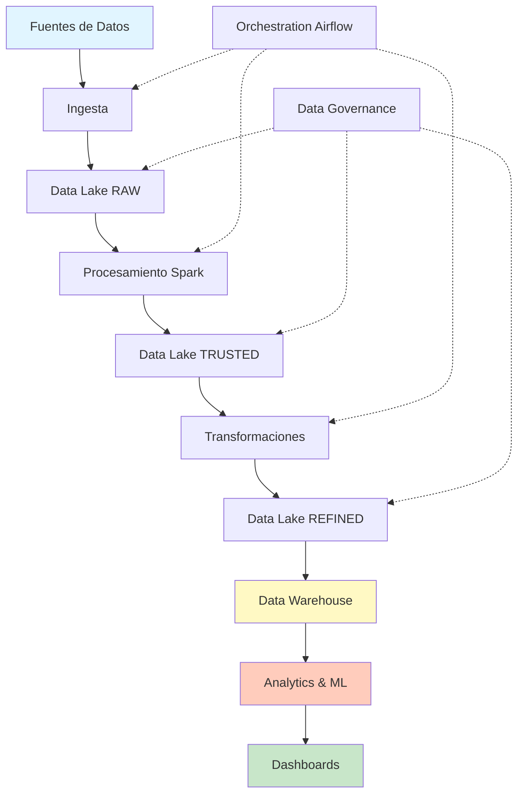

# Proyecto final: Caso práctico integrador

!!! info "Estado del Capítulo"
    🚧 **En desarrollo** - Este capítulo está planificado para futuras versiones.

## Introducción

Este proyecto final integra todos los conocimientos adquiridos en los bloques anteriores en un caso práctico completo de principio a fin.

## Objetivos del proyecto

Diseñar e implementar una **plataforma completa de Data Analytics** que incluya:

1. ✅ Arquitectura cloud (AWS/Azure/GCP)
2. ✅ Ingesta de datos desde múltiples fuentes
3. ✅ Data Lake con capas RAW/TRUSTED/REFINED
4. ✅ Procesamiento Big Data (Spark)
5. ✅ Data Warehouse (Star Schema)
6. ✅ Pipeline ETL/ELT
7. ✅ Modelo de Machine Learning
8. ✅ Dashboard de visualización
9. ✅ Gobierno y calidad de datos
10. ✅ Despliegue automatizado (CI/CD)

## Caso de uso: e-commerce analytics

**Contexto empresarial:**

Una empresa de comercio electrónico necesita:

- Analizar patrones de compra
- Predecir churn de clientes
- Optimizar inventario
- Personalizar recomendaciones
- Detectar fraude

**Requisitos técnicos:**



## Estructura del proyecto

**Fase 1: arquitectura cloud (bloques 2-3)**

**Stack tecnológico:**
```yaml
Cloud Provider: AWS
Storage: S3 (Data Lake)
Compute: EMR (Spark), Lambda
Database: Redshift (DWH), RDS (operational)
Orchestration: Airflow (MWAA)
Streaming: Kinesis / Kafka
Monitoring: CloudWatch
```

**Diagrama de arquitectura:**
```
┌─────────────────────────────────────────────────────┐
│                 DATA SOURCES                        │
├─────────────┬──────────────┬────────────────────────┤
│   Web App   │     APIs     │    Databases │  Files  │
└─────────────┴──────────────┴────────────────────────┘
                      │
                      ▼
            ┌─────────────────┐
            │  AWS Kinesis/   │
            │      Kafka      │
            └─────────────────┘
                      │
                      ▼
┌────────────────────────────────────────────────────┐
│              S3 DATA LAKE                          │
├─────────────┬──────────────┬───────────────────────┤
│  RAW Layer  │ TRUSTED Layer│   REFINED Layer       │
│  (Bronze)   │   (Silver)   │     (Gold)            │
└─────────────┴──────────────┴───────────────────────┘
                      │
                      ▼
            ┌─────────────────┐
            │  EMR / Glue     │
            │  (Spark Jobs)   │
            └─────────────────┘
                      │
        ┌─────────────┴─────────────┐
        ▼                           ▼
┌──────────────┐           ┌──────────────┐
│   Redshift   │           │   SageMaker  │
│  (Analytics) │           │     (ML)     │
└──────────────┘           └──────────────┘
        │                           │
        └─────────────┬─────────────┘
                      ▼
            ┌─────────────────┐
            │  QuickSight /   │
            │    Tableau      │
            └─────────────────┘
```

**Fase 2: Data Lake (bloque 3)**

**Implementación S3:**
```python
# Estructura del Data Lake
s3://mi-datalake/
├── raw/
│   ├── ecommerce/
│   │   ├── transactions/year=2024/month=01/day=15/
│   │   ├── customers/
│   │   ├── products/
│   │   └── clickstream/
│   └── external/
│       ├── weather/
│       └── demographics/
├── trusted/
│   ├── transactions_clean/
│   ├── customers_enriched/
│   └── products_catalog/
└── refined/
    ├── fact_sales/
    ├── dim_customer/
    ├── dim_product/
    ├── dim_date/
    └── agg_daily_metrics/
```

**Fase 3: ETL Pipeline (bloques 4-5-6)**

**Airflow DAG:**
```python
from airflow import DAG
from airflow.providers.amazon.aws.operators.emr import EmrAddStepsOperator
from airflow.providers.amazon.aws.sensors.emr import EmrStepSensor

dag = DAG(
    'ecommerce_analytics_pipeline',
    schedule_interval='@daily',
    catchup=False
)

# Step 1: Ingest from API
ingest_task = PythonOperator(
    task_id='ingest_api_data',
    python_callable=ingest_from_api
)

# Step 2: Spark Processing (RAW -> TRUSTED)
spark_clean = EmrAddStepsOperator(
    task_id='spark_data_cleaning',
    job_flow_id='{{ ti.xcom_pull("create_cluster")["JobFlowId"] }}',
    steps=[{
        'Name': 'Clean Data',
        'ActionOnFailure': 'CONTINUE',
        'HadoopJarStep': {
            'Jar': 'command-runner.jar',
            'Args': [
                'spark-submit',
                's3://my-bucket/scripts/clean_data.py'
            ]
        }
    }]
)

# Step 3: Transformations (TRUSTED -> REFINED)
spark_transform = EmrAddStepsOperator(
    task_id='spark_transformations',
    steps=[...]
)

# Step 4: Load to Redshift
load_dwh = RedshiftSQLOperator(
    task_id='load_to_redshift',
    sql='sql/load_fact_sales.sql'
)

# Step 5: ML Model Training
train_model = SageMakerTrainingOperator(
    task_id='train_churn_model',
    config={...}
)

# Dependencies
ingest_task >> spark_clean >> spark_transform >> load_dwh >> train_model
```

**Fase 4: Data Warehouse (bloque 5)**

**Star Schema en Redshift:**
```sql
-- Fact Table
CREATE TABLE fact_sales (
    sale_id BIGINT IDENTITY(1,1),
    date_key INT NOT NULL,
    customer_key INT NOT NULL,
    product_key INT NOT NULL,
    store_key INT NOT NULL,
    
    quantity INT NOT NULL,
    unit_price DECIMAL(10,2),
    discount_amount DECIMAL(10,2),
    sales_amount DECIMAL(12,2),
    cost_amount DECIMAL(12,2),
    profit_amount DECIMAL(12,2),
    
    FOREIGN KEY (date_key) REFERENCES dim_date(date_key),
    FOREIGN KEY (customer_key) REFERENCES dim_customer(customer_key),
    FOREIGN KEY (product_key) REFERENCES dim_product(product_key),
    FOREIGN KEY (store_key) REFERENCES dim_store(store_key)
)
DISTKEY(customer_key)
SORTKEY(date_key);
```

**Fase 5: Machine Learning (bloque 7)**

**Modelo de churn:**
```python
from pyspark.ml import Pipeline
from pyspark.ml.classification import RandomForestClassifier
from pyspark.ml.feature import VectorAssembler

# Feature engineering
feature_cols = [
    'recency_days',
    'frequency_purchases',
    'monetary_total',
    'avg_basket_size',
    'days_since_last_purchase',
    'total_returns'
]

assembler = VectorAssembler(
    inputCols=feature_cols,
    outputCol='features'
)

rf = RandomForestClassifier(
    featuresCol='features',
    labelCol='churned',
    numTrees=100
)

pipeline = Pipeline(stages=[assembler, rf])
model = pipeline.fit(train_df)

# Deploy to SageMaker
model.save('s3://my-bucket/models/churn_model/')
```

**Fase 6: visualización y reporting**

**Dashboard con QuickSight:**

- KPIs principales
- Ventas por categoría
- Análisis de cohortes
- Predicciones de churn
- Análisis RFM

---

## Entregables

1. **Arquitectura Cloud**
   - Diagrama de arquitectura
   - IaC con Terraform/CloudFormation
   - Documentación técnica

2. **Data Lake**
   - Estructura de carpetas S3
   - Políticas de retención
   - Catálogo de datos (Glue)

3. **Pipeline ETL**
   - DAGs de Airflow
   - Scripts Spark
   - SQL procedures

4. **Data Warehouse**
   - Esquema dimensional
   - Scripts DDL/DML
   - Queries analíticas

5. **Modelos ML**
   - Notebooks de exploración
   - Pipeline de entrenamiento
   - API de predicción

6. **Dashboards**
   - Visualizaciones interactivas
   - Reportes automáticos

7. **Documentación**
   - Manual de usuario
   - Guía de mantenimiento
   - Procedimientos operativos

---

## Criterios de evaluación

| Criterio | Peso | Descripción |
|----------|------|-------------|
| Arquitectura Cloud | 20% | Diseño escalable y cost-effective |
| Data Lake | 15% | Organización y gobernanza |
| ETL Pipeline | 20% | Robustez y eficiencia |
| Data Warehouse | 15% | Modelado dimensional correcto |
| ML Model | 15% | Performance y deployment |
| Visualización | 10% | Claridad y valor de negocio |
| Documentación | 5% | Completitud y claridad |

---

!!! tip "Consejos para el Éxito"
    1. **Empieza simple** y ve agregando complejidad
    2. **Documenta todo** desde el principio
    3. **Usa control de versiones** (Git)
    4. **Implementa CI/CD** temprano
    5. **Monitorea costos** constantemente
    6. **Aplica best practices** de seguridad
    7. **Itera basado en feedback**

## Próximos pasos

Este proyecto será desarrollado en futuras versiones con:

- Tutoriales paso a paso
- Código completo en GitHub
- Videos explicativos
- Datasets de ejemplo
- Templates reutilizables

---

**¡Manténte al tanto de las actualizaciones!**
