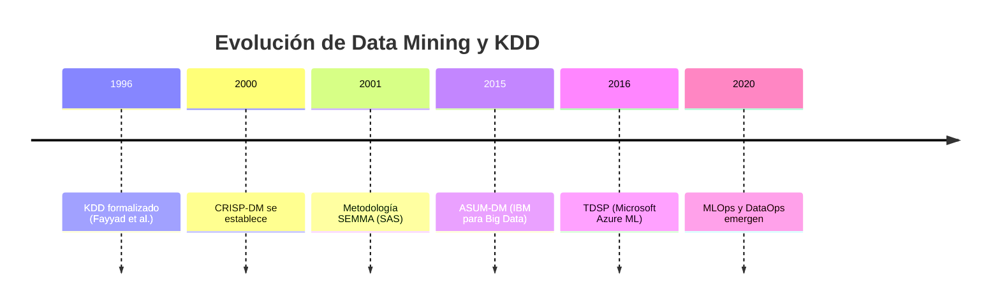
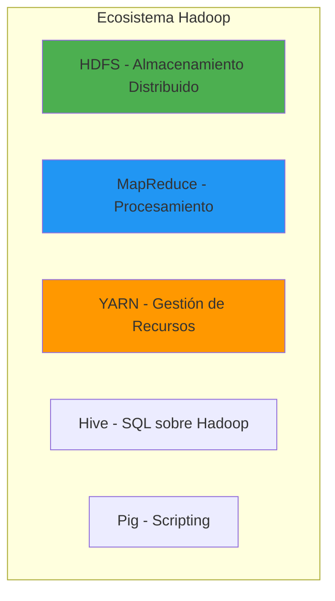
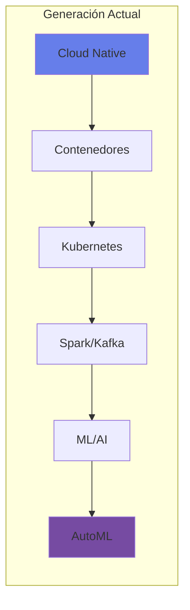
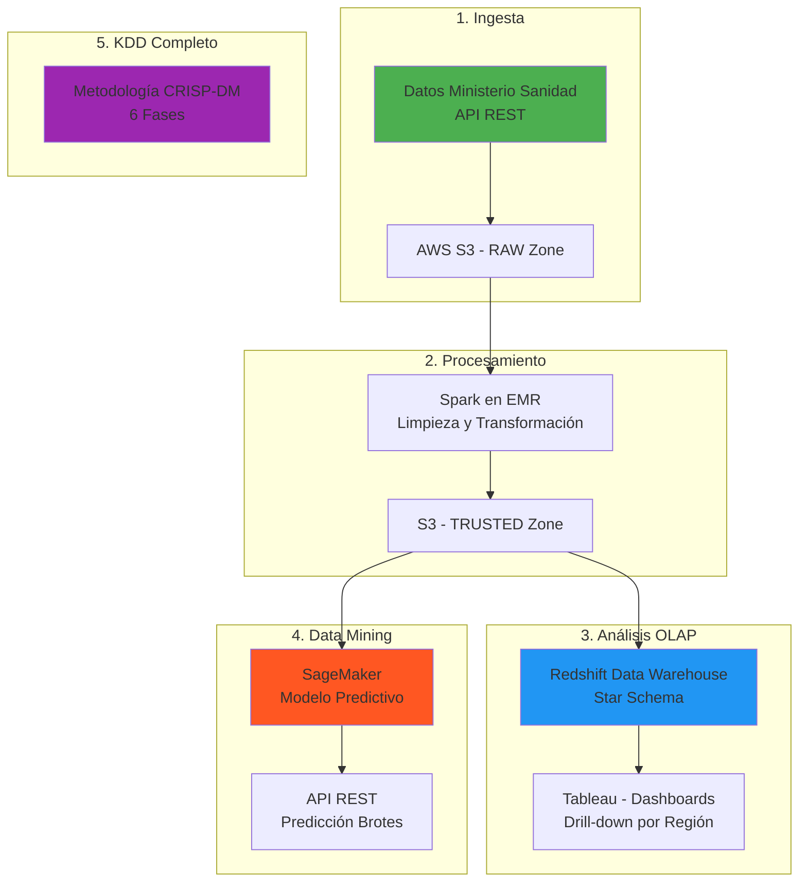
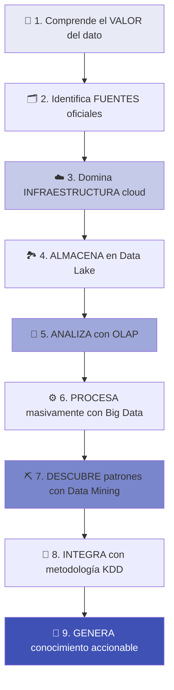
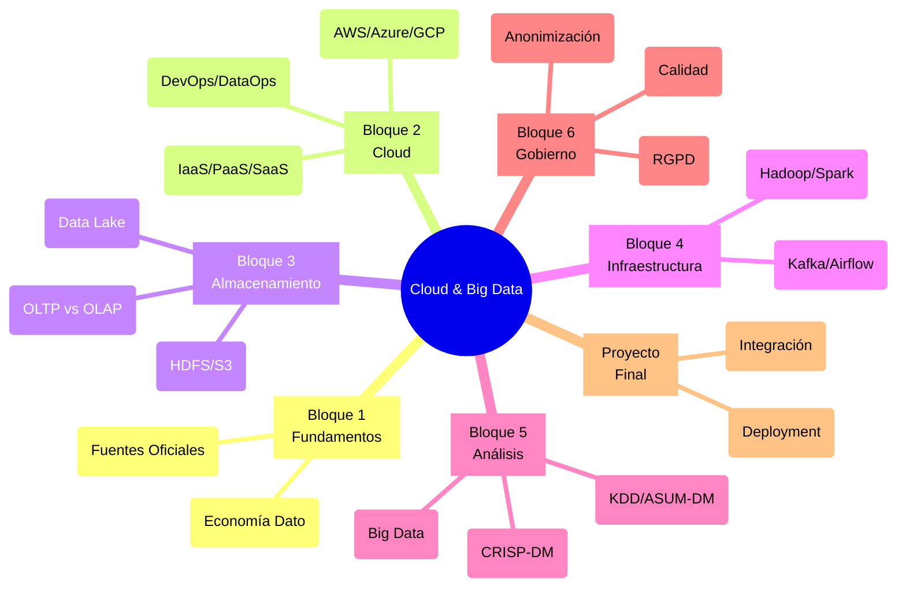

# Cloud & Big Data
## Universidad Internacional de Valencia 

!!! quote "Visión del Curso"
    *"Del dato al conocimiento: Un viaje desde las fuentes abiertas hasta la generación de insights accionables mediante infraestructuras cloud, análisis multidimensional y minería de datos inteligente."*


## Contexto histórico de la disciplina

**La evolución del procesamiento de datos:**

La historia del análisis de datos y la computación distribuida es una narrativa fascinante que conecta directamente con los desafíos actuales de Big Data y Cloud Computing.

**1960-1970: Los Orígenes de las Bases de Datos**

!!! info "Era Mainframe"
    - **1970**: Edgar F. Codd publica "A Relational Model of Data" - nacimiento de las bases de datos relacionales
    - Sistemas OLTP emergen para transacciones bancarias y comerciales
    - IBM desarrolla SQL (Structured Query Language)
    - **Limitación**: Procesamiento centralizado, capacidad limitada

**1980-1990: Nace el Data Warehousing y OLAP**

!!! success "Revolución Analítica"
    - **1988**: Barry Devlin y Paul Murphy (IBM) introducen el concepto de **Data Warehouse**
    - **1992**: Bill Inmon publica "Building the Data Warehouse" - arquitectura formal
    - **1992**: Ralph Kimball desarrolla el **modelado dimensional** (Star Schema)
    - **1993**: Edgar F. Codd define **OLAP** (Online Analytical Processing)
    - **1996**: Fayyad, Piatetsky-Shapiro y Smyth formalizan el proceso **KDD** (Knowledge Discovery in Databases)
    
    **Impacto**: Separación clara entre sistemas operacionales (OLTP) y analíticos (OLAP)

**1995-2005: Data Mining y Descubrimiento de Conocimiento**

!!! example "Era del Descubrimiento"
    - **1996**: Proceso **KDD** formalizado como metodología científica
    - **2000**: Metodología **CRISP-DM** se convierte en estándar de facto
    - Algoritmos clásicos: Decision Trees, K-Means, Apriori, SVM
    - **Desafío**: Los datos crecen más rápido que la capacidad de procesamiento

**Cronología del Data Mining:**



**2003-2010: Nace Big Data**

!!! warning "Crisis de Escala"
    **Problema**: Los sistemas tradicionales no podían manejar el volumen creciente de datos web.
    
    - **2003**: Google publica el paper de **GFS** (Google File System)
    - **2004**: Google publica **MapReduce** - paradigma de procesamiento distribuido
    - **2006**: Doug Cutting crea **Apache Hadoop** basado en papers de Google
    - **2006**: Se acuña el término **"Big Data"**
    - **2008**: Artículo "Big Data: The next frontier for innovation" (McKinsey)
    - **2010**: Las **3 V's** se formalizan: Volumen, Velocidad, Variedad

**Arquitectura Hadoop - Revolución del Open Source:**



**2006-2015: La Revolución Cloud**

!!! tip "Computación como Servicio"
    - **2006**: Amazon lanza **AWS EC2** - primera infraestructura cloud pública
    - **2006**: Google CEO Eric Schmidt acuña el término **"Cloud Computing"**
    - **2008**: Microsoft lanza **Azure**
    - **2010**: OpenStack nace como proyecto open source
    - **2011**: IBM Watson gana Jeopardy - AI mainstream
    - **2014**: Apache Spark supera a MapReduce en rendimiento (100x más rápido en memoria)
    
    **Cambio de Paradigma**: De CAPEX (comprar servidores) a OPEX (pagar por uso)

**Evolución de los Modelos Cloud:**

| Año | Hito | Impacto |
|-----|------|---------|
| 2006 | AWS S3 + EC2 | IaaS nace |
| 2008 | Google App Engine | PaaS se populariza |
| 2009 | Salesforce | SaaS se consolida |
| 2014 | AWS Lambda | FaaS (Serverless) emerge |
| 2015 | Kubernetes GA | Contenedores cloud-native |

**2010-2020: Big Data + Cloud + AI Convergen**

!!! success "Era de la Convergencia"
    - **2011**: Apache Spark lanzado - supera limitaciones de MapReduce
    - **2014**: **Lambda Architecture** (Nathan Marz) - batch + streaming
    - **2015**: TensorFlow se hace open source
    - **2016**: AlphaGo vence a campeón mundial de Go
    - **2017**: Metodología **TDSP** (Microsoft) para proyectos en cloud
    - **2018-2020**: **MLOps** y **DataOps** emergen como disciplinas

**Stack Tecnológico Moderno:**



**2020-Presente: Data Mesh y Cloud-Native**

!!! abstract "Estado Actual"
    - **2019**: Zhamak Dehghani propone **Data Mesh** - arquitectura descentralizada
    - **2020**: **Lakehouse** (Databricks) - fusión de Data Lake y Data Warehouse
    - **2021**: **Cloud-native Big Data** se convierte en estándar
    - **2022-2024**: **IA Generativa** (GPT, LLMs) transforman el análisis de datos
    - **2025**: **Real-time Everything** - streaming como default
    - **2026**: **Sostenibilidad en Cloud** - Green Computing es prioridad

---

**Conexión con la historia:**

| Fase del Curso | Fundamento Histórico | Tecnologías |
|----------------|----------------------|-------------|
| **Fuentes de Datos** | Datos abiertos (2010s) | APIs REST, Open Data |
| **Cloud Computing** | AWS (2006), Azure (2008) | IaaS, PaaS, SaaS |
| **Data Lake** | Hadoop HDFS (2006) | S3, Azure Data Lake |
| **OLAP** | Codd (1993), Kimball (1996) | Star Schema, Cubos |
| **Big Data** | MapReduce (2004), Spark (2011) | Hadoop, Spark, Kafka |
| **Data Mining** | Algoritmos 1990s-2000s | scikit-learn, XGBoost |
| **KDD/CRISP-DM** | KDD (1996), CRISP-DM (2000) | MLflow, Kubeflow |

---

## ¿Por qué esta combinación?

**Cloud & Big Data:**

!!! question "Visión Integradora"
    **No son tecnologías aisladas**, sino **capas complementarias** de una arquitectura moderna de datos:
    
    1. **Cloud** = Infraestructura elástica y escalable
    2. **Data Lake** = Almacenamiento flexible (schema-on-read)
    3. **OLAP** = Análisis exploratorio y descriptivo
    4. **Big Data** = Procesamiento masivo y distribuido
    5. **Data Mining** = Descubrimiento de patrones (predictivo)
    6. **KDD** = Metodología end-to-end para generar conocimiento

**Caso de uso integrado: salud pública:**

Imagina analizar datos epidemiológicos para predecir brotes de enfermedades:



**Resultado**: Un sistema completo que:
✅ Ingesta datos oficiales  
✅ Los almacena eficientemente en cloud  
✅ Permite análisis exploratorio (OLAP)  
✅ Descubre patrones con ML (Data Mining)  
✅ Aplica metodología rigurosa (KDD)  
✅ Genera conocimiento accionable para salud pública

---

## Estructura del curso: 9 bloques integrados

El curso está diseñado con una **progresión lógica** que reproduce el flujo real de un proyecto de datos desde la fuente hasta el conocimiento accionable.

---

**BLOQUE 1: fundamentos del dato y fuentes reales**

!!! note "Base Conceptual"
    Comprender el valor estratégico del dato y trabajar con fuentes oficiales reales desde el inicio.

<div class="grid cards" markdown>

- :material-database: **[Capítulo 1: Economía y Gobierno del Dato](capitulo01/economia-gobierno-dato.md)**

    ---
    
    - El dato como activo estratégico
    - Calidad y gobierno del dato
    - Marcos y estándares (DAMA-DMBoK, DCAM, ISO 38505)
    - RGPD y protección de datos
    
    **🔑 Concepto clave**: *El dato es el nuevo petróleo, pero requiere refinamiento*

- :material-file-chart: **[Capítulo 2: Fuentes Oficiales y Médicas](capitulo02/fuentes-datos.md)**

    ---
    
    - **Datos abiertos**: datos.gob.es, Instituto Nacional de Estadística (INE)
    - **Datos sanitarios**: Ministerio de Sanidad, Organización Mundial de la Salud (OMS)
    - APIs públicas y formatos abiertos (JSON, CSV, XML)
    - Problemas de calidad y protección de datos sanitarios
    
    **🔑 Concepto clave**: *Datos reales desde el día 1*

</div>

---

**BLOQUE 2: Cloud Computing y arquitectura**

!!! tip "Infraestructura Escalable"
    De servidores físicos a infraestructura como código en la nube.

<div class="grid cards" markdown>

- :material-cloud: **[Capítulo 3: Fundamentos Cloud Computing](capitulo03/fundamentos-cloud.md)**

    ---
    
    - **Modelos de servicio**: IaaS, PaaS, SaaS, FaaS
    - **Modelos de despliegue**: Pública, Privada, Híbrida, Multi-cloud
    - **Características NIST**: Elasticidad, auto-servicio, medición
    - Regiones, zonas de disponibilidad, escalabilidad
    - Comparación CAPEX vs OPEX
    
    **🔑 Concepto clave**: *Pagar por lo que usas, escalar según demanda*

- :material-server: **[Capítulo 4: Proveedores Cloud](capitulo04/proveedores-cloud.md)**

    ---
    
    - **Amazon Web Services (AWS)**: EC2, S3, RDS, EMR, Redshift, SageMaker
    - **Microsoft Azure**: VMs, Blob Storage, SQL Database, Synapse, ML Studio
    - **Google Cloud Platform (GCP)**: Compute Engine, Cloud Storage, BigQuery, Vertex AI
    - Comparativas de servicios y precios
    - Casos de uso y mejores prácticas
    
    **🔑 Concepto clave**: *Cada proveedor tiene fortalezas específicas*

- :material-sync: **[Capítulo 5: Metodologías DevOps y DataOps](capitulo05/metodologias-devops-dataops.md)**

    ---
    
    - **DevOps**: Integración continua (CI), despliegue continuo (CD), infraestructura como código
    - **DataOps**: Orquestación de pipelines de datos, observabilidad, calidad
    - **Herramientas**: Git, Jenkins, GitLab CI/CD, Terraform, Ansible
    - **Contenedores**: Docker, Kubernetes, servicios gestionados (ECS, AKS, GKE)
    - Automatización y monitorización de pipelines
    
    **🔑 Concepto clave**: *Automatizar todo el ciclo de vida de datos y aplicaciones*

</div>

---

**BLOQUE 3: Data Lakes y almacenamiento analítico**

!!! success "Schema-on-Read"
    Almacenamiento flexible que permite exploración antes de estructura rígida.

<div class="grid cards" markdown>

-  **[Capítulo 6: Arquitectura Data Lake](capitulo06/arquitectura-data-lake.md)**

    ---
    
    - **Concepto**: Repositorio centralizado para datos estructurados y no estructurados
    - **Capas**: RAW (crudo) → TRUSTED (validado) → REFINED (procesado)
    - **Schema-on-read** vs Schema-on-write
    - Diferencia con Data Warehouse tradicional
    - Tecnologías: Amazon S3, Azure Data Lake Storage Gen2
    
    **🔑 Concepto clave**: *Almacena primero, estructura después*
    
    **📌 Práctica**: Crear Data Lake con datos del INE y Ministerio de Sanidad

- :material-harddisk: **[Capítulo 7: Almacenamiento Distribuido](capitulo07/almacenamiento-distribuido.md)**

    ---
    
    - **HDFS** (Hadoop Distributed File System) - arquitectura y replicación
    - **Object Storage** en cloud (S3, Blob Storage, GCS)
    - **Formatos columnares**: Parquet, ORC, Avro
    - Particionado y compresión para optimización
    - Comparación rendimiento y casos de uso
    
    **🔑 Concepto clave**: *Formatos columnares = consultas analíticas 100x más rápidas*

</div>

---

**BLOQUE 4: sistemas OLTP vs OLAP**

!!! warning "Separación de Preocupaciones"
    Sistemas transaccionales (operaciones) vs analíticos (inteligencia de negocio).

<div class="grid cards" markdown>

- :material-database-sync: **[Capítulo 8: OLTP vs OLAP](capitulo08/oltp-vs-olap.md)**

    ---
    
    - **OLTP** (Online Transaction Processing): INSERT/UPDATE/DELETE, normalización, ACID
    - **OLAP** (Online Analytical Processing): SELECT complejos, cubos multidimensionales
    - **Modelado dimensional**: Star Schema y Snowflake Schema
    - **Dimensiones**: SCD Type 1, 2, 3 (Slowly Changing Dimensions)
    - **Medidas y agregaciones**: SUM, AVG, COUNT con drill-down/roll-up
    - **ETL**: Extracción, Transformación, Carga de OLTP a OLAP
    - Tecnologías: Redshift, Synapse, BigQuery, Snowflake
    
    **🔑 Concepto clave**: *OLTP optimiza escrituras, OLAP optimiza lecturas analíticas*
    
    **📌 Aplicación**: Modelo multidimensional para datos epidemiológicos (Región, Tiempo, Enfermedad, Edad)

</div>

---

**BLOQUE 5: Big Data y procesamiento distribuido**

!!! example "Escalabilidad Horizontal"
    Procesar terabytes/petabytes dividiendo el trabajo entre cientos de nodos.

<div class="grid cards" markdown>

- :material-elephant: **[Capítulo 9: Infraestructura Big Data](capitulo09/infraestructura-big-data.md)**

    ---
    
    - **Ecosistema Hadoop**: HDFS, MapReduce, YARN, Hive, Pig
    - **Apache Spark**: RDDs, DataFrames, Spark SQL, MLlib (100x más rápido que Hadoop)
    - **Batch vs Streaming**: Procesamiento por lotes vs tiempo real
    - **Apache Kafka**: Event streaming, producer/consumer, topics
    - **Apache Airflow**: Orquestación de workflows, DAGs, scheduling
    - Arquitectura Lambda y Kappa
    - Casos de uso y comparación tecnologías
    
    **🔑 Concepto clave**: *Divide y conquistarás: paralelización masiva*
    
    **📌 Práctica**: Procesar datasets masivos sanitarios o demográficos con Spark

</div>

---

**BLOQUE 6: minería de datos**

!!! abstract "De Descriptivo a Predictivo"
    Descubrir patrones ocultos, predecir comportamientos, segmentar poblaciones.

<div class="grid cards" markdown>

- :material-pickaxe: **[Capítulo 10: Fundamentos Big Data y Data Mining](capitulo10/fundamentos-big-data.md)**

    ---
    
    **Parte 1: Fundamentos Big Data**
    
    - Las 5 V's: Volumen, Velocidad, Variedad, Veracidad, Valor
    - Small Data vs Big Data vs Data Warehouse vs Data Lake
    - Machine Learning vs Deep Learning
    - Relación Big Data, AI y Data Science
    
    **Parte 2: Técnicas de Data Mining**
    
    - **Clasificación**: Predecir categorías (Decision Trees, Random Forest, SVM, XGBoost)
    - **Regresión**: Predecir valores continuos (Linear, Polynomial, Ridge, Lasso)
    - **Clustering**: Segmentación (K-Means, DBSCAN, Hierarchical)
    - **Reglas de asociación**: Market Basket Analysis (Apriori, FP-Growth)
    - **Detección de anomalías**: Fraude, fallos (Isolation Forest, One-Class SVM)
    
    **🔑 Concepto clave**: *OLAP responde "¿Qué pasó?", Data Mining responde "¿Qué pasará?"*
    
    **📌 Aplicación**: Predicción de incidencia de enfermedades, segmentación poblacional, detección de patrones territoriales

- :material-chart-line: **[Capítulo 10.2: Preprocesamiento y CRISP-DM](capitulo10/mineria-datos-metodologias.md)**

    ---
    
    - **Preprocesamiento**: Limpieza, integración, transformación, reducción de dimensionalidad
    - **Metodología CRISP-DM** (6 fases):
        1. Comprensión del Negocio
        2. Comprensión de los Datos
        3. Preparación de los Datos
        4. Modelado
        5. Evaluación
        6. Despliegue
    - **Proyecto completo**: Churn prediction con MLflow, FastAPI deployment
    
    **🔑 Concepto clave**: *El 80% del tiempo se va en preprocesamiento, el 20% en modelado*

</div>

---

**BLOQUE 7: proceso KDD - marco metodológico global**

!!! info "Conocimiento desde Datos"
    KDD integra todo: selección, limpieza, transformación, minería, evaluación, interpretación.

<div class="grid cards" markdown>

- :material-brain: **[Capítulo 11: KDD y Metodologías Avanzadas](capitulo11/metodologias-avanzadas.md)**

    ---
    
    **KDD como Proceso Integrador**
    
    - **Fases KDD**:
        1. **Selección**: Elegir fuentes de datos relevantes (← Bloque 1)
        2. **Limpieza**: Corregir inconsistencias, valores faltantes
        3. **Transformación**: Feature engineering, normalización
        4. **Minería de Datos**: Aplicar algoritmos (← Bloque 6)
        5. **Evaluación**: Validación de modelos, métricas
        6. **Interpretación**: Generar insights accionables
    
    **Metodologías Complementarias**
    
    - **CRISP-DM** (2000): Estándar de facto, agnóstico de industria
    - **ASUM-DM** (IBM 2015): Para Big Data y proyectos enterprise
    - **TDSP** (Microsoft 2016): Integrado con Azure ML
    - **MLOps**: Operacionalización de modelos ML
    
    **🔑 Concepto clave**: *KDD es el esqueleto metodológico que conecta todos los bloques del curso*
    
    **Conexión con curso**:
    - Datos oficiales → **Selección** (Bloque 1)
    - Data Lake → **Almacenamiento** (Bloque 3)
    - OLAP → **Análisis Exploratorio** (Bloque 4)
    - Big Data → **Procesamiento** (Bloque 5)
    - Minería → **Descubrimiento** (Bloque 6)
    - Cloud → **Infraestructura** (Bloque 2)

</div>

---

**BLOQUE 8: gobierno del dato y ética**

!!! danger "Crucial en Datos Médicos"
    Privacidad, seguridad, trazabilidad, calidad, cumplimiento normativo.

<div class="grid cards" markdown>

- :material-shield-check: **[Capítulo 12: Protección de Datos](capitulo12/proteccion-datos.md)**

    ---
    
    - **RGPD** (Reglamento General de Protección de Datos)
    - Principios: minimización, limitación de finalidad, exactitud
    - Derechos: acceso, rectificación, supresión, portabilidad
    - Delegado de Protección de Datos (DPO)
    - Sanciones y ejemplos reales

- :material-incognito: **[Capítulo 12.2: Anonimización](capitulo12/anonimizacion.md)**

    ---
    
    - **Técnicas**: k-anonimato, l-diversidad, t-closeness, differential privacy
    - **Pseudonimización** vs Anonimización
    - **Re-identificación**: ataques y defensa
    - Aplicación a datos sanitarios

- :material-check-circle: **[Capítulo 12.3: Calidad y Trazabilidad](capitulo12/calidad-trazabilidad.md)**

    ---
    
    - **Dimensiones de calidad**: Completitud, exactitud, consistencia, actualidad
    - **Data Lineage**: Trazabilidad del origen al destino
    - **Metadata Management**
    - Herramientas: Apache Atlas, AWS Glue Data Catalog

</div>

---

**BLOQUE 9: proyecto final integrador**

!!! success "Arquitectura Cloud para Datos Epidemiológicos"
    Integrar todos los conocimientos del curso en un caso real.

<div class="grid cards" markdown>

- :material-trophy: **[Capítulo 13: Proyecto Final](capitulo13/proyecto-final.md)**

    ---
    
    **Caso Práctico**: *Diseñar una arquitectura cloud que permita analizar datos epidemiológicos abiertos y descubrir patrones de riesgo territorial mediante técnicas de minería de datos*
    
    **Requisitos del Proyecto**:
    
    1. **Arquitectura Cloud**: Diseñar stack completo (AWS, Azure o GCP)
    2. **Data Lake**: Definir capas RAW/TRUSTED/REFINED con datos del Ministerio de Sanidad
    3. **Modelo OLAP**: Dimensiones (Región, Tiempo, Enfermedad, Grupo_Edad), Hechos (Casos, Fallecimientos)
    4. **Proceso KDD**: Aplicar fases completas desde selección hasta interpretación
    5. **Minería de Datos**: Implementar clasificación, clustering o predicción
    6. **Justificación Técnica**: Decisiones de arquitectura, tecnologías, seguridad, costes
    
    **Entregables**:
    
    - Diagrama de arquitectura cloud completa
    - Código ETL (Spark/Python)
    - Modelo OLAP (SQL DDL + Star Schema)
    - Modelo de Machine Learning (notebook Jupyter)
    - Documentación metodológica (CRISP-DM o KDD)
    - Informe ejecutivo con insights descubiertos
    
    **🎯 Objetivo**: Demostrar dominio end-to-end del ciclo de datos

</div>

**Ruta de aprendizaje: del concepto a la implementación:**



---

## Tecnologías cubiertas

<div style="display: flex; flex-wrap: wrap; gap: 10px; justify-content: center; margin: 2em 0;">
  <a href="https://aws.amazon.com/" target="_blank" style="text-decoration: none;"><span style="background: #FF9900; color: white; padding: 8px 16px; border-radius: 4px; font-weight: bold;">☁️ AWS</span></a>
  <a href="https://azure.microsoft.com/" target="_blank" style="text-decoration: none;"><span style="background: #0078D4; color: white; padding: 8px 16px; border-radius: 4px; font-weight: bold;">☁️ Azure</span></a>
  <a href="https://cloud.google.com/" target="_blank" style="text-decoration: none;"><span style="background: #4285F4; color: white; padding: 8px 16px; border-radius: 4px; font-weight: bold;">☁️ GCP</span></a>
  <a href="https://hadoop.apache.org/" target="_blank" style="text-decoration: none;"><span style="background: #FFCC00; color: black; padding: 8px 16px; border-radius: 4px; font-weight: bold;">🐘 Hadoop</span></a>
  <a href="https://spark.apache.org/" target="_blank" style="text-decoration: none;"><span style="background: #E25A1C; color: white; padding: 8px 16px; border-radius: 4px; font-weight: bold;">⚡ Spark</span></a>
  <a href="https://kafka.apache.org/" target="_blank" style="text-decoration: none;"><span style="background: #231F20; color: white; padding: 8px 16px; border-radius: 4px; font-weight: bold;">📊 Kafka</span></a>
  <a href="https://airflow.apache.org/" target="_blank" style="text-decoration: none;"><span style="background: #017CEE; color: white; padding: 8px 16px; border-radius: 4px; font-weight: bold;">🔄 Airflow</span></a>
  <a href="https://www.python.org/" target="_blank" style="text-decoration: none;"><span style="background: #3776AB; color: white; padding: 8px 16px; border-radius: 4px; font-weight: bold;">🐍 Python</span></a>
  <a href="https://www.w3schools.com/sql/" target="_blank" style="text-decoration: none;"><span style="background: #00758F; color: white; padding: 8px 16px; border-radius: 4px; font-weight: bold;">💾 SQL</span></a>
  <a href="https://parquet.apache.org/" target="_blank" style="text-decoration: none;"><span style="background: #F7931E; color: white; padding: 8px 16px; border-radius: 4px; font-weight: bold;">🔢 Parquet</span></a>
  <a href="https://scikit-learn.org/" target="_blank" style="text-decoration: none;"><span style="background: #F89820; color: white; padding: 8px 16px; border-radius: 4px; font-weight: bold;">📈 scikit-learn</span></a>
  <a href="https://www.tensorflow.org/" target="_blank" style="text-decoration: none;"><span style="background: #FF6F00; color: white; padding: 8px 16px; border-radius: 4px; font-weight: bold;">🤖 TensorFlow</span></a>
  <a href="https://mlflow.org/" target="_blank" style="text-decoration: none;"><span style="background: #0086C6; color: white; padding: 8px 16px; border-radius: 4px; font-weight: bold;">⚙️ MLflow</span></a>
  <a href="https://www.docker.com/" target="_blank" style="text-decoration: none;"><span style="background: #2496ED; color: white; padding: 8px 16px; border-radius: 4px; font-weight: bold;">🐳 Docker</span></a>
  <a href="https://kubernetes.io/" target="_blank" style="text-decoration: none;"><span style="background: #326CE5; color: white; padding: 8px 16px; border-radius: 4px; font-weight: bold;">☸️ Kubernetes</span></a>
</div>

---
## Cómo usar este sitio

**Navegación:**

!!! tip "Tips de Navegación"
    
    - **Menú superior (Tabs)**: Acceso rápido a bloques principales
    - **Menú lateral izquierdo**: Índice detallado de todos los capítulos
    - **Tabla de contenidos derecha**: Navegación interna del capítulo actual
    - **Buscador** (esquina superior derecha): Busca cualquier término en todo el curso
    - **Temas claro/oscuro**: Botón superior derecha para cambiar apariencia

**Características interactivas:**

=== "📝 Código Copiable"

    Todos los bloques de código tienen un botón **Copy** en la esquina superior derecha:
    
    ```python
    # Ejemplo: Este código es copiable con un clic
    import pandas as pd
    
    df = pd.read_csv('datos_ine.csv')
    print(df.head())
    ```

=== "📊 Diagramas Interactivos"

    Los diagramas Mermaid son interactivos:
    
    - **Zoom**: Usa scroll del ratón
    - **Pan**: Arrastra con el ratón
    - **Reset**: Doble clic
    
    ```mermaid
    graph LR
        A[Fuente] --> B[Cloud]
        B --> C[Data Lake]
        C --> D[Analytics]
    ```

=== "⚡ Tabs y Acordeones"

    Contenido organizado en tabs para fácil navegación y comparación:
    
    - AWS vs Azure vs GCP
    - OLTP vs OLAP
    - Metodologías DS

=== "🔗 Enlaces Cruzados"

    Enlaces internos entre capítulos para profundizar:
    
    - Ver [Data Lake](capitulo06/arquitectura-data-lake.md) para más detalles
    - Conexión con [OLAP](capitulo08/oltp-vs-olap.md)

---

## Mapa del curso



---

## Soporte y recursos

!!! question "¿Necesitas Ayuda?"
    
    **Durante el Curso:**
    - Consulta la sección **FAQ** al final de cada capítulo
    - Revisa **ejemplos prácticos** y **casos de uso**
    - Explora **referencias** a documentación oficial
    
    **Recursos Externos:**
    - [AWS Documentation](https://docs.aws.amazon.com/)
    - [Azure Documentation](https://docs.microsoft.com/azure/)
    - [Google Cloud Documentation](https://cloud.google.com/docs)
    - [Apache Spark Documentation](https://spark.apache.org/docs/latest/)
    - [scikit-learn Documentation](https://scikit-learn.org/stable/)

!!! info "Actualizaciones"
    Este material se actualiza regularmente

---

## Próximos pasos

!!! success "¡Comienzamos!"

    1. **[ Capítulo 1: Economía y Gobierno del Dato](capitulo01/economia-gobierno-dato.md)**  
       Entiende por qué el dato es el nuevo petróleo
    
    2. **[ Capítulo 2: Fuentes Oficiales](capitulo02/fuentes-datos.md)**  
       Explora datos reales del INE y Ministerio de Sanidad
    
    3. **[ Capítulo 3: Cloud Computing](capitulo03/fundamentos-cloud.md)**  
       Domina IaaS, PaaS, SaaS y arquitecturas cloud
---

## Licencia y créditos

!!! note "Información Académica"
    **Copyright © 2026 Universidad Internacional de Valencia**
    Material educativo protegido para uso académico.